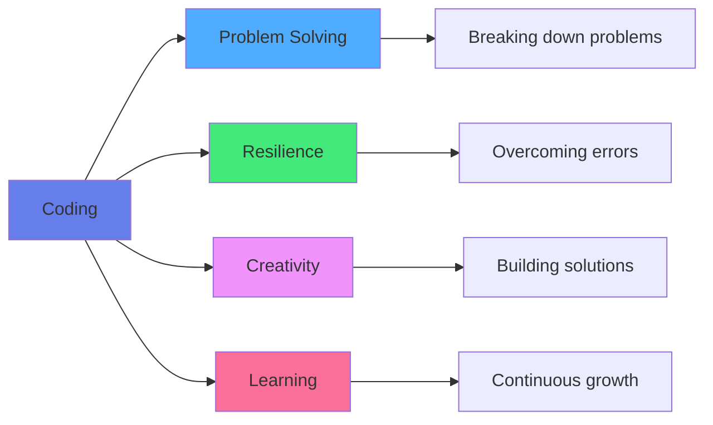
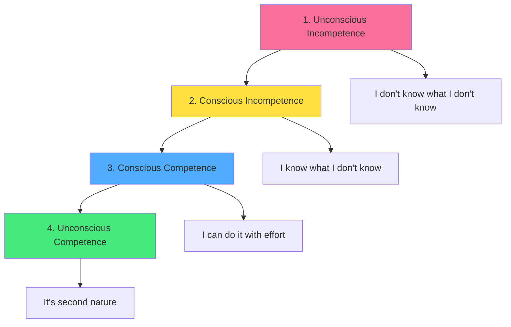
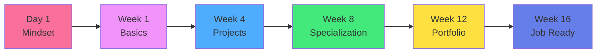

<div align="center">

# 🏁 Chapter 01 · Getting Started


### *Mindset, Habits & The "Pre-Game" Setup*


### *(Ready? Set? Let's go!)*

</div>

---

> [!NOTE]
> *"Give me six hours to chop down a tree and I will spend the first four sharpening the axe."* — **Abraham Lincoln**

<div align="center">

[](../README.md)
[](./02-environment-setup.md)

</div>

<br>

## 👋 Welcome to Day One

<div align="center">

You are standing at the edge of a rabbit hole.

Down there? A world where you can build **anything** you imagine.

</div>

<br>

<table>
<tr>
<td align="center" width="25%">

📱  
**Apps**

Mobile & desktop

</td>
<td align="center" width="25%">

🌐  
**Websites**

Interactive experiences

</td>
<td align="center" width="25%">

🤖  
**AI Agents**

Intelligent systems

</td>
<td align="center" width="25%">

🎮  
**Games**

Virtual worlds

</td>
</tr>
</table>

<br>

> [!IMPORTANT]
> **But wait!** 🛑  
> Before we install tools or write code, we need to install the most important software of all:  
> **Your Mindset.**

<br>

<div align="center">

This chapter is your **axe-sharpening session**.

</div>

---

<br>

## 🧠 Part 1 · The Developer Mindset

<div align="center">

Most people think coding is about math or memorizing syntax.

**It's not.**

</div>

<br>

<div align="center">



</div>

<br>

> [!NOTE]
> Coding is about **problem-solving** and **resilience**.

---

<br>

### 💪 The "Yet" Power

<br>

<div align="center">

You **will** fail. You **will** see red error messages. You **will** feel confused.

**This is normal.**

</div>

<br>

<table>
<tr>
<td width="50%" bgcolor="#ffebee" valign="top">

### ❌ Fixed Mindset

**Limiting beliefs:**

- "I'm not smart enough for this."
- "This error means I broke it."
- "It's too hard, I quit."
- "I'm just not a tech person."
- "Others learn faster than me."
- "I should already know this."

**Result:** Giving up early

</td>
<td width="50%" bgcolor="#e8f5e9" valign="top">

### ✅ Growth Mindset

**Empowering thoughts:**

- "I don't understand this **yet**."
- "This error is a clue to the solution."
- "Let me Google this or ask AI."
- "Every expert was once a beginner."
- "I'm learning at my own pace."
- "Mistakes are part of learning."

**Result:** Continuous improvement

</td>
</tr>
</table>

<br>

<div align="center">


*You, looking at code for the first time. Don't worry, we'll fix this.*

</div>

---

<br>

### 🎯 The Developer's Mantras

<br>

<details>
<summary><b>💡 Repeat These Daily</b></summary>

<br>

1. **"Every expert was once a beginner."**  
   Even Linus Torvalds wrote his first "Hello World"

2. **"Errors are not failures; they're feedback."**  
   Each error message is teaching you something

3. **"I don't need to know everything; I need to know how to find answers."**  
   Google, documentation, and AI are your friends

4. **"Comparison is the thief of joy."**  
   Focus on your own progress, not others'

5. **"Done is better than perfect."**  
   Ship it, then improve it

6. **"The best time to start was yesterday. The second best time is now."**  
   You're already in the right place

</details>

---

<br>

### 🧪 The Learning Stages

<br>

<div align="center">



</div>

<br>

> [!TIP]
> **You are here:** Stage 1 → 2  
> **That's perfect!** Awareness is the first step.

---

<br>

## 📅 Part 2 · Atomic Habits > Heroic Bursts

<br>

<div align="center">

### 🏆 The Golden Rule of ZeroToDevExpert:

</div>

<br>

<div align="center">

## **Consistency > Intensity**

</div>

<br>

<table>
<tr>
<td width="50%" align="center" bgcolor="#ffebee">

### ❌ Heroic Bursts

**8 hours once a week**

- Exhausting
- Unsustainable
- Leads to burnout
- Irregular progress
- Poor retention

</td>
<td width="50%" align="center" bgcolor="#e8f5e9">

### ✅ Atomic Habits

**20-30 minutes daily**

- Sustainable
- Builds muscle memory
- Allows sleep consolidation
- Steady progress
- Better retention

</td>
</tr>
</table>

<br>

> [!IMPORTANT]
> Your brain needs **sleep** to consolidate what you learned.  
> Learning → Sleep → Solidify → Repeat

---

<br>

### 🎯 The Learning Protocol

<br>

<details>
<summary><b>📝 Your Daily Learning System</b></summary>

<br>

**1️⃣ The Trigger (Anchor)**

Pick a **specific** time and place:
- ✅ "After my morning coffee"
- ✅ "Right after dinner"
- ✅ "During lunch break"
- ❌ "Whenever I feel like it" (too vague!)

**2️⃣ The Action (Pomodoro)**

Use the Pomodoro Technique:
```
25 minutes: Focused learning
5 minutes: Break
Repeat 4 times
Then: 15-30 minute break
```

**3️⃣ The Reward**

Immediate positive reinforcement:
- ✅ Scroll social media (5 min)
- ✅ Favorite snack
- ✅ Short walk
- ✅ Gaming session
- ✅ Relaxation

**4️⃣ The Tracking**

Keep a streak:
- [ ] Day 1 ✅
- [ ] Day 2 ✅
- [ ] Day 3 ✅
- [ ] Don't break the chain!

</details>

---

<br>

### 📊 The Power of Consistency

<br>

<div align="center">

**Math doesn't lie:**

| Schedule | Time/Week | Total (12 weeks) |
|:---|:---:|:---:|
| 8 hours Sunday | 8 hours | 96 hours |
| 30 min daily | 3.5 hours | 42 hours |

</div>

<br>

> [!NOTE]
> **Wait, that's less time?**  
> Yes! But with **better retention** and **no burnout**.  
> Quality > Quantity when it comes to learning.

---

<br>

### ⏰ Finding Your Time

<br>

<details>
<summary><b>🔍 Time Audit Exercise</b></summary>

<br>

**Where can you find 30 minutes?**

Common time slots:
- 🌅 Before work (6:00-6:30 AM)
- 🍳 During breakfast (7:00-7:30 AM)
- 🚇 Commute (if not driving)
- ☕ Lunch break (12:00-12:30 PM)
- 🌆 Right after work (6:00-6:30 PM)
- 🌙 Before bed (9:00-9:30 PM)

**Challenge:** Track your phone screen time.  
Replace 30 min of social media with coding.

```
Before: 2 hours TikTok
After: 1.5 hours TikTok + 30 min coding

Result: Still enjoy social media + learn to code!
```

</details>

---

<br>

## ⚙️ Part 3 · The "Life" Setup

<div align="center">

We'll install VS Code and Git in **Chapter 02**.

Today, we set up your **physical** and **mental** space.

</div>

---

<br>

### 1. The Zone 🎧

<br>

> [!TIP]
> Coding requires **Deep Work** — uninterrupted focus.

<br>

<details>
<summary><b>🎵 Music for Focus</b></summary>

<br>

**Proven focus music:**

- **Lofi Hip Hop**
  - [Lofi Girl 24/7 stream](https://www.youtube.com/c/LofiGirl)
  - Calm, no lyrics, consistent tempo

- **Video Game Soundtracks**
  - Designed to maintain focus!
  - Recommendations: Minecraft, Stardew Valley, Zelda

- **Classical Music**
  - Bach, Mozart, Debussy
  - Baroque period especially good

- **Ambient/Electronic**
  - Brian Eno, Tycho
  - Minimal lyrics or none

- **White/Brown Noise**
  - Masks distractions
  - [mynoise.net](https://mynoise.net)

**Avoid:**
- Songs with lyrics (in your language)
- High-energy music
- Anything that makes you sing along

</details>

<details>
<summary><b>📱 Eliminating Distractions</b></summary>

<br>

**Phone strategy:**

✅ **Best:** Different room  
✅ **Good:** Do Not Disturb mode  
✅ **Okay:** Face down, silent  
❌ **Bad:** In your hand "just checking"

**Computer strategy:**

```bash
# Block distracting sites during study time
# Browser extensions:
- Freedom
- Cold Turkey
- LeechBlock
```

**Physical environment:**

- Clean desk (minimize visual clutter)
- Good lighting (prevents eye strain)
- Comfortable chair (but not too comfortable!)
- Water bottle nearby
- Temperature: 65-70°F (18-21°C)

</details>

---

<br>

### 2. The Rubber Duck 🦆

<br>

<div align="center">

This is a **real technique** used by professional developers.

</div>

<br>

<details>
<summary><b>🦆 Rubber Duck Debugging</b></summary>

<br>

**The concept:**

When stuck, explain your code **line by line** to an inanimate object.

**Why it works:**

1. Forces you to **articulate** the problem
2. Reveals **assumptions** you didn't know you made
3. Often, the **solution appears** as you explain
4. No judgment from the duck!

**What to use:**

- 🦆 Classic rubber duck
- 🧸 Stuffed animal
- 🪨 A rock
- 🖼️ Framed photo
- 🌵 Office plant
- 🤖 Toy robot

**The process:**

```
1. "Okay duck, here's what I'm trying to do..."
2. "This line here should..."
3. "Wait, actually that doesn't make sense..."
4. "Oh! I see the problem now!"
5. *Fix the bug*
6. "Thanks, duck!"
```

</details>

<br>

<div align="center">


</div>

---

<br>

### 3. The Learning Tools 📚

<br>

<details>
<summary><b>🛠️ Your Learning Arsenal</b></summary>

<br>

**Note-taking:**

- **Obsidian** (Markdown notes)
- **Notion** (All-in-one workspace)
- **Physical notebook** (Don't underestimate this!)

**Code practice:**

- **CodePen** (HTML/CSS/JS)
- **Replit** (Multiple languages)
- **LeetCode** (Practice problems)

**Documentation:**

- **MDN** (Web development)
- **DevDocs** (Multiple languages)
- Official docs (always best)

**Community:**

- **Stack Overflow** (Q&A)
- **Reddit** (r/learnprogramming)
- **Discord** (Join coding servers)
- **Twitter/X** (Follow devs)

</details>

---

<br>

### 4. The Growth Tracker 📈

<br>

<details>
<summary><b>📊 Measuring Progress</b></summary>

<br>

**Keep a learning journal:**

```markdown
# Day 1 - [Date]

## What I learned:
- Variables store data
- Functions are reusable code blocks

## What I built:
- Hello World program
- Simple calculator

## Challenges faced:
- Syntax errors with semicolons
- Forgot to close brackets

## Tomorrow's goal:
- Learn about loops
- Practice with arrays

## Mood: 😊 Excited!
```

**Weekly review:**

Every Sunday, answer:
1. What did I learn this week?
2. What was my biggest win?
3. What do I still not understand?
4. What will I focus on next week?

</details>

---

<br>

## 🎯 Mission · Day 01

<div align="center">

### 🚀 Your First Mission

We're keeping it light today.

</div>

<br>

### Core Tasks:

- [ ] 📝 **Find your "Why"** — Write in physical notebook
- [ ] 📅 **Block your calendar** — 30-min recurring slot
- [ ] 🎧 **Create focus playlist** — Music that helps you concentrate
- [ ] 🦆 **Get your duck** — Or equivalent debugging companion
- [ ] 🌐 **Join community** — Say "Hello World!" in discussions
- [ ] 📱 **Phone strategy** — Decide where it goes during study time

<br>

<details>
<summary><b>⭐ Bonus Challenges</b></summary>

<br>

- [ ] 📊 Track your screen time for one day
- [ ] 🗂️ Set up a note-taking system
- [ ] 📖 Read a success story from a self-taught developer
- [ ] 🎯 Write down 3 projects you want to build
- [ ] 💪 Do a morning/evening routine audit
- [ ] 🤝 Find an accountability partner
- [ ] 📸 Take "Day 1" photo (you'll want this later!)
- [ ] 🎨 Set up your learning space

</details>

---

<br>

## 💡 Your "Why" Matters

<br>

<details>
<summary><b>🎯 Writing Your Why</b></summary>

<br>

**Answer these questions:**

1. **Why do I want to learn coding?**
   - Money?
   - Freedom?
   - Building something specific?
   - Career change?
   - Curiosity?

2. **What does success look like to me?**
   - First job as developer?
   - Side project income?
   - Specific skill mastery?

3. **How will my life change when I succeed?**
   - More money?
   - Remote work?
   - Creating something meaningful?

4. **What will I regret if I don't do this?**
   - This is powerful. Write it down.

**Keep this somewhere visible.**  
Read it when motivation is low.

</details>

---

<br>

## 🗺️ The Journey Ahead

<br>

<div align="center">



</div>

<br>

> [!NOTE]
> **You are here:** Day 1 🎯  
> **Destination:** Job-ready developer  
> **Time:** 12-16 weeks of consistent effort

---

<br>

<div align="center">

## 🏆 Achievement Unlocked

### **The Journey Begins**

<br>

**You are ready.**

<br>

*Sleep well, drink water.*  
*Tomorrow, we get our hands dirty with the tools.*

<br>


</div>

---

<br>

<div align="center">

### 🎓 Pro Tip

> "The secret to getting ahead is getting started.  
> The secret to getting started is breaking your complex  
> overwhelming tasks into small manageable tasks,  
> and starting on the first one."  
> — **Mark Twain**

</div>

---

<br>

<div align="center">

### 📚 Recommended Reading

**For mindset:**
- *Atomic Habits* by James Clear
- *Mindset* by Carol Dweck
- *Deep Work* by Cal Newport

**For coding journeys:**
- *The Self-Taught Programmer* by Cory Althoff
- *The Pragmatic Programmer* by Hunt & Thomas

</div>

---

<br>

<div align="center">

[](./02-environment-setup.md)

</div>

<br>
