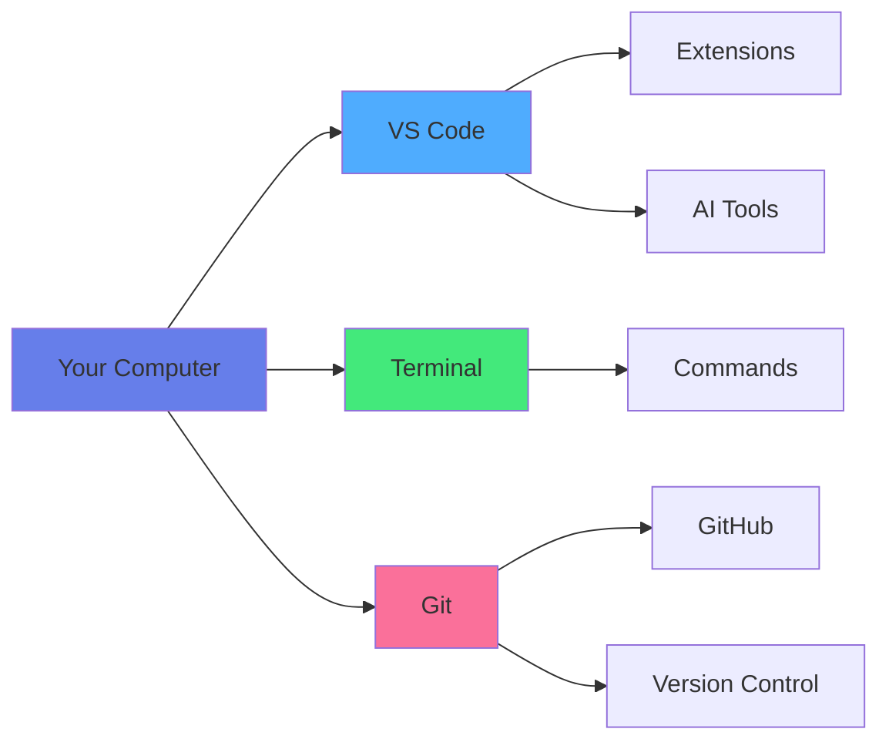

<div align="center">

# 🛠️ Chapter 02 · Environment Setup


### *VS Code · Terminal · Git — Your Dev Command Center*


</div>

---

> [!NOTE]
> *Time to build your command center.*

<div align="center">

[](./01-getting-started.md)
[](./03-programming-basics.md)

</div>

<br>

## 🏗️ Building Your Workshop

<div align="center">

In the previous chapter, we **sharpened the axe**.  
Now, we build the **workshop**.

</div>

<br>

<table>
<tr>
<td align="center" width="33%" bgcolor="#e3f2fd">

📝  
**The Editor**

VS Code - where magic is written

</td>
<td align="center" width="33%" bgcolor="#f3e5f5">

🐚  
**The Terminal**

Talk directly to your system

</td>
<td align="center" width="33%" bgcolor="#fff9c4">

🕒  
**Git**

Your time machine

</td>
</tr>
</table>

<br>

> [!IMPORTANT]
> You don't need the most expensive computer — but you *do* need the **right tools** and knowledge to use them well.

<br>

<div align="center">



</div>

---

<br>

## 🖥️ Part 1 · Visual Studio Code

<div align="center">

### *The Industry Standard Editor*

There are many editors out there… but **VS Code is king** 👑

</div>

<br>

### 🌟 Why VS Code?

<br>

<table>
<tr>
<td align="center" width="25%">

⚡  
**Lightweight**

Fast startup, low memory

</td>
<td align="center" width="25%">

🔌  
**Extensible**

Thousands of extensions

</td>
<td align="center" width="25%">

🤖  
**AI Integration**

Best AI support

</td>
<td align="center" width="25%">

🆓  
**Free**

Open source, free forever

</td>
</tr>
</table>

---

<br>

### 📥 Installation

<br>

<details>
<summary><b>💻 Windows Installation</b></summary>

<br>

1. Go to **https://code.visualstudio.com**
2. Click **Download for Windows**
3. Run the installer

**Important checkboxes during installation:**
- ✅ Add "Open with Code" to context menu
- ✅ Add to PATH
- ✅ Register Code as editor for supported file types

</details>

<details>
<summary><b>🍎 macOS Installation</b></summary>

<br>

1. Go to **https://code.visualstudio.com**
2. Click **Download for Mac**
3. Open the `.dmg` file
4. Drag VS Code to Applications folder

**Add to PATH:**
1. Open VS Code
2. Press `Cmd+Shift+P`
3. Type "shell command"
4. Select "Install 'code' command in PATH"

</details>

<details>
<summary><b>🐧 Linux Installation</b></summary>

<br>

**Ubuntu/Debian:**
```bash
sudo apt update
sudo apt install code
```

**Fedora:**
```bash
sudo dnf install code
```

**Arch:**
```bash
yay -S visual-studio-code-bin
```

</details>

---

<br>

### ⚙️ Essential VS Code Settings

<br>

<details>
<summary><b>🎨 Recommended Settings</b></summary>

<br>

Press `Ctrl+,` (or `Cmd+,` on Mac) to open settings.

**Search and enable:**

```json
{
  "editor.fontSize": 14,
  "editor.fontFamily": "Fira Code, Consolas, monospace",
  "editor.fontLigatures": true,
  "editor.formatOnSave": true,
  "editor.tabSize": 2,
  "editor.minimap.enabled": true,
  "editor.bracketPairColorization.enabled": true,
  "editor.guides.bracketPairs": true,
  "files.autoSave": "afterDelay",
  "terminal.integrated.fontSize": 13,
  "workbench.colorTheme": "One Dark Pro"
}
```

</details>

---

<br>

### 🧩 Essential Extensions

<br>

> [!TIP]
> Open Extensions panel: `Ctrl+Shift+X` (Windows/Linux) or `Cmd+Shift+X` (Mac)

<br>

<details>
<summary><b>🤖 AI & Productivity</b></summary>

<br>

| Extension | Purpose | Priority |
|:---|:---|:---:|
| **GitHub Copilot** | AI code completion | ⭐⭐⭐ |
| **Codeium** | Free AI assistant | ⭐⭐⭐ |
| **Continue** | Open source AI coding | ⭐⭐ |
| **Prettier** | Code formatter | ⭐⭐⭐ |
| **Error Lens** | Inline error display | ⭐⭐⭐ |
| **Auto Rename Tag** | HTML tag pairs | ⭐⭐ |
| **Path Intellisense** | Auto-complete paths | ⭐⭐ |

</details>

<details>
<summary><b>🎨 Themes & Icons</b></summary>

<br>

**Popular Themes:**
- One Dark Pro
- Dracula Official
- Night Owl
- Material Theme
- Tokyo Night

**Icon Themes:**
- Material Icon Theme
- vscode-icons

**Install:**
1. Extensions panel
2. Search for theme name
3. Click Install
4. `Ctrl+K Ctrl+T` to select theme

</details>

<details>
<summary><b>💻 Language Support</b></summary>

<br>

| Language | Extension | Features |
|:---|:---|:---|
| **Python** | Python (Microsoft) | Linting, debugging, IntelliSense |
| **JavaScript** | Built-in | Native support |
| **HTML/CSS** | Built-in | Native support |
| **React** | ES7+ React/Redux/React-Native | Snippets |
| **Vue** | Vue - Official | Syntax highlighting |
| **C/C++** | C/C++ (Microsoft) | IntelliSense, debugging |

</details>

---

<br>

### ⌨️ Essential Keyboard Shortcuts

<br>

<div align="center">

| Action | Windows/Linux | Mac |
|:---|:---:|:---:|
| Command Palette | `Ctrl+Shift+P` | `Cmd+Shift+P` |
| Quick Open File | `Ctrl+P` | `Cmd+P` |
| Toggle Terminal | `` Ctrl+` `` | `` Cmd+` `` |
| Find in Files | `Ctrl+Shift+F` | `Cmd+Shift+F` |
| Split Editor | `Ctrl+\` | `Cmd+\` |
| Format Document | `Shift+Alt+F` | `Shift+Option+F` |
| Toggle Comment | `Ctrl+/` | `Cmd+/` |
| Multi-cursor | `Alt+Click` | `Option+Click` |

</div>

---

<br>

## 🐚 Part 2 · The Terminal

<div align="center">

### *Don't Panic.*

The terminal is that *black box* from hacker movies.  
**Good news: it doesn't bite** 🐍

</div>

<br>

> [!NOTE]
> The terminal is simply a faster, more precise way to talk to your computer.

---

<br>

### 🎯 Opening the Terminal

<br>

<table>
<tr>
<td width="50%" valign="top">

#### In VS Code:

**Shortcut:** `` Ctrl+` `` (or `` Cmd+` ``)  
**Or:** Menu → Terminal → New Terminal

</td>
<td width="50%" valign="top">

#### System Terminals:

**Windows:** Command Prompt, PowerShell, Git Bash  
**Mac:** Terminal (Cmd+Space, type "terminal")  
**Linux:** Terminal (Ctrl+Alt+T)

</td>
</tr>
</table>

---

<br>

### 📜 Essential Commands

<br>

<details>
<summary><b>🗺️ Navigation Commands</b></summary>

<br>

```bash
# Where am I?
pwd  # Print Working Directory

# What's in this folder?
ls        # List (Mac/Linux)
dir       # List (Windows)
ls -la    # Detailed list with hidden files

# Move to a folder
cd Documents              # Enter folder
cd ..                     # Go back one level
cd ~                      # Go to home directory
cd /                      # Go to root

# Autocomplete
# Type first letters, press TAB
cd Doc[TAB]  → cd Documents
```

</details>

<details>
<summary><b>📁 File & Folder Management</b></summary>

<br>

```bash
# Create folder
mkdir my-project
mkdir -p path/to/nested/folder  # Create nested folders

# Create file
touch file.txt              # Mac/Linux
echo. > file.txt            # Windows

# Copy
cp file.txt backup.txt      # Copy file
cp -r folder backup-folder  # Copy folder

# Move/Rename
mv old.txt new.txt          # Rename
mv file.txt ~/Documents/    # Move

# Delete
rm file.txt                 # Delete file
rm -r folder                # Delete folder (careful!)

# View file content
cat file.txt               # Show entire file
head file.txt              # First 10 lines
tail file.txt              # Last 10 lines
```

</details>

<details>
<summary><b>🔍 Search & Find</b></summary>

<br>

```bash
# Find files
find . -name "*.js"         # Find all .js files
grep "TODO" *.js            # Search text in files

# Which command?
which python                # Find Python location
which node                  # Find Node location

# Command history
history                     # Show command history
!123                        # Run command #123 from history
```

</details>

<details>
<summary><b>💡 Helpful Commands</b></summary>

<br>

```bash
# Clear terminal
clear        # Mac/Linux
cls          # Windows

# Check command
man ls       # Manual for ls command (Mac/Linux)
ls --help    # Help for ls command

# Current user
whoami

# Disk usage
df -h        # Disk space
du -sh *     # Folder sizes

# Processes
top          # Running processes (Mac/Linux)
ps aux       # Process list
```

</details>

---

<br>

### 🧭 Terminal Survival Tips

<br>

<table>
<tr>
<td width="50%" bgcolor="#e8f5e9" valign="top">

### ✅ Good Habits:

- Use **TAB** for autocomplete
- Use **↑/↓** arrows for history
- Copy full error messages
- Read error messages carefully
- Use `pwd` when lost
- Practice in safe folders

</td>
<td width="50%" bgcolor="#ffebee" valign="top">

### ❌ Avoid:

- `rm -rf /` (NEVER!)
- Deleting without checking
- Running unknown scripts
- Working as root unnecessarily
- Ignoring error messages

</td>
</tr>
</table>

<br>

> [!WARNING]
> **Be careful with:**
> - `rm` (delete) - it's permanent!
> - `sudo` (admin rights) - use only when needed
> - Scripts from unknown sources

---

<br>

## 🕒 Part 3 · Git & GitHub

<div align="center">

### *Your Personal Time Machine*

Imagine a hard video game 🎮  
Before a boss fight… you **save the game**.

**Git = Save Game for Developers**

</div>

---

<br>

### 1️⃣ Install Git

<br>

<details>
<summary><b>💻 Windows Installation</b></summary>

<br>

1. Go to **https://git-scm.com**
2. Download Windows installer
3. Run installer with these settings:
   - ✅ Git from command line and 3rd-party software
   - ✅ Use Visual Studio Code as Git's default editor
   - ✅ Override default branch name: `main`
   - ✅ Git Credential Manager

</details>

<details>
<summary><b>🍎 macOS Installation</b></summary>

<br>

**Option 1: Homebrew (recommended)**
```bash
brew install git
```

**Option 2: Direct download**
- Go to **https://git-scm.com**
- Download macOS installer

**Option 3: Xcode Command Line Tools**
```bash
xcode-select --install
```

</details>

<details>
<summary><b>🐧 Linux Installation</b></summary>

<br>

**Ubuntu/Debian:**
```bash
sudo apt update
sudo apt install git
```

**Fedora:**
```bash
sudo dnf install git
```

**Arch:**
```bash
sudo pacman -S git
```

</details>

---

<br>

### 2️⃣ Configure Your Identity

<br>

<details>
<summary><b>⚙️ Git Configuration</b></summary>

<br>

```bash
# Set your name
git config --global user.name "Your Real Name"

# Set your email
git config --global user.email "your@email.com"

# Set default branch name
git config --global init.defaultBranch main

# Set default editor
git config --global core.editor "code --wait"

# View all settings
git config --list

# Check specific setting
git config user.name
```

**Verify installation:**
```bash
git --version
```

</details>

---

<br>

### 3️⃣ Create Your GitHub Account

<br>

> [!IMPORTANT]
> 🌍 **https://github.com**
> 
> GitHub is:
> - 🗂️ Your **portfolio**
> - 📄 Your **developer CV**
> - 🌐 Your **professional social network**

<br>

<details>
<summary><b>📝 GitHub Setup Steps</b></summary>

<br>

1. **Create Account:**
   - Go to github.com
   - Click "Sign up"
   - Choose a professional username
   - Verify email

2. **Set up Profile:**
   - Add profile picture
   - Add bio
   - Add location
   - Link website/portfolio

3. **Set up SSH (recommended):**
```bash
# Generate SSH key
ssh-keygen -t ed25519 -C "your@email.com"

# Copy public key
cat ~/.ssh/id_ed25519.pub

# Add to GitHub:
# Settings → SSH and GPG keys → New SSH key
```

</details>

---

<br>

### 🎯 Basic Git Commands

<br>

<details>
<summary><b>📦 Repository Basics</b></summary>

<br>

```bash
# Initialize new repository
git init

# Clone existing repository
git clone https://github.com/username/repo.git

# Check status
git status

# View changes
git diff
```

</details>

<details>
<summary><b>💾 Saving Changes</b></summary>

<br>

```bash
# Stage specific file
git add filename.js

# Stage all changes
git add .

# Commit with message
git commit -m "Add user authentication"

# Stage and commit in one step
git commit -am "Quick fix"

# View commit history
git log
git log --oneline --graph
```

</details>

<details>
<summary><b>🌐 Remote Repository</b></summary>

<br>

```bash
# Add remote repository
git remote add origin https://github.com/username/repo.git

# View remotes
git remote -v

# Push changes
git push origin main

# Pull changes
git pull origin main

# Fetch changes (without merging)
git fetch origin
```

</details>

---

<br>

## 🤖 Part 4 · The AI Touch

<div align="center">

### *Because This Is an AI-First Course*

</div>

<br>

### 🔐 AI Accounts

<br>

> [!TIP]
> Make sure you have **at least one:**

<br>

<table>
<tr>
<td width="50%" align="center" bgcolor="#e3f2fd">

### 🧠 ChatGPT

**OpenAI**  
- Free tier available
- GPT-4 with subscription
- Code interpreter
- DALL-E integration

[chat.openai.com](https://chat.openai.com)

</td>
<td width="50%" align="center" bgcolor="#f3e5f5">

### 🧠 Claude

**Anthropic**  
- Free tier available
- Claude 3.5 Sonnet
- Long context window
- Great for coding

[claude.ai](https://claude.ai)

</td>
</tr>
</table>

---

<br>

### 🧩 AI Coding Extensions

<br>

<details>
<summary><b>⭐ GitHub Copilot (Paid)</b></summary>

<br>

**Features:**
- AI code completion
- Whole function generation
- Test generation
- Documentation writing

**Cost:** $10/month (free for students)

**Install:**
1. VS Code Extensions
2. Search "GitHub Copilot"
3. Install and sign in

</details>

<details>
<summary><b>🆓 Codeium (Free)</b></summary>

<br>

**Features:**
- AI autocomplete
- Multi-language support
- Free forever
- No credit card needed

**Install:**
1. VS Code Extensions
2. Search "Codeium"
3. Install and create account

</details>

<details>
<summary><b>🔧 Continue (Open Source)</b></summary>

<br>

**Features:**
- Open source
- Multiple AI providers
- Local models support
- Customizable

**Install:**
1. VS Code Extensions
2. Search "Continue"
3. Configure AI provider

</details>

---

<br>

### 🏆 AI Usage Guidelines

<br>

<table>
<tr>
<td width="50%" bgcolor="#e8f5e9" valign="top">

### ✅ Use AI to:

- **Learn** new concepts
- **Generate** boilerplate code
- **Explain** error messages
- **Refactor** code
- **Write** tests
- **Understand** complex code
- **Find** bugs

</td>
<td width="50%" bgcolor="#ffebee" valign="top">

### ❌ Don't Use AI to:

- **Copy** without understanding
- **Skip** learning fundamentals
- **Avoid** reading documentation
- **Blindly** accept suggestions
- **Replace** critical thinking

</td>
</tr>
</table>

<br>

> [!IMPORTANT]
> **Golden Rule:**  
> AI is your *copilot*, not the captain.  
> 👉 Always **read and understand** the code before accepting it.

---

<br>

## 🎯 Mission · Day 02

<div align="center">

### ⚔️ Confirm your workshop is battle-ready

</div>

<br>

### Core Tasks:

- [ ] 🎨 **Install VS Code** — Download and configure
- [ ] 🧩 **Add extensions** — At least Prettier and Error Lens
- [ ] 🎭 **Choose theme** — Make it yours
- [ ] 🐚 **Terminal practice** — Navigate and create folders
- [ ] 🕒 **Install Git** — Configure name and email
- [ ] 🌐 **GitHub account** — Create and set up profile
- [ ] 🤖 **AI setup** — ChatGPT or Claude account

<br>

<details>
<summary><b>⭐ Bonus Challenges</b></summary>

<br>

- [ ] 📸 Take screenshot of your configured VS Code
- [ ] 🎹 Memorize 5 keyboard shortcuts
- [ ] 🔑 Set up SSH key for GitHub
- [ ] 📁 Create project structure:
  ```
  projects/
  ├── learning/
  ├── practice/
  └── portfolio/
  ```
- [ ] 🎨 Customize your terminal (colors, prompt)
- [ ] 📚 Create first Git repository
- [ ] 🤖 Install GitHub Copilot or Codeium
- [ ] 📝 Write a README.md for your profile

</details>

---

<br>

## 🔧 Troubleshooting

<br>

<details>
<summary><b>❌ VS Code won't open from terminal</b></summary>

<br>

**Problem:** `code` command not found

**Solution:**

**Windows:**
- Reinstall VS Code
- Check "Add to PATH" during installation

**Mac:**
- Open VS Code
- `Cmd+Shift+P`
- Type "shell command"
- Select "Install 'code' command in PATH"

**Linux:**
```bash
sudo ln -s /usr/share/code/bin/code /usr/local/bin/code
```

</details>

<details>
<summary><b>❌ Git commands not working</b></summary>

<br>

**Problem:** `git: command not found`

**Solution:**

1. Verify installation:
   ```bash
   git --version
   ```

2. If not installed, reinstall Git

3. Restart terminal after installation

4. Check PATH:
   ```bash
   echo $PATH  # Mac/Linux
   echo %PATH% # Windows
   ```

</details>

<details>
<summary><b>❌ GitHub authentication failed</b></summary>

<br>

**Problem:** Can't push to GitHub

**Solutions:**

**Option 1: HTTPS with token**
1. GitHub → Settings → Developer settings
2. Personal access tokens → Generate new token
3. Use token as password

**Option 2: SSH (recommended)**
1. Generate SSH key
2. Add to GitHub
3. Use SSH URL instead of HTTPS

</details>

---

<br>

<div align="center">

## 🏆 Achievement Unlocked

### **Workshop Master**

<br>

**You now have:**
- Professional code editor (VS Code)
- Terminal proficiency
- Version control system (Git)
- GitHub presence
- AI coding assistants

<br>

*Your development environment is ready.*  
**Time to build something amazing.**

<br>


</div>

---

<br>

<div align="center">

### 🎓 Pro Tip

> "A craftsman is only as good as their tools.  
> Invest time in learning your tools well—  
> they'll serve you for your entire career."

</div>

---

<br>

<div align="center">

[](./03-programming-basics.md)

</div>

<br>
