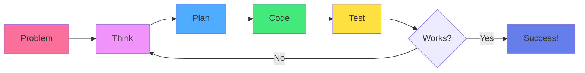

<div align="center">

# 🧠 Chapter 03 · Programming Basics


### *Variables · Logic · Functions · Python / JavaScript*


</div>

---

> [!NOTE]
> *"Code is not magic. It's structured thinking."*

<div align="center">

[](./02-environment-setup.md)
[](./04-data-structures.md)

</div>

<br>

## 🏗️ What Is Programming, Really?

<div align="center">

Programming is **telling a computer what to do**, step by step, in a language it understands.

</div>

<br>

<table>
<tr>
<td align="center" width="33%" bgcolor="#e3f2fd">

🧩  
**Problem Solving**

Breaking challenges into steps

</td>
<td align="center" width="33%" bgcolor="#f3e5f5">

🧠  
**Logical Thinking**

Clear, precise instructions

</td>
<td align="center" width="33%" bgcolor="#fff9c4">

📐  
**Decomposition**

Big ideas → small steps

</td>
</tr>
</table>

<br>

> [!IMPORTANT]
> **Good programmers don't memorize code — they understand logic.**

<br>

<div align="center">



</div>

---

<br>

## 📦 Part 1 · Variables

<div align="center">

### *Giving Names to Things*

A **variable** is a labeled container that stores information.

</div>

<br>

> [!TIP]
> Think of variables like: 📦 A box with a name → containing a value

---

<br>

### Creating Variables

<br>

<details>
<summary><b>🐍 Python Variables</b></summary>

<br>

```python
# Basic variables
age = 30
name = "Sergio"
is_developer = True
height = 1.75

# Multiple assignment
x, y, z = 10, 20, 30

# Same value to multiple variables
a = b = c = 0

# Type checking
print(type(age))        # <class 'int'>
print(type(name))       # <class 'str'>
print(type(is_developer)) # <class 'bool'>
```

</details>

<details>
<summary><b>🟨 JavaScript Variables</b></summary>

<br>

```javascript
// Modern way (ES6+)
let age = 30;              // Can be reassigned
const name = "Sergio";     // Cannot be reassigned
let isDeveloper = true;
let height = 1.75;

// Old way (avoid)
var oldStyle = "Don't use var";

// Multiple assignment
let x = 10, y = 20, z = 30;

// Type checking
console.log(typeof age);         // "number"
console.log(typeof name);        // "string"
console.log(typeof isDeveloper); // "boolean"
```

</details>

---

<br>

### 📊 Data Types

<br>

<div align="center">

| Type | Python Example | JavaScript Example | Description |
|:---|:---|:---|:---|
| **Number** | `age = 30` | `let age = 30;` | Integers & decimals |
| **String** | `name = "Alice"` | `let name = "Alice";` | Text |
| **Boolean** | `is_active = True` | `let isActive = true;` | True/False |
| **List/Array** | `nums = [1, 2, 3]` | `let nums = [1, 2, 3];` | Collections |
| **None/Null** | `value = None` | `let value = null;` | No value |

</div>

---

<br>

### 🏷️ Variable Naming Rules

<br>

<table>
<tr>
<td width="50%" bgcolor="#e8f5e9" valign="top">

### ✅ Good Variable Names:

```python
user_age
total_price
is_logged_in
first_name
max_attempts
```

**Characteristics:**
- Descriptive
- camelCase or snake_case
- Meaningful
- Clear purpose

</td>
<td width="50%" bgcolor="#ffebee" valign="top">

### ❌ Bad Variable Names:

```python
x
data1
tmp
a
thing
asdf
```

**Problems:**
- Too short
- Not descriptive
- Random letters
- No meaning

</td>
</tr>
</table>

<br>

> [!TIP]
> **Naming convention:**
> - Python: `snake_case`
> - JavaScript: `camelCase`

---

<br>

### 🔄 Variable Operations

<br>

<details>
<summary><b>🔢 Arithmetic Operations</b></summary>

<br>

```python
# Python
a = 10
b = 3

print(a + b)   # 13 (Addition)
print(a - b)   # 7  (Subtraction)
print(a * b)   # 30 (Multiplication)
print(a / b)   # 3.333... (Division)
print(a // b)  # 3  (Integer division)
print(a % b)   # 1  (Modulo/remainder)
print(a ** b)  # 1000 (Exponentiation)
```

```javascript
// JavaScript
let a = 10;
let b = 3;

console.log(a + b);   // 13
console.log(a - b);   // 7
console.log(a * b);   // 30
console.log(a / b);   // 3.333...
console.log(a % b);   // 1
console.log(a ** b);  // 1000
```

</details>

<details>
<summary><b>📝 String Operations</b></summary>

<br>

```python
# Python
first = "Hello"
last = "World"

# Concatenation
full = first + " " + last  # "Hello World"

# Repetition
stars = "*" * 10  # "**********"

# String methods
text = "python programming"
print(text.upper())        # "PYTHON PROGRAMMING"
print(text.capitalize())   # "Python programming"
print(text.replace("python", "Python"))  # "Python programming"
print(len(text))          # 18
```

```javascript
// JavaScript
let first = "Hello";
let last = "World";

// Concatenation
let full = first + " " + last;  // "Hello World"

// Template literals (modern)
let greeting = `${first} ${last}!`;  // "Hello World!"

// String methods
let text = "javascript programming";
console.log(text.toUpperCase());     // "JAVASCRIPT PROGRAMMING"
console.log(text.replace("javascript", "JavaScript"));
console.log(text.length);            // 22
```

</details>

---

<br>

## 🔀 Part 2 · Logic & Conditions

<div align="center">

### *Teaching Computers to Decide*

Computers are fast… but not smart. They only understand **true** or **false**.

</div>

---

<br>

### 🎯 If Statements

<br>

<details>
<summary><b>🐍 Python Conditions</b></summary>

<br>

```python
# Simple if
age = 18
if age >= 18:
    print("Access granted")

# If-else
age = 16
if age >= 18:
    print("Access granted")
else:
    print("Access denied")

# If-elif-else
score = 75
if score >= 90:
    print("Grade: A")
elif score >= 80:
    print("Grade: B")
elif score >= 70:
    print("Grade: C")
else:
    print("Grade: F")

# Nested conditions
age = 20
has_license = True

if age >= 18:
    if has_license:
        print("You can drive")
    else:
        print("You need a license")
else:
    print("Too young to drive")
```

</details>

<details>
<summary><b>🟨 JavaScript Conditions</b></summary>

<br>

```javascript
// Simple if
let age = 18;
if (age >= 18) {
  console.log("Access granted");
}

// If-else
age = 16;
if (age >= 18) {
  console.log("Access granted");
} else {
  console.log("Access denied");
}

// If-else if-else
let score = 75;
if (score >= 90) {
  console.log("Grade: A");
} else if (score >= 80) {
  console.log("Grade: B");
} else if (score >= 70) {
  console.log("Grade: C");
} else {
  console.log("Grade: F");
}

// Ternary operator (shorthand)
let result = age >= 18 ? "Adult" : "Minor";

// Nested conditions
let hasLicense = true;

if (age >= 18) {
  if (hasLicense) {
    console.log("You can drive");
  } else {
    console.log("You need a license");
  }
} else {
  console.log("Too young to drive");
}
```

</details>

---

<br>

### 🧮 Comparison Operators

<br>

<div align="center">

| Operator | Meaning | Example | Result |
|:---:|:---|:---|:---:|
| `==` | Equal to | `5 == 5` | True |
| `!=` | Not equal | `5 != 3` | True |
| `>` | Greater than | `5 > 3` | True |
| `<` | Less than | `3 < 5` | True |
| `>=` | Greater or equal | `5 >= 5` | True |
| `<=` | Less or equal | `3 <= 5` | True |

</div>

---

<br>

### 🔗 Logical Operators

<br>

<details>
<summary><b>🧠 AND, OR, NOT</b></summary>

<br>

```python
# Python
age = 20
has_id = True

# AND (both must be true)
if age >= 18 and has_id:
    print("Entry allowed")

# OR (at least one must be true)
is_member = False
has_ticket = True

if is_member or has_ticket:
    print("Welcome!")

# NOT (reverses the boolean)
is_banned = False
if not is_banned:
    print("You can enter")

# Combining operators
if (age >= 18 and has_id) or is_member:
    print("Access granted")
```

```javascript
// JavaScript
let age = 20;
let hasId = true;

// AND (both must be true)
if (age >= 18 && hasId) {
  console.log("Entry allowed");
}

// OR (at least one must be true)
let isMember = false;
let hasTicket = true;

if (isMember || hasTicket) {
  console.log("Welcome!");
}

// NOT (reverses the boolean)
let isBanned = false;
if (!isBanned) {
  console.log("You can enter");
}

// Combining operators
if ((age >= 18 && hasId) || isMember) {
  console.log("Access granted");
}
```

</details>

---

<br>

### 🧠 Mental Model

<br>

```
IF something is true
  → DO this
ELSE IF something else is true
  → DO that
ELSE
  → DO default action
```

<br>

> [!NOTE]
> This is the foundation of all logic in software.

---

<br>

## 🔁 Part 3 · Loops (Repetition)

<div align="center">

### *Doing Things More Than Once*

When you want to repeat an action, you use a **loop**.

</div>

---

<br>

### 🔄 For Loops

<br>

<details>
<summary><b>🐍 Python For Loops</b></summary>

<br>

```python
# Basic for loop
for i in range(5):
    print(i)  # 0, 1, 2, 3, 4

# Range with start and end
for i in range(1, 6):
    print(i)  # 1, 2, 3, 4, 5

# Range with step
for i in range(0, 10, 2):
    print(i)  # 0, 2, 4, 6, 8

# Iterate over list
fruits = ["apple", "banana", "cherry"]
for fruit in fruits:
    print(fruit)

# Enumerate (with index)
for index, fruit in enumerate(fruits):
    print(f"{index}: {fruit}")

# Loop over string
for char in "Python":
    print(char)  # P, y, t, h, o, n
```

</details>

<details>
<summary><b>🟨 JavaScript For Loops</b></summary>

<br>

```javascript
// Classic for loop
for (let i = 0; i < 5; i++) {
  console.log(i);  // 0, 1, 2, 3, 4
}

// Iterate over array
let fruits = ["apple", "banana", "cherry"];

// Traditional for
for (let i = 0; i < fruits.length; i++) {
  console.log(fruits[i]);
}

// For...of (modern)
for (let fruit of fruits) {
  console.log(fruit);
}

// forEach (array method)
fruits.forEach((fruit, index) => {
  console.log(`${index}: ${fruit}`);
});

// For...in (for objects)
let person = {name: "Alice", age: 25};
for (let key in person) {
  console.log(`${key}: ${person[key]}`);
}
```

</details>

---

<br>

### 🔂 While Loops

<br>

<details>
<summary><b>⏰ While Loop Examples</b></summary>

<br>

```python
# Python
count = 0
while count < 5:
    print(count)
    count += 1

# While with break
while True:
    user_input = input("Enter 'quit' to exit: ")
    if user_input == "quit":
        break
    print(f"You entered: {user_input}")

# While with continue
num = 0
while num < 10:
    num += 1
    if num % 2 == 0:
        continue  # Skip even numbers
    print(num)  # Only prints odd numbers
```

```javascript
// JavaScript
let count = 0;
while (count < 5) {
  console.log(count);
  count++;
}

// While with break
while (true) {
  let userInput = prompt("Enter 'quit' to exit:");
  if (userInput === "quit") {
    break;
  }
  console.log(`You entered: ${userInput}`);
}

// Do-while (runs at least once)
let num = 0;
do {
  console.log(num);
  num++;
} while (num < 5);
```

</details>

---

<br>

### 🎯 Loop Control

<br>

<div align="center">

| Keyword | Purpose | Example |
|:---:|:---|:---|
| `break` | Exit loop immediately | Stop when found |
| `continue` | Skip to next iteration | Skip even numbers |
| `pass` (Python) | Do nothing | Placeholder |

</div>

---

<br>

## 🔧 Part 4 · Functions

<div align="center">

### *Reusable Code Blocks*

A **function** is a named block of code that performs a specific task.

</div>

<br>

> [!TIP]
> Think of functions like: 🎁 A gift-wrapped box of instructions you can use again and again

---

<br>

### 📦 Creating Functions

<br>

<details>
<summary><b>🐍 Python Functions</b></summary>

<br>

```python
# Simple function
def greet():
    print("Hello, World!")

greet()  # Call the function

# Function with parameters
def greet_person(name):
    print(f"Hello, {name}!")

greet_person("Alice")  # Hello, Alice!

# Function with return value
def add(a, b):
    return a + b

result = add(5, 3)
print(result)  # 8

# Function with default parameters
def greet_user(name="Guest"):
    print(f"Welcome, {name}!")

greet_user()        # Welcome, Guest!
greet_user("Bob")   # Welcome, Bob!

# Multiple return values
def get_user_info():
    name = "Alice"
    age = 25
    return name, age

user_name, user_age = get_user_info()

# Docstring (function documentation)
def calculate_area(width, height):
    """
    Calculate the area of a rectangle.
    
    Args:
        width: The width of the rectangle
        height: The height of the rectangle
    
    Returns:
        The area as a number
    """
    return width * height
```

</details>

<details>
<summary><b>🟨 JavaScript Functions</b></summary>

<br>

```javascript
// Function declaration
function greet() {
  console.log("Hello, World!");
}

greet();  // Call the function

// Function with parameters
function greetPerson(name) {
  console.log(`Hello, ${name}!`);
}

greetPerson("Alice");  // Hello, Alice!

// Function with return value
function add(a, b) {
  return a + b;
}

let result = add(5, 3);
console.log(result);  // 8

// Arrow function (ES6+)
const multiply = (a, b) => {
  return a * b;
};

// Arrow function (short form)
const square = x => x * x;

// Function with default parameters
function greetUser(name = "Guest") {
  console.log(`Welcome, ${name}!`);
}

greetUser();        // Welcome, Guest!
greetUser("Bob");   // Welcome, Bob!

// Function expression
const divide = function(a, b) {
  return a / b;
};
```

</details>

---

<br>

### 🎯 Function Best Practices

<br>

<table>
<tr>
<td width="50%" bgcolor="#e8f5e9" valign="top">

### ✅ Good Functions:

```python
def calculate_total_price(items, tax_rate):
    """Calculate total with tax."""
    subtotal = sum(items)
    tax = subtotal * tax_rate
    return subtotal + tax

def is_valid_email(email):
    """Check if email format is valid."""
    return "@" in email and "." in email
```

**Characteristics:**
- Single responsibility
- Clear name
- Documented
- Reusable

</td>
<td width="50%" bgcolor="#ffebee" valign="top">

### ❌ Bad Functions:

```python
def do_stuff(x, y, z):
    # What does this do?
    a = x + y
    b = a * z
    c = b - x
    print(c)
    return c, a, b

def f(n):
    # Too short, unclear
    return n * 2
```

**Problems:**
- Unclear purpose
- No documentation
- Too many responsibilities

</td>
</tr>
</table>

---

<br>

## 🧠 Part 5 · Thinking Like a Programmer

<div align="center">

### *The Problem-Solving Framework*

</div>

<br>

### 📋 The 4-Step Process

<br>

<table>
<tr>
<td align="center" width="25%">

**1️⃣**  
**Understand**

What is the problem?

</td>
<td align="center" width="25%">

**2️⃣**  
**Plan**

Break it into steps

</td>
<td align="center" width="25%">

**3️⃣**  
**Code**

Write the solution

</td>
<td align="center" width="25%">

**4️⃣**  
**Test**

Verify it works

</td>
</tr>
</table>

<br>

### 🎯 Problem-Solving Example

<br>

<details>
<summary><b>💡 Example: Find the Largest Number</b></summary>

<br>

**1️⃣ Understand:**
- Input: List of numbers
- Output: The largest number

**2️⃣ Plan:**
1. Start with first number as max
2. Compare each number to max
3. If number > max, update max
4. Return max

**3️⃣ Code:**

```python
def find_largest(numbers):
    max_num = numbers[0]
    
    for num in numbers:
        if num > max_num:
            max_num = num
    
    return max_num

# Test
nums = [3, 7, 2, 9, 1]
print(find_largest(nums))  # 9
```

**4️⃣ Test:**
- [3, 7, 2, 9, 1] → 9 ✅
- [10] → 10 ✅
- [5, 5, 5] → 5 ✅

</details>

---

<br>

### 🔍 Debugging Tips

<br>

<details>
<summary><b>🐛 How to Find and Fix Bugs</b></summary>

<br>

```python
# Use print statements
def calculate_average(numbers):
    print(f"Input: {numbers}")  # Debug
    
    total = sum(numbers)
    print(f"Total: {total}")  # Debug
    
    count = len(numbers)
    print(f"Count: {count}")  # Debug
    
    average = total / count
    print(f"Average: {average}")  # Debug
    
    return average

# Test with known values
result = calculate_average([10, 20, 30])
print(f"Final result: {result}")
```

**Debugging strategies:**
1. Read error messages carefully
2. Use print() to check values
3. Test with simple inputs first
4. Check your assumptions
5. Google the error message
6. Ask AI for help

</details>

---

<br>

## 🤖 AI Tip · Learn Faster, Not Lazier

<br>

### ✅ Use AI to:

<table>
<tr>
<td width="50%" bgcolor="#e8f5e9" valign="top">

#### 📚 Learning:

- Ask for explanations
- Generate practice examples
- Clarify confusing concepts
- Get alternative approaches
- Learn best practices

</td>
<td width="50%" bgcolor="#e3f2fd" valign="top">

#### 🐛 Debugging:

- Understand error messages
- Find bugs in code
- Suggest improvements
- Explain why code works
- Compare different solutions

</td>
</tr>
</table>

<br>

### ❌ Don't Use AI to:

- Copy code without understanding
- Skip learning fundamentals
- Avoid thinking through problems
- Blindly trust without testing

<br>

> [!IMPORTANT]
> **The Golden Rule:**  
> AI accelerates learning — it does not replace thinking.

---

<br>

## 🎯 Mission · Day 03

<div align="center">

### 💪 Time to practice

</div>

<br>

### Core Tasks:

- [ ] 📝 **Create variables** — Name, age, is_student
- [ ] 🔀 **Write condition** — Check if age > 18
- [ ] 🔁 **Create loop** — Print numbers 1 to 10
- [ ] 🔧 **Write function** — That adds two numbers
- [ ] 🧪 **Test your code** — Run and verify
- [ ] 🤖 **Ask AI** — Explain why your code works

<br>

<details>
<summary><b>⭐ Bonus Challenges</b></summary>

<br>

- [ ] 📊 Create a grade calculator function
- [ ] 🔢 Write FizzBuzz (print "Fizz" for multiples of 3, "Buzz" for 5, "FizzBuzz" for both)
- [ ] 🎯 Rewrite same logic in both Python AND JavaScript
- [ ] 🔍 Find and fix a bug in someone else's code
- [ ] 📝 Write a function with documentation
- [ ] 🧮 Create a simple calculator function
- [ ] 🎲 Make a number guessing game

</details>

---

<br>

## 📚 Quick Reference

<br>

### Python Cheat Sheet

<br>

<details>
<summary><b>🐍 Python Essentials</b></summary>

<br>

```python
# Variables
name = "Alice"
age = 25

# Conditions
if age >= 18:
    print("Adult")
elif age >= 13:
    print("Teen")
else:
    print("Child")

# Loops
for i in range(5):
    print(i)

while count < 10:
    count += 1

# Functions
def greet(name):
    return f"Hello, {name}!"

# Lists
fruits = ["apple", "banana"]
fruits.append("cherry")

# Dictionaries
person = {"name": "Alice", "age": 25}
```

</details>

---

<br>

### JavaScript Cheat Sheet

<br>

<details>
<summary><b>🟨 JavaScript Essentials</b></summary>

<br>

```javascript
// Variables
let name = "Alice";
const age = 25;

// Conditions
if (age >= 18) {
  console.log("Adult");
} else if (age >= 13) {
  console.log("Teen");
} else {
  console.log("Child");
}

// Loops
for (let i = 0; i < 5; i++) {
  console.log(i);
}

while (count < 10) {
  count++;
}

// Functions
function greet(name) {
  return `Hello, ${name}!`;
}

const add = (a, b) => a + b;

// Arrays
let fruits = ["apple", "banana"];
fruits.push("cherry");

// Objects
let person = {name: "Alice", age: 25};
```

</details>

---

<br>

<div align="center">

## 🏆 Achievement Unlocked

### **The Thinker**

<br>

**You now understand:**
- Variables and data types
- Conditions and logic
- Loops and iteration
- Functions and reusability
- Problem-solving process
- Debugging basics

<br>

*Code is no longer intimidating.*  
**It's just structured thought.**

<br>


</div>

---

<br>

<div align="center">

### 🎓 Pro Tip

> "The best way to learn programming is not to read about it.  
> It's to write code, break things, fix them, and repeat.  
> Every error is a lesson in disguise."

</div>

---

<br>

<div align="center">

[](./04-data-structures.md)

</div>

<br>
