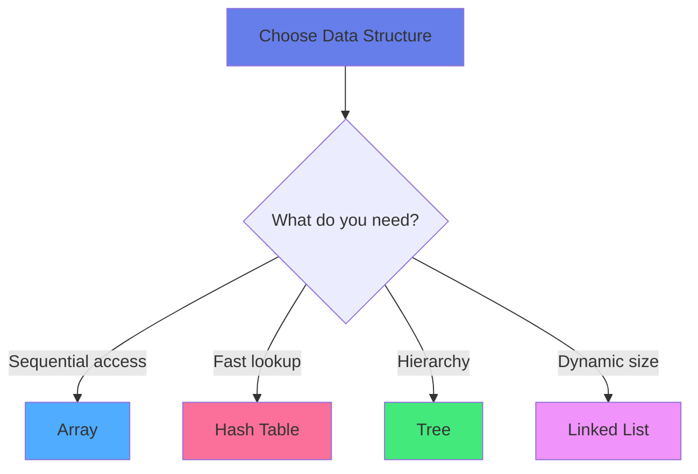
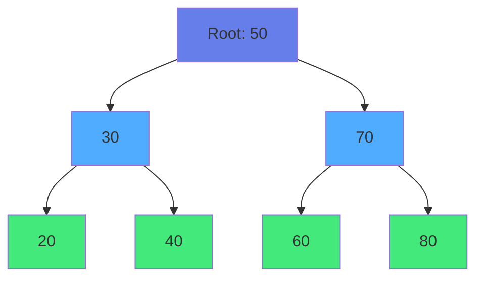

<div align="center">

# 🧱 Chapter 04 · Data Structures


### *Arrays · Trees · Hash Tables · Big-O Notation*


</div>

---

> [!NOTE]
> *"Good code works. Great code scales."*

<div align="center">

[](./03-programming-basics.md)
[](./05-version-control.md)

</div>

<br>

## 🧠 Why Data Structures Matter

<div align="center">

Programs don't just **do things**.  
They **store, organize, and retrieve data**.

</div>

<br>

<table>
<tr>
<td align="center" width="33%" bgcolor="#e3f2fd">

🚀  
**Performance**

Run faster with right structure

</td>
<td align="center" width="33%" bgcolor="#f3e5f5">

📈  
**Scalability**

Handle millions of records

</td>
<td align="center" width="33%" bgcolor="#fff9c4">

🧠  
**Clarity**

Code that makes sense

</td>
</tr>
</table>

<br>

> [!IMPORTANT]
> Choosing the right data structure often matters more than the language itself.

<br>

<div align="center">



</div>

---

<br>

## 📦 Part 1 · Arrays

<div align="center">

### *Ordered Collections*

An **array** is a list of elements stored in contiguous memory.

</div>

<br>

> [!TIP]
> Think of arrays like: 🧺 A row of numbered boxes

---

<br>

### Basic Array Operations

<br>

<details>
<summary><b>🐍 Python Arrays (Lists)</b></summary>

<br>

```python
# Creating arrays
numbers = [10, 20, 30, 40, 50]
names = ["Alice", "Bob", "Charlie"]
mixed = [1, "hello", True, 3.14]

# Accessing elements
first = numbers[0]        # 10
last = numbers[-1]        # 50
middle = numbers[2]       # 30

# Slicing
subset = numbers[1:4]     # [20, 30, 40]
first_three = numbers[:3] # [10, 20, 30]

# Modifying
numbers[0] = 15           # Change value
numbers.append(60)        # Add to end
numbers.insert(0, 5)      # Insert at index
numbers.remove(30)        # Remove value
popped = numbers.pop()    # Remove last

# Common operations
length = len(numbers)
total = sum(numbers)
maximum = max(numbers)

# Iteration
for num in numbers:
    print(num)

# List comprehension
squares = [x**2 for x in numbers]
evens = [x for x in numbers if x % 2 == 0]
```

</details>

<details>
<summary><b>🟨 JavaScript Arrays</b></summary>

<br>

```javascript
// Creating arrays
let numbers = [10, 20, 30, 40, 50];
let names = ["Alice", "Bob", "Charlie"];

// Accessing elements
let first = numbers[0];                    // 10
let last = numbers[numbers.length - 1];    // 50

// Slicing
let subset = numbers.slice(1, 4);          // [20, 30, 40]

// Modifying
numbers[0] = 15;              // Change value
numbers.push(60);             // Add to end
numbers.unshift(5);           // Add to beginning
let popped = numbers.pop();   // Remove last
let shifted = numbers.shift(); // Remove first

// Array methods
let squares = numbers.map(x => x ** 2);
let evens = numbers.filter(x => x % 2 === 0);
let sum = numbers.reduce((acc, x) => acc + x, 0);

// Iteration
numbers.forEach(num => console.log(num));
```

</details>

---

<br>

### 📊 Array Time Complexities

<br>

<div align="center">

| Operation | Time Complexity | Notes |
|:---|:---:|:---|
| Access by index | **O(1)** ⚡ | Direct memory access |
| Search (unsorted) | **O(n)** 🐌 | Must check each element |
| Append (end) | **O(1)** ⚡ | Simple addition |
| Insert (beginning) | **O(n)** 🐌 | Must shift elements |
| Delete | **O(n)** 🐌 | Must shift elements |

</div>

---

<br>

### 🧠 When to Use Arrays

<br>

<table>
<tr>
<td width="50%" bgcolor="#e8f5e9" valign="top">

### ✅ Arrays are Great For:

- **Fast access** by index
- **Sequential iteration**
- **Known/fixed size** data
- **Cache-friendly** operations
- Simple data storage

</td>
<td width="50%" bgcolor="#ffebee" valign="top">

### ❌ Arrays are Bad For:

- **Frequent insertions** in middle
- **Unknown size** (in some languages)
- **Frequent deletions**
- Sparse data

</td>
</tr>
</table>

---

<br>

## 🌳 Part 2 · Trees

<div align="center">

### *Hierarchical Thinking*

A **tree** organizes data in a parent → child structure.

</div>

<br>

<div align="center">



</div>

<br>

```
        50 (Root)
       /         \
     30           70
    /  \         /  \
   20   40      60   80
 (Leaves)
```

---

<br>

### 🧠 Tree Vocabulary

<br>

<div align="center">

| Term | Meaning |
|:---|:---|
| 🌱 **Root** | Top element (no parent) |
| 🌿 **Node** | Each element in tree |
| 🍃 **Leaf** | Node with no children |
| 👨‍👦 **Parent** | Node with children |
| 👶 **Child** | Node under parent |
| 🌲 **Height** | Longest path to leaf |

</div>

---

<br>

### 🎯 Binary Search Tree

<br>

> [!TIP]
> **BST Rule:** Left < Parent < Right

<br>

<details>
<summary><b>🐍 Python BST Implementation</b></summary>

<br>

```python
class TreeNode:
    def __init__(self, value):
        self.value = value
        self.left = None
        self.right = None

class BinarySearchTree:
    def __init__(self):
        self.root = None
    
    def insert(self, value):
        if not self.root:
            self.root = TreeNode(value)
        else:
            self._insert_recursive(self.root, value)
    
    def _insert_recursive(self, node, value):
        if value < node.value:
            if node.left is None:
                node.left = TreeNode(value)
            else:
                self._insert_recursive(node.left, value)
        else:
            if node.right is None:
                node.right = TreeNode(value)
            else:
                self._insert_recursive(node.right, value)
    
    def search(self, value):
        return self._search_recursive(self.root, value)
    
    def _search_recursive(self, node, value):
        if node is None:
            return False
        if node.value == value:
            return True
        elif value < node.value:
            return self._search_recursive(node.left, value)
        else:
            return self._search_recursive(node.right, value)

# Usage
bst = BinarySearchTree()
bst.insert(50)
bst.insert(30)
bst.insert(70)
print(bst.search(30))  # True
```

</details>

---

<br>

### 💡 Real-World Trees

<br>

<table>
<tr>
<td align="center" width="33%">

📁  
**File Systems**

Folders → Subfolders

</td>
<td align="center" width="33%">

🌐  
**HTML DOM**

Web page structure

</td>
<td align="center" width="33%">

🏢  
**Organization**

Company hierarchy

</td>
</tr>
</table>

---

<br>

## 🗃️ Part 3 · Hash Tables

<div align="center">

### *Lightning-Fast Lookups*

A **hash table** stores key-value pairs with O(1) average access.

</div>

<br>

> [!TIP]
> Think of it like: 📇 A magic filing cabinet where you find anything instantly

---

<br>

<details>
<summary><b>🐍 Python Dictionaries</b></summary>

<br>

```python
# Creating hash tables
user = {
    "name": "Alice",
    "age": 28,
    "email": "alice@email.com"
}

# Accessing
name = user["name"]           # "Alice"
age = user.get("age")         # 28

# Adding/Updating
user["phone"] = "555-1234"
user["age"] = 29

# Deleting
del user["phone"]

# Checking
if "name" in user:
    print("Found")

# Iteration
for key, value in user.items():
    print(f"{key}: {value}")

# Dictionary comprehension
squares = {x: x**2 for x in range(5)}
```

</details>

<details>
<summary><b>🟨 JavaScript Objects</b></summary>

<br>

```javascript
// Creating objects
let user = {
    name: "Alice",
    age: 28,
    email: "alice@email.com"
};

// Accessing
let name = user.name;         // "Alice"
let age = user["age"];        // 28

// Adding/Updating
user.phone = "555-1234";
user["age"] = 29;

// Deleting
delete user.phone;

// Checking
if ("name" in user) {
    console.log("Found");
}

// Iteration
for (let key in user) {
    console.log(`${key}: ${user[key]}`);
}

Object.keys(user);      // ["name", "age", "email"]
Object.values(user);    // ["Alice", 29, "alice@email.com"]
```

</details>

---

<br>

### ⚡ Hash Table Performance

<br>

<div align="center">

| Operation | Average | Why |
|:---|:---:|:---|
| **Lookup** | O(1) ⚡ | Direct hash access |
| **Insert** | O(1) ⚡ | Hash to index |
| **Delete** | O(1) ⚡ | Find and remove |

</div>

<br>

> [!IMPORTANT]
> **Perfect for:** Caching, counting, fast lookups by key

---

<br>

## ⏱️ Part 4 · Big-O Notation

<div align="center">

### *How Fast Is Your Code?*

**Big-O** describes how performance grows as input size increases.

</div>

<br>

> [!NOTE]
> It's about **scaling**, not exact time.

---

<br>

### 📊 Common Complexities

<br>

<div align="center">

| Big-O | Name | Example | Speed |
|:---:|:---|:---|:---:|
| **O(1)** | Constant | Array access | ⚡⚡⚡ |
| **O(log n)** | Logarithmic | Binary search | ⚡⚡ |
| **O(n)** | Linear | Loop | ⚡ |
| **O(n log n)** | Linearithmic | Merge sort | 🔶 |
| **O(n²)** | Quadratic | Nested loops | 🐌 |
| **O(2ⁿ)** | Exponential | Bad recursion | 🐌🐌🐌 |

</div>

---

<br>

### 🧪 Big-O Examples

<br>

<details>
<summary><b>⚡ O(1) - Constant</b></summary>

<br>

```python
# Array access
def get_first(arr):
    return arr[0]  # Always 1 operation
```

**Scaling:** Same time regardless of size ✨

</details>

<details>
<summary><b>📈 O(n) - Linear</b></summary>

<br>

```python
# Loop through array
def print_all(arr):
    for item in arr:
        print(item)  # n operations
```

**Scaling:** Double input → Double time

</details>

<details>
<summary><b>🔍 O(log n) - Logarithmic</b></summary>

<br>

```python
# Binary search
def binary_search(arr, target):
    left, right = 0, len(arr) - 1
    
    while left <= right:
        mid = (left + right) // 2
        
        if arr[mid] == target:
            return mid
        elif arr[mid] < target:
            left = mid + 1
        else:
            right = mid - 1
    
    return -1
```

**Scaling:** Halves problem each step 🚀

</details>

<details>
<summary><b>🐌 O(n²) - Quadratic</b></summary>

<br>

```python
# Nested loops
def print_pairs(arr):
    for i in arr:
        for j in arr:
            print(i, j)  # n × n operations
```

**Scaling:** Double input → 4× time ⚠️

> [!WARNING]
> **This doesn't scale!**

</details>

---

<br>

### 📈 Visual Comparison

<br>

```
For n = 100 items:

O(1)      →        1 operation
O(log n)  →        7 operations
O(n)      →      100 operations
O(n log n) →     664 operations
O(n²)     →   10,000 operations
O(2ⁿ)     → 1,267,650,600,228,229,401,496,703,205,376 operations
```

---

<br>

### 🧠 Big-O Thinking

<br>

> [!TIP]
> **Ask yourself:**
> - 📈 What if my data grows 10×?
> - 🔄 Am I looping inside another loop?
> - 🧱 Is there a better structure?

<br>

<table>
<tr>
<td width="50%" bgcolor="#e8f5e9" valign="top">

### ✅ Good Complexity:

```python
# O(n) - Single loop
def sum_array(arr):
    total = 0
    for num in arr:
        total += num
    return total
```

</td>
<td width="50%" bgcolor="#ffebee" valign="top">

### ❌ Bad Complexity:

```python
# O(n²) - Nested loops
def has_duplicate(arr):
    for i in range(len(arr)):
        for j in range(i+1, len(arr)):
            if arr[i] == arr[j]:
                return True
    return False
```

</td>
</tr>
</table>

---

<br>

## 🤖 AI Tip · Data Structures

<br>

### ✅ Smart Prompts:

<table>
<tr>
<td width="50%">

```
💡 "What is the Big-O of this code?"
```
```
💡 "Should I use array or hash table?"
```

</td>
<td width="50%">

```
💡 "Explain binary search tree simply"
```
```
💡 "Optimize this algorithm"
```

</td>
</tr>
</table>

<br>

### 🎯 AI Can Help With:

| Area | Application |
|:---|:---|
| ✅ Complexity analysis | Calculate Big-O |
| ✅ Structure selection | Choose best structure |
| ✅ Optimization | Improve efficiency |
| ✅ Visualization | Explain concepts |

---

<br>

## 🎯 Mission · Day 04

<div align="center">

### ⚔️ Time to level up

</div>

<br>

### Core Tasks:

- [ ] 📦 **Create array** — 5 numbers, print each
- [ ] 🌳 **Draw tree** — On paper (root + children)
- [ ] ⏱️ **Identify Big-O** — Of a simple loop
- [ ] 🗃️ **Use hash table** — Store key-value pairs
- [ ] 🤖 **Ask AI** — Why O(n²) is dangerous
- [ ] 🧠 **Compare** — Array vs Hash Table

<br>

<details>
<summary><b>⭐ Bonus Challenges</b></summary>

<br>

- [ ] 🔧 Implement binary search tree
- [ ] ⚡ Optimize nested loop
- [ ] 📝 Explain O(n) vs O(log n)
- [ ] 🎯 Solve problem with hash table
- [ ] 📊 Create complexity comparison chart

</details>

---

<br>

<div align="center">

## 🏆 Achievement Unlocked

### **The Architect**

<br>

**You now understand:**
- Arrays and their operations
- Trees for hierarchical data
- Hash tables for fast lookups
- Big-O notation
- How to choose structures

<br>

*You're no longer just writing code—*  
**You're designing efficient systems.**

<br>


</div>

---

<br>

<div align="center">

### 🎓 Pro Tip

> "Premature optimization is the root of all evil.  
> But understanding Big-O helps you avoid  
> writing slow code in the first place."

</div>

---

<br>

<div align="center">

[](./05-version-control.md)

</div>

<br>
