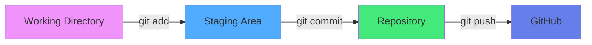
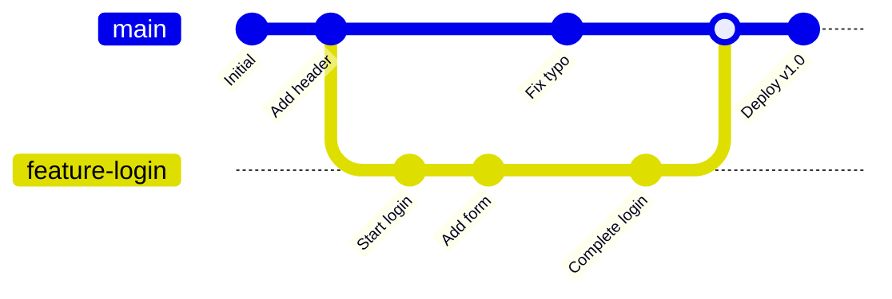
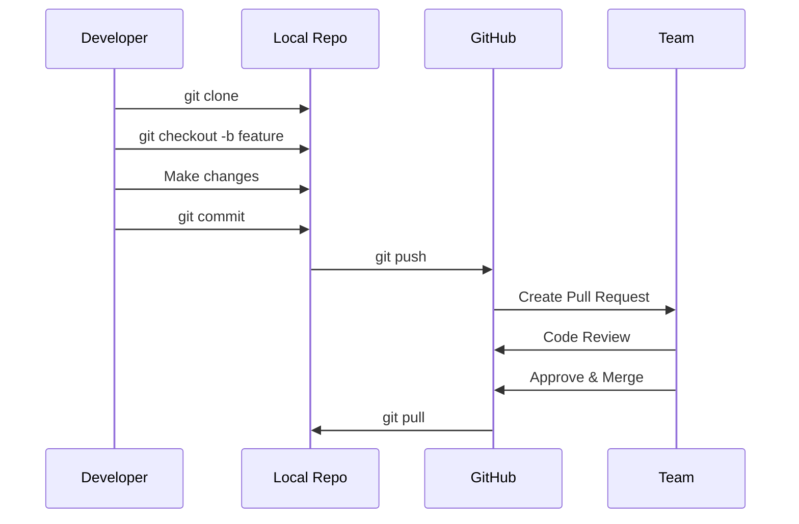

<div align="center">

# 🌿 Chapter 05 · Version Control


### *Git Branching · GitHub Collaboration · Team Workflows*


</div>

---

> [!NOTE]
> *"Code without version control is like writing without an undo button."*

<div align="center">

[](./04-data-structures.md)
[](./06-web-dev-basics.md)

</div>

<br>

## 🕰️ Why Version Control Matters

<div align="center">

Imagine working on a project and:

</div>

<br>

<table>
<tr>
<td width="50%" bgcolor="#ffebee" valign="top">

### ❌ Without Version Control:

- Accidentally deleting important code
- Can't remember what changed yesterday
- Breaking everything with no way back
- Team members overwrite each other's work
- No backup of previous versions
- Fear of experimenting

</td>
<td width="50%" bgcolor="#e8f5e9" valign="top">

### ✅ With Version Control:

- Complete history of all changes
- Ability to revert to any point
- Safe experimentation with branches
- Seamless team collaboration
- Cloud backup of your code
- Confidence to refactor

</td>
</tr>
</table>

<br>

<div align="center">

**Version control is like having:**

</div>

<br>

<table>
<tr>
<td align="center" width="33%" bgcolor="#e3f2fd">

⏪  
**Time Machine**

Go back to any point in history

</td>
<td align="center" width="33%" bgcolor="#f3e5f5">

📚  
**Complete History**

Every change documented

</td>
<td align="center" width="33%" bgcolor="#fff9c4">

🤝  
**Team System**

Collaborate without chaos

</td>
</tr>
</table>

<br>

> [!IMPORTANT]
> **Professional developers never code without version control.**

---

<br>

## 🎯 Part 1 · Git Basics

<div align="center">

### *What Is Git?*

**Git** is a system that tracks every change you make to your code.

</div>

<br>

<div align="center">



</div>

<br>

> [!TIP]
> Think of Git as: 📸 Taking snapshots of your project over time

---

<br>

### Core Concepts

<br>

<div align="center">

| Concept | What It Means | Example |
|:---:|:---|:---|
| 📂 **Repository** | Your project folder tracked by Git | `my-project/.git/` |
| 💾 **Commit** | A saved snapshot of your code | "Add login feature" |
| 📝 **Staging** | Preparing files to be committed | Selected files ready to commit |
| 🌿 **Branch** | A parallel version of your code | `feature-payment` |
| 🔀 **Merge** | Combining branches | Merge feature into main |
| 📍 **HEAD** | Current position in history | Points to latest commit |

</div>

---

<br>

### 🔧 Essential Git Commands

<br>

<details>
<summary><b>🚀 Getting Started</b></summary>

<br>

```bash
# Initialize a new Git repository
git init

# Configure your identity (first time only)
git config --global user.name "Your Name"
git config --global user.email "your.email@example.com"

# Check Git configuration
git config --list

# Get help on any command
git help <command>
git <command> --help
```

</details>

<details>
<summary><b>📊 Checking Status</b></summary>

<br>

```bash
# Check status of your files
git status

# Short status output
git status -s

# Show differences
git diff              # Changes not staged
git diff --staged     # Changes staged for commit
git diff HEAD         # All changes since last commit
```

</details>

<details>
<summary><b>💾 Staging and Committing</b></summary>

<br>

```bash
# Stage a specific file
git add filename.py

# Stage all files
git add .

# Stage all files with a specific extension
git add *.js

# Stage all modified and deleted files (not new files)
git add -u

# Interactive staging
git add -p

# Commit staged changes
git commit -m "Add user authentication"

# Commit with longer message (opens editor)
git commit

# Stage and commit in one command
git commit -am "Quick fix"

# Amend last commit
git commit --amend -m "Better commit message"
```

</details>

<details>
<summary><b>📜 Viewing History</b></summary>

<br>

```bash
# View commit history
git log

# Compact log (one line per commit)
git log --oneline

# Graphical representation
git log --graph --oneline --all

# Show commits by author
git log --author="Your Name"

# Show commits in last week
git log --since="1 week ago"

# Show specific file history
git log -- filename.py

# Show commit details
git show <commit-hash>
```

</details>

---

<br>

### 🧠 Mental Model

<br>

<div align="center">

```
Working Directory → Staging Area → Local Repository → Remote Repository
     (edit)           (git add)      (git commit)        (git push)
```

</div>

<br>

<details>
<summary><b>📝 Example Workflow</b></summary>

<br>

```bash
# 1. Make changes to files
echo "console.log('Hello');" > app.js

# 2. Check what changed
git status

# 3. Stage the changes
git add app.js

# 4. Commit with message
git commit -m "Add hello message to app.js"

# 5. Push to GitHub
git push origin main
```

</details>

---

<br>

## 🌿 Part 2 · Git Branching

<div align="center">

### *Parallel Universes for Your Code*

A **branch** lets you work on new features without affecting the main code.

</div>

<br>

<div align="center">



</div>

<br>

> [!TIP]
> Think of branches like: 🌳 Growing a new branch on a tree — the trunk stays stable

---

<br>

### Why Branches Matter

<br>

<table>
<tr>
<td align="center" width="25%">

🧪  
**Experiment Safely**

Try new ideas without risk

</td>
<td align="center" width="25%">

⚡  
**Parallel Work**

Multiple features at once

</td>
<td align="center" width="25%">

👀  
**Code Review**

Review before merging

</td>
<td align="center" width="25%">

🐛  
**Isolate Fixes**

Fix bugs separately

</td>
</tr>
</table>

---

<br>

### 🔧 Branch Commands

<br>

<details>
<summary><b>🌱 Creating and Switching Branches</b></summary>

<br>

```bash
# Create a new branch
git branch feature-login

# Switch to a branch
git checkout feature-login

# Create and switch in one command (old way)
git checkout -b feature-payment

# Create and switch (modern way)
git switch -c feature-payment

# Switch to existing branch
git switch main

# List all branches
git branch

# List all branches (including remote)
git branch -a

# List branches with last commit
git branch -v

# Delete a branch
git branch -d feature-login

# Force delete (if not merged)
git branch -D feature-login

# Rename current branch
git branch -m new-name
```

</details>

<details>
<summary><b>🔀 Merging Branches</b></summary>

<br>

```bash
# Merge a branch into current branch
git checkout main
git merge feature-login

# Merge without fast-forward (keeps history)
git merge --no-ff feature-login

# Abort a merge
git merge --abort

# Merge with custom message
git merge feature-login -m "Merge login feature"
```

</details>

---

<br>

### 📊 Branching Workflow Visualization

<br>

```
main     ───●───●───────●───────●───●
             \         /         /
feature-login ●───●───●         /
                      \        /
feature-payment        ●───●──●
```

---

<br>

### 🧠 Branching Strategy

<br>

<div align="center">

| Branch Type | Purpose | Example |
|:---:|:---|:---|
| 🌱 `main` | Production-ready code | Always stable |
| 🔨 `develop` | Integration branch | Merge features here first |
| ✨ `feature/*` | New features | `feature/user-profile` |
| 🐛 `bugfix/*` | Bug fixes | `bugfix/login-error` |
| 🚨 `hotfix/*` | Urgent production fixes | `hotfix/security-patch` |
| 🔬 `experiment/*` | Experimental features | `experiment/new-ui` |

</div>

---

<br>

## 🤝 Part 3 · GitHub Collaboration

<div align="center">

### *From Local to Cloud*

**GitHub** is where you store your Git repositories online.

</div>

<br>

<table>
<tr>
<td align="center" width="25%">

☁️  
**Cloud Backup**

Never lose your code

</td>
<td align="center" width="25%">

👥  
**Team Collaboration**

Work together seamlessly

</td>
<td align="center" width="25%">

📝  
**Code Review**

Review before merging

</td>
<td align="center" width="25%">

🌍  
**Open Source**

Contribute globally

</td>
</tr>
</table>

---

<br>

### 🔧 Connecting to GitHub

<br>

<details>
<summary><b>🔗 Remote Repository Setup</b></summary>

<br>

```bash
# Add remote repository
git remote add origin https://github.com/username/project.git

# Or with SSH
git remote add origin git@github.com:username/project.git

# View remote repositories
git remote -v

# Change remote URL
git remote set-url origin https://github.com/username/new-repo.git

# Remove remote
git remote remove origin

# Rename remote
git remote rename origin upstream
```

</details>

<details>
<summary><b>📤 Pushing and Pulling</b></summary>

<br>

```bash
# Push to GitHub (first time)
git push -u origin main

# Push subsequent changes
git push

# Push a specific branch
git push origin feature-branch

# Pull latest changes
git pull origin main

# Pull with rebase (cleaner history)
git pull --rebase origin main

# Fetch changes (without merging)
git fetch origin

# Fetch all branches
git fetch --all
```

</details>

<details>
<summary><b>📥 Cloning Repositories</b></summary>

<br>

```bash
# Clone a repository
git clone https://github.com/username/project.git

# Clone into specific folder
git clone https://github.com/username/project.git my-folder

# Clone specific branch
git clone -b develop https://github.com/username/project.git

# Clone with SSH
git clone git@github.com:username/project.git
```

</details>

---

<br>

### 🔄 Collaboration Workflow

<br>

<div align="center">



</div>

---

<br>

#### Step-by-Step Process

<br>

<details>
<summary><b>1️⃣ Fork & Clone</b></summary>

<br>

```bash
# Fork the repository on GitHub (click Fork button)

# Clone your fork
git clone https://github.com/YOUR-USERNAME/project.git
cd project

# Add upstream remote
git remote add upstream https://github.com/ORIGINAL-OWNER/project.git
```

</details>

<details>
<summary><b>2️⃣ Create a Branch</b></summary>

<br>

```bash
# Update your main branch
git checkout main
git pull upstream main

# Create feature branch
git checkout -b feature-awesome-feature
```

</details>

<details>
<summary><b>3️⃣ Make Changes & Commit</b></summary>

<br>

```bash
# Make your changes
# ...

# Stage and commit
git add .
git commit -m "feat: add awesome feature"

# Or multiple commits
git commit -m "feat: add feature skeleton"
git commit -m "test: add feature tests"
git commit -m "docs: update README"
```

</details>

<details>
<summary><b>4️⃣ Push to GitHub</b></summary>

<br>

```bash
# Push your branch
git push origin feature-awesome-feature

# Or set upstream and push
git push -u origin feature-awesome-feature
```

</details>

<details>
<summary><b>5️⃣ Create Pull Request</b></summary>

<br>

1. Go to GitHub repository
2. Click "**Compare & pull request**"
3. Fill in PR template:
   - Clear title
   - Detailed description
   - Link related issues
   - Add screenshots if UI changes
4. Request reviewers
5. Wait for feedback

</details>

---

<br>

### 🎯 Pull Request Best Practices

<br>

<table>
<tr>
<td width="50%" bgcolor="#e8f5e9" valign="top">

### ✅ Good PR:

**Title:**
```
feat: Add user authentication with JWT
```

**Description:**
```markdown
## What
Implements JWT-based authentication

## Why
Needed for secure API access

## How
- Added login endpoint
- Implemented JWT middleware
- Added tests

## Testing
- Unit tests pass
- Tested manually with Postman

Closes #123
```

**Characteristics:**
- Clear title and description
- Small, focused changes (<400 lines)
- Linked to an issue
- Tests included
- Screenshots for UI changes

</td>
<td width="50%" bgcolor="#ffebee" valign="top">

### ❌ Bad PR:

**Title:**
```
Fixed stuff
```

**Description:**
```
Made some changes
```

**Problems:**
- Vague title
- No description
- 1000+ lines changed
- Mixes multiple features
- No tests
- No context

**Example issues:**
```
- "Update code"
- "Fix bug"
- "Changes"
- Empty description
- Mixing features + refactoring
```

</td>
</tr>
</table>

---

<br>

## 🛡️ Part 4 · Best Practices

<br>

### 💬 Commit Messages

<br>

<table>
<tr>
<td width="50%" bgcolor="#e8f5e9" valign="top">

#### ✅ Good Commit Messages:

```bash
git commit -m "feat: add user authentication endpoint"

git commit -m "fix: resolve login bug for mobile users"

git commit -m "docs: update README with setup instructions"

git commit -m "refactor: simplify payment processing logic"

git commit -m "test: add unit tests for user service"
```

</td>
<td width="50%" bgcolor="#ffebee" valign="top">

#### ❌ Bad Commit Messages:

```bash
git commit -m "changes"

git commit -m "fix"

git commit -m "asdf"

git commit -m "updates"

git commit -m "."
```

</td>
</tr>
</table>

---

<br>

### 📋 Commit Message Format

<br>

<details>
<summary><b>📝 Conventional Commits</b></summary>

<br>

```
<type>(<scope>): <subject>

<body>

<footer>
```

**Types:**
- `feat:` new feature
- `fix:` bug fix
- `docs:` documentation only
- `style:` formatting, missing semicolons
- `refactor:` code restructuring
- `test:` adding tests
- `chore:` maintenance tasks
- `perf:` performance improvements

**Examples:**

```bash
feat(auth): add JWT authentication

Implemented JWT-based authentication for API endpoints.
Added login and refresh token endpoints.

Closes #123
```

```bash
fix(ui): resolve mobile navigation bug

Fixed navigation menu not closing on mobile devices
when clicking outside the menu area.

Fixes #456
```

</details>

---

<br>

### 🚫 What NOT to Commit

<br>

<details>
<summary><b>📄 Creating .gitignore</b></summary>

<br>

```bash
# Create .gitignore file
touch .gitignore
```

**Common patterns:**

```gitignore
# Dependencies
node_modules/
venv/
env/

# Environment variables
.env
.env.local
.env.*.local

# Build outputs
dist/
build/
*.pyc
__pycache__/

# Logs
*.log
logs/

# IDE files
.vscode/
.idea/
*.swp
*.swo

# OS files
.DS_Store
Thumbs.db

# Database files
*.sqlite
*.db

# Secrets
secrets.json
credentials.json
*.pem
*.key
```

</details>

---

<br>

### 🔐 Security Best Practices

<br>

> [!WARNING]
> **Never commit:**
> - API keys
> - Passwords
> - Private keys
> - Environment variables
> - Database credentials

<br>

<details>
<summary><b>🛡️ What to Do If You Committed Secrets</b></summary>

<br>

```bash
# Remove file from Git history (use carefully!)
git filter-branch --force --index-filter \
  "git rm --cached --ignore-unmatch path/to/secret/file" \
  --prune-empty --tag-name-filter cat -- --all

# Or use BFG Repo-Cleaner (easier)
bfg --delete-files secrets.json

# Force push (rewrites history)
git push origin --force --all

# IMPORTANT: Rotate the exposed credentials immediately!
```

**Better approach: Prevent it**
- Use `.gitignore`
- Use environment variables
- Use secret management tools
- Enable GitHub secret scanning

</details>

---

<br>

## 🔧 Part 5 · Advanced Git

<br>

### 🔄 Stashing Changes

<br>

<details>
<summary><b>💾 Temporary Storage</b></summary>

<br>

```bash
# Save changes without committing
git stash

# Stash with message
git stash save "WIP: working on feature"

# List stashes
git stash list

# Apply most recent stash
git stash apply

# Apply and remove from stash
git stash pop

# Apply specific stash
git stash apply stash@{2}

# Delete stash
git stash drop stash@{0}

# Clear all stashes
git stash clear
```

</details>

---

<br>

### ⏪ Undoing Changes

<br>

<details>
<summary><b>🔙 Various Undo Methods</b></summary>

<br>

```bash
# Discard changes in working directory
git checkout -- filename.py
git restore filename.py  # Modern way

# Unstage file
git reset HEAD filename.py
git restore --staged filename.py  # Modern way

# Undo last commit (keep changes)
git reset --soft HEAD~1

# Undo last commit (unstage changes)
git reset HEAD~1

# Undo last commit (discard changes)
git reset --hard HEAD~1

# Revert a commit (creates new commit)
git revert <commit-hash>

# Go back to specific commit
git reset --hard <commit-hash>
```

</details>

---

<br>

### 🔀 Rebasing

<br>

<details>
<summary><b>📐 Rebase vs Merge</b></summary>

<br>

**Merge (preserves history):**
```bash
git checkout main
git merge feature-branch
```

**Rebase (linear history):**
```bash
git checkout feature-branch
git rebase main
```

**Interactive rebase (clean up commits):**
```bash
git rebase -i HEAD~3

# In editor:
# pick -> keep commit
# reword -> change message
# squash -> combine with previous
# drop -> remove commit
```

**When to use:**
- Merge: For feature branches into main
- Rebase: To update feature branch with latest main

</details>

---

<br>

### 🏷️ Tags

<br>

<details>
<summary><b>📌 Version Tagging</b></summary>

<br>

```bash
# Create lightweight tag
git tag v1.0.0

# Create annotated tag (recommended)
git tag -a v1.0.0 -m "Release version 1.0.0"

# List tags
git tag

# Show tag details
git show v1.0.0

# Push tag to remote
git push origin v1.0.0

# Push all tags
git push origin --tags

# Delete tag
git tag -d v1.0.0

# Delete remote tag
git push origin :refs/tags/v1.0.0
```

</details>

---

<br>

## 🤖 AI Tip · Git Mastery

<br>

### ✅ Smart Prompts:

<table>
<tr>
<td width="50%">

```
💡 "Explain git rebase vs git merge"
```
```
💡 "How do I resolve a merge conflict?"
```
```
💡 "Write .gitignore for Python/React project"
```

</td>
<td width="50%">

```
💡 "Generate conventional commit message for this change"
```
```
💡 "How do I undo my last commit?"
```
```
💡 "Explain git branching strategies"
```

</td>
</tr>
</table>

<br>

### 🔧 AI Can Help With:

| Area | Application |
|:---|:---|
| ✅ Complex concepts | Rebase, cherry-pick, submodules |
| ✅ Commit messages | Generate conventional commits |
| ✅ Troubleshooting | Resolve conflicts, fix mistakes |
| ✅ Workflow review | Optimize your Git workflow |
| ✅ .gitignore | Generate patterns for your stack |

---

<br>

## 🎯 Mission · Day 05

<div align="center">

### 🚀 Master version control

</div>

<br>

### Core Tasks:

- [ ] 📦 **Initialize Git repository** — In a project folder
- [ ] 💾 **Make first commit** — With meaningful message
- [ ] 🌿 **Create new branch** — And switch to it
- [ ] 🔀 **Make changes & merge** — Commit and merge back to main
- [ ] ☁️ **Push to GitHub** — Create repo and push
- [ ] 👥 **Clone repository** — Clone someone else's project

<br>

<details>
<summary><b>⭐ Bonus Challenges</b></summary>

<br>

- [ ] 📄 Create `.gitignore` file for your project
- [ ] 📝 Write 5 commits with conventional commit format
- [ ] 🌍 Fork an open source project
- [ ] 📬 Create a Pull Request (even fixing a typo!)
- [ ] 🔀 Resolve a merge conflict
- [ ] 🏷️ Create and push a version tag
- [ ] 💾 Use `git stash` to save work temporarily
- [ ] 📊 Use `git log --graph` to visualize history

</details>

---

<br>

## 📚 Common Git Scenarios

<br>

<details>
<summary><b>🆘 "I made a mistake in my last commit"</b></summary>

<br>

```bash
# Amend the last commit message
git commit --amend -m "Corrected commit message"

# Amend and add forgotten files
git add forgotten-file.js
git commit --amend --no-edit
```

</details>

<details>
<summary><b>🔙 "I want to undo changes"</b></summary>

<br>

```bash
# Discard changes in working directory
git restore filename.py
git checkout -- filename.py  # Old way

# Undo last commit (keep changes)
git reset --soft HEAD~1

# Undo last commit (discard changes) ⚠️
git reset --hard HEAD~1
```

</details>

<details>
<summary><b>🔄 "I need to update my branch with latest main"</b></summary>

<br>

```bash
# Method 1: Merge
git checkout main
git pull origin main
git checkout feature-branch
git merge main

# Method 2: Rebase (cleaner history)
git checkout feature-branch
git pull origin main --rebase
```

</details>

<details>
<summary><b>⚔️ "I have a merge conflict"</b></summary>

<br>

```bash
# 1. Git will mark conflicts in files
<<<<<<< HEAD
Your changes
=======
Their changes
>>>>>>> branch-name

# 2. Edit files to resolve conflicts

# 3. Stage resolved files
git add resolved-file.py

# 4. Complete the merge
git commit

# Or abort the merge
git merge --abort
```

</details>

<details>
<summary><b>🔍 "I want to find when a bug was introduced"</b></summary>

<br>

```bash
# Binary search through commits
git bisect start
git bisect bad                # Current commit is bad
git bisect good <commit>      # Known good commit

# Git will checkout commits to test
# Mark each as good or bad
git bisect good
git bisect bad

# When found
git bisect reset
```

</details>

---

<br>

<div align="center">

## 🏆 Achievement Unlocked

### **The Collaborator**

<br>

**You now understand:**
- Git fundamentals and workflows
- Branching strategies
- GitHub collaboration
- Pull request best practices
- Team development processes

<br>

*You're no longer coding alone.*  
**You're ready to work with the world.**

<br>


</div>

---

<br>

<div align="center">

### 🎓 Pro Tip

> "The best time to start using Git was on your first project.  
> The second best time is now."

</div>

---

<br>

<div align="center">

[](./06-web-dev-basics.md)

</div>

<br>
