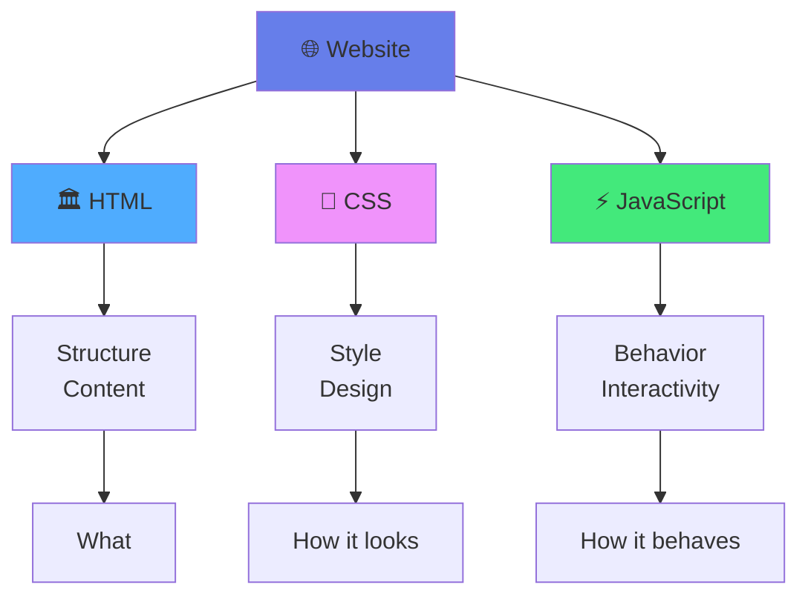
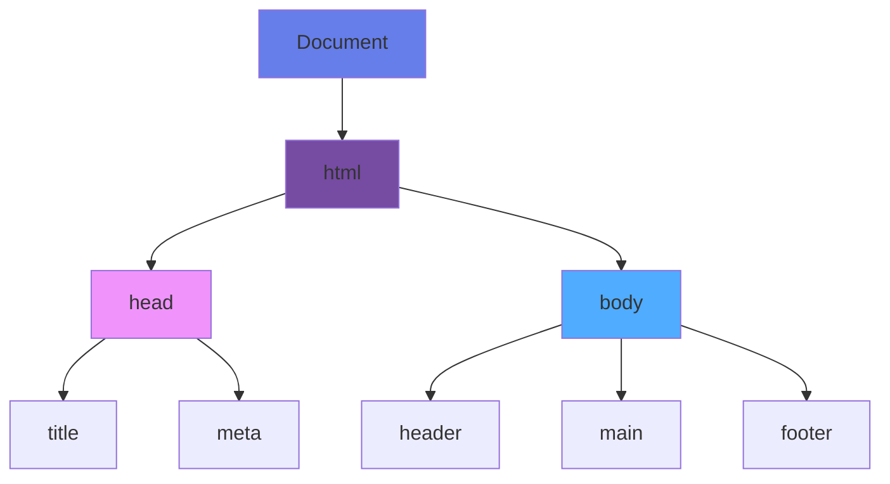

<div align="center">

# 🌐 Chapter 06 · Web Dev Basics


### *HTML5 · CSS3 · DOM Manipulation*


</div>

---

> [!NOTE]
> *"Every website you've ever visited is just HTML, CSS, and JavaScript working together."*

<div align="center">

[](./05-version-control.md)
[](./07-data-management.md)

</div>

<br>

## 🏗️ The Three Pillars of the Web

<div align="center">

Every website is built with three core technologies:

</div>

<br>

<div align="center">



</div>

<br>

<table>
<tr>
<td width="33%" align="center" bgcolor="#e3f2fd">

### 🏛️ HTML

**Structure & Content**

*The skeleton of a house*

Defines **WHAT** is on the page

</td>
<td width="33%" align="center" bgcolor="#f3e5f5">

### 🎨 CSS

**Style & Design**

*The paint and decoration*

Defines **HOW** it looks

</td>
<td width="33%" align="center" bgcolor="#fff9c4">

### ⚡ JavaScript

**Behavior & Interactivity**

*The electricity and plumbing*

Defines **HOW** it behaves

</td>
</tr>
</table>

---

<br>

## 🏛️ Part 1 · HTML5

<div align="center">

### *The Foundation of Every Website*

**HTML** (HyperText Markup Language) is the skeleton of the web.

</div>

<br>

> [!TIP]
> HTML uses **tags** to structure content: `<tagname>Content goes here</tagname>`

---

<br>

### 🧱 Basic HTML Structure

<br>

<details>
<summary><b>📄 Complete HTML Template</b></summary>

<br>

```html
<!DOCTYPE html>
<html lang="en">
<head>
    <meta charset="UTF-8">
    <meta name="viewport" content="width=device-width, initial-scale=1.0">
    <meta name="description" content="My awesome website">
    <meta name="keywords" content="web, development, tutorial">
    <title>My First Website</title>
    <link rel="stylesheet" href="styles.css">
</head>
<body>
    <h1>Hello, World!</h1>
    <p>This is my first webpage.</p>
    
    <script src="script.js"></script>
</body>
</html>
```

</details>

---

<br>

### 📋 Common HTML Tags

<br>

#### Text Content

<br>

<details>
<summary><b>📝 Headings and Paragraphs</b></summary>

<br>

```html
<!-- Headings (h1 is most important, h6 least) -->
<h1>Main Heading</h1>
<h2>Subheading</h2>
<h3>Section Title</h3>
<h4>Subsection</h4>
<h5>Minor Heading</h5>
<h6>Smallest Heading</h6>

<!-- Paragraphs -->
<p>This is a paragraph of text.</p>

<!-- Text formatting -->
<strong>Bold text (important)</strong>
<b>Bold text (stylistic)</b>
<em>Italic text (emphasis)</em>
<i>Italic text (stylistic)</i>
<mark>Highlighted text</mark>
<small>Small text</small>
<del>Deleted text</del>
<ins>Inserted text</ins>
<sub>Subscript</sub>
<sup>Superscript</sup>

<!-- Links -->
<a href="https://example.com">External link</a>
<a href="#section">Internal link</a>
<a href="mailto:email@example.com">Email link</a>
<a href="tel:+1234567890">Phone link</a>
```

</details>

---

<br>

#### Lists

<br>

<details>
<summary><b>📋 Unordered, Ordered, and Description Lists</b></summary>

<br>

```html
<!-- Unordered List -->
<ul>
    <li>Coffee</li>
    <li>Tea</li>
    <li>Milk</li>
</ul>

<!-- Ordered List -->
<ol>
    <li>First step</li>
    <li>Second step</li>
    <li>Third step</li>
</ol>

<!-- Nested List -->
<ul>
    <li>Fruits
        <ul>
            <li>Apple</li>
            <li>Banana</li>
        </ul>
    </li>
    <li>Vegetables</li>
</ul>

<!-- Description List -->
<dl>
    <dt>HTML</dt>
    <dd>HyperText Markup Language</dd>
    <dt>CSS</dt>
    <dd>Cascading Style Sheets</dd>
</dl>
```

</details>

---

<br>

#### Images & Media

<br>

<details>
<summary><b>🖼️ Images, Videos, and Audio</b></summary>

<br>

```html
<!-- Image -->


<!-- Responsive Image -->
<picture>
    <source media="(min-width: 1024px)" srcset="large.jpg">
    <source media="(min-width: 768px)" srcset="medium.jpg">
    
</picture>

<!-- Video -->
<video controls width="640" height="360">
    <source src="video.mp4" type="video/mp4">
    <source src="video.webm" type="video/webm">
    Your browser doesn't support video.
</video>

<!-- Audio -->
<audio controls>
    <source src="audio.mp3" type="audio/mpeg">
    <source src="audio.ogg" type="audio/ogg">
    Your browser doesn't support audio.
</audio>

<!-- Embedded Content -->
<iframe 
    src="https://www.youtube.com/embed/VIDEO_ID"
    width="560" 
    height="315"
    frameborder="0"
    allowfullscreen>
</iframe>
```

</details>

---

<br>

#### Forms

<br>

<details>
<summary><b>📝 Complete Form Example</b></summary>

<br>

```html
<form action="/submit" method="POST">
    <!-- Text Input -->
    <label for="name">Name:</label>
    <input type="text" id="name" name="name" required>
    
    <!-- Email Input -->
    <label for="email">Email:</label>
    <input type="email" id="email" name="email" required>
    
    <!-- Password -->
    <label for="password">Password:</label>
    <input type="password" id="password" name="password" minlength="8" required>
    
    <!-- Number -->
    <label for="age">Age:</label>
    <input type="number" id="age" name="age" min="0" max="120">
    
    <!-- Date -->
    <label for="birthdate">Birth Date:</label>
    <input type="date" id="birthdate" name="birthdate">
    
    <!-- Textarea -->
    <label for="message">Message:</label>
    <textarea id="message" name="message" rows="4" cols="50"></textarea>
    
    <!-- Radio Buttons -->
    <fieldset>
        <legend>Gender:</legend>
        <label><input type="radio" name="gender" value="male"> Male</label>
        <label><input type="radio" name="gender" value="female"> Female</label>
        <label><input type="radio" name="gender" value="other"> Other</label>
    </fieldset>
    
    <!-- Checkboxes -->
    <label>
        <input type="checkbox" name="terms" required>
        I agree to terms
    </label>
    
    <!-- Select Dropdown -->
    <label for="country">Country:</label>
    <select id="country" name="country">
        <option value="">Select a country</option>
        <option value="us">United States</option>
        <option value="uk">United Kingdom</option>
        <option value="ca">Canada</option>
    </select>
    
    <!-- File Upload -->
    <label for="file">Upload file:</label>
    <input type="file" id="file" name="file" accept=".pdf,.jpg,.png">
    
    <!-- Submit Button -->
    <button type="submit">Submit</button>
    <button type="reset">Reset</button>
</form>
```

</details>

---

<br>

### 🆕 HTML5 Semantic Tags

<br>

> [!IMPORTANT]
> Semantic tags make your HTML more meaningful and accessible!

<br>

<details>
<summary><b>🏗️ Complete Page Structure with Semantic HTML</b></summary>

<br>

```html
<!DOCTYPE html>
<html lang="en">
<head>
    <meta charset="UTF-8">
    <title>Semantic HTML Example</title>
</head>
<body>
    <!-- Header Section -->
    <header>
        <h1>My Website</h1>
        <nav>
            <ul>
                <li><a href="#home">Home</a></li>
                <li><a href="#about">About</a></li>
                <li><a href="#services">Services</a></li>
                <li><a href="#contact">Contact</a></li>
            </ul>
        </nav>
    </header>

    <!-- Main Content -->
    <main>
        <!-- Article Section -->
        <article>
            <header>
                <h2>Article Title</h2>
                <p>Published on <time datetime="2026-01-11">January 11, 2026</time></p>
            </header>
            
            <section>
                <h3>Introduction</h3>
                <p>Article introduction...</p>
            </section>
            
            <section>
                <h3>Main Content</h3>
                <p>Article content...</p>
            </section>
            
            <footer>
                <p>Author: John Doe</p>
            </footer>
        </article>
        
        <!-- Sidebar -->
        <aside>
            <h3>Related Links</h3>
            <ul>
                <li><a href="#">Related Article 1</a></li>
                <li><a href="#">Related Article 2</a></li>
            </ul>
        </aside>
    </main>

    <!-- Footer -->
    <footer>
        <p>&copy; 2026 My Website. All rights reserved.</p>
        <address>
            Contact: <a href="mailto:info@example.com">info@example.com</a>
        </address>
    </footer>
</body>
</html>
```

</details>

---

<br>

### 🧠 Why Semantic HTML Matters

<br>

<table>
<tr>
<td align="center" width="33%" bgcolor="#e8f5e9">

♿  
**Accessibility**

Screen readers understand structure better

</td>
<td align="center" width="33%" bgcolor="#e3f2fd">

🔍  
**SEO**

Search engines rank semantic HTML higher

</td>
<td align="center" width="33%" bgcolor="#fff3e0">

🧹  
**Maintainability**

Code is easier to read and maintain

</td>
</tr>
</table>

---

<br>

## 🎨 Part 2 · CSS3

<div align="center">

### *Making the Web Beautiful*

**CSS** (Cascading Style Sheets) controls how your HTML looks.

</div>

---

<br>

### 🎯 Three Ways to Add CSS

<br>

<table>
<tr>
<td width="33%" valign="top">

#### ❌ 1. Inline (Not Recommended)

```html
<p style="color: blue;">
    Blue text
</p>
```

**Issues:**
- Hard to maintain
- Repetitive
- No reusability

</td>
<td width="33%" valign="top">

#### ⚠️ 2. Internal (OK for Small Pages)

```html
<head>
    <style>
        p {
            color: blue;
        }
    </style>
</head>
```

**Use when:**
- Single page site
- Quick prototypes

</td>
<td width="33%" valign="top">

#### ✅ 3. External (Best Practice)

```html
<head>
    <link rel="stylesheet" 
          href="styles.css">
</head>
```

**Benefits:**
- Reusable
- Cacheable
- Maintainable

</td>
</tr>
</table>

---

<br>

### 🎨 CSS Syntax

<br>

<div align="center">

```
selector {
    property: value;
}
```

</div>

<br>

<details>
<summary><b>📝 Complete CSS Example</b></summary>

<br>

```css
/* Element Selector */
h1 {
    color: navy;
    font-size: 32px;
    text-align: center;
    font-family: Arial, sans-serif;
    margin-bottom: 20px;
}

/* Multiple properties */
p {
    color: #333;
    line-height: 1.6;
    margin: 10px 0;
}
```

</details>

---

<br>

### 🎯 CSS Selectors

<br>

<details>
<summary><b>🔍 All Selector Types</b></summary>

<br>

```css
/* Element selector */
p {
    color: black;
}

/* Class selector (most common) */
.highlight {
    background-color: yellow;
}

.btn-primary {
    background: blue;
    color: white;
}

/* ID selector (use sparingly) */
#header {
    background-color: navy;
}

/* Attribute selector */
input[type="text"] {
    border: 1px solid #ccc;
}

a[href^="https"] {
    color: green; /* External links */
}

/* Descendant selector */
div p {
    margin: 10px;
}

/* Child selector */
div > p {
    font-weight: bold;
}

/* Adjacent sibling */
h1 + p {
    font-size: 18px;
}

/* Multiple selectors */
h1, h2, h3 {
    font-family: Arial, sans-serif;
}

/* Pseudo-classes */
a:hover {
    color: red;
}

a:visited {
    color: purple;
}

input:focus {
    border-color: blue;
}

li:first-child {
    font-weight: bold;
}

li:last-child {
    border-bottom: none;
}

li:nth-child(odd) {
    background: #f0f0f0;
}

/* Pseudo-elements */
p::first-line {
    font-weight: bold;
}

p::first-letter {
    font-size: 2em;
}

.clearfix::after {
    content: "";
    display: table;
    clear: both;
}
```

</details>

---

<br>

### 📦 The Box Model

<br>

<div align="center">

Every HTML element is a box!

</div>

<br>

```
┌─────────────────────────────────────┐
│         Margin (transparent)        │
│  ┌──────────────────────────────┐   │
│  │      Border                  │   │
│  │  ┌───────────────────────┐   │   │
│  │  │   Padding             │   │   │
│  │  │  ┌────────────────┐   │   │   │
│  │  │  │   Content      │   │   │   │
│  │  │  │   (Text/Image) │   │   │   │
│  │  │  └────────────────┘   │   │   │
│  │  └───────────────────────┘   │   │
│  └──────────────────────────────┘   │
└─────────────────────────────────────┘
```

<br>

<details>
<summary><b>📐 Box Model Properties</b></summary>

<br>

```css
.box {
    /* Content size */
    width: 200px;
    height: 150px;
    
    /* Padding (inside) */
    padding: 20px;
    /* or */
    padding: 10px 20px; /* vertical horizontal */
    /* or */
    padding: 10px 20px 15px 25px; /* top right bottom left */
    
    /* Border */
    border: 2px solid black;
    border-radius: 8px;
    
    /* Margin (outside) */
    margin: 10px;
    margin: 0 auto; /* Center horizontally */
    
    /* Box sizing */
    box-sizing: border-box; /* Include padding and border in width */
}
```

</details>

---

<br>

### 🎨 Modern CSS Layout

<br>

#### Flexbox (1D Layout)

<br>

<details>
<summary><b>📊 Flexbox Complete Guide</b></summary>

<br>

```css
/* Container properties */
.container {
    display: flex;
    
    /* Direction */
    flex-direction: row; /* row | column | row-reverse | column-reverse */
    
    /* Wrap */
    flex-wrap: wrap; /* nowrap | wrap | wrap-reverse */
    
    /* Justify content (main axis) */
    justify-content: center; /* flex-start | flex-end | center | space-between | space-around | space-evenly */
    
    /* Align items (cross axis) */
    align-items: center; /* flex-start | flex-end | center | stretch | baseline */
    
    /* Gap between items */
    gap: 20px;
}

/* Item properties */
.item {
    /* Grow factor */
    flex-grow: 1;
    
    /* Shrink factor */
    flex-shrink: 0;
    
    /* Base size */
    flex-basis: 200px;
    
    /* Shorthand */
    flex: 1 0 200px; /* grow shrink basis */
    
    /* Individual alignment */
    align-self: flex-end;
}

/* Common patterns */
.center-everything {
    display: flex;
    justify-content: center;
    align-items: center;
}

.space-between {
    display: flex;
    justify-content: space-between;
}

.column-layout {
    display: flex;
    flex-direction: column;
}
```

</details>

---

<br>

#### Grid (2D Layout)

<br>

<details>
<summary><b>🗂️ CSS Grid Complete Guide</b></summary>

<br>

```css
/* Basic grid */
.container {
    display: grid;
    grid-template-columns: repeat(3, 1fr); /* 3 equal columns */
    grid-template-rows: auto;
    gap: 20px;
}

/* Named areas */
.layout {
    display: grid;
    grid-template-areas:
        "header header header"
        "sidebar main main"
        "footer footer footer";
    grid-template-columns: 200px 1fr 1fr;
    gap: 20px;
}

.header { grid-area: header; }
.sidebar { grid-area: sidebar; }
.main { grid-area: main; }
.footer { grid-area: footer; }

/* Responsive grid */
.responsive-grid {
    display: grid;
    grid-template-columns: repeat(auto-fit, minmax(250px, 1fr));
    gap: 20px;
}

/* Item placement */
.item {
    grid-column: 1 / 3; /* Span 2 columns */
    grid-row: 1 / 2;
}
```

</details>

---

<br>

### ✨ CSS3 Features

<br>

<details>
<summary><b>🎨 Gradients & Shadows</b></summary>

<br>

```css
/* Linear Gradient */
.gradient-linear {
    background: linear-gradient(to right, #ff6b6b, #4ecdc4);
    background: linear-gradient(45deg, #667eea 0%, #764ba2 100%);
}

/* Radial Gradient */
.gradient-radial {
    background: radial-gradient(circle, #667eea, #764ba2);
}

/* Box Shadow */
.card {
    box-shadow: 0 4px 6px rgba(0, 0, 0, 0.1);
    box-shadow: 0 10px 30px rgba(0, 0, 0, 0.2); /* Deeper shadow */
}

/* Text Shadow */
.heading {
    text-shadow: 2px 2px 4px rgba(0, 0, 0, 0.3);
}

/* Multiple Shadows */
.fancy {
    box-shadow: 
        0 2px 4px rgba(0,0,0,0.1),
        0 4px 8px rgba(0,0,0,0.1),
        0 8px 16px rgba(0,0,0,0.1);
}
```

</details>

<details>
<summary><b>🎬 Transitions & Transforms</b></summary>

<br>

```css
/* Transitions */
.button {
    background: #3498db;
    transition: all 0.3s ease;
    /* or specific properties */
    transition: background-color 0.3s ease, transform 0.2s ease;
}

.button:hover {
    background: #2980b9;
    transform: scale(1.05);
}

/* Transforms */
.transform-example {
    /* Translate */
    transform: translateX(50px);
    transform: translateY(-20px);
    transform: translate(50px, -20px);
    
    /* Rotate */
    transform: rotate(45deg);
    
    /* Scale */
    transform: scale(1.2);
    transform: scale(1.5, 0.8); /* x, y */
    
    /* Skew */
    transform: skewX(10deg);
    
    /* Combine multiple */
    transform: translateX(50px) rotate(45deg) scale(1.2);
}

/* 3D Transforms */
.card-3d {
    transform: rotateY(45deg);
    transform-style: preserve-3d;
    perspective: 1000px;
}
```

</details>

<details>
<summary><b>✨ CSS Animations</b></summary>

<br>

```css
/* Define animation */
@keyframes fadeIn {
    from {
        opacity: 0;
        transform: translateY(20px);
    }
    to {
        opacity: 1;
        transform: translateY(0);
    }
}

/* Apply animation */
.animated {
    animation: fadeIn 1s ease-in;
}

/* Detailed animation properties */
.detailed-animation {
    animation-name: fadeIn;
    animation-duration: 1s;
    animation-timing-function: ease-in-out;
    animation-delay: 0.5s;
    animation-iteration-count: infinite;
    animation-direction: alternate;
    animation-fill-mode: forwards;
}

/* Complex animation */
@keyframes bounce {
    0%, 100% {
        transform: translateY(0);
    }
    50% {
        transform: translateY(-20px);
    }
}

.bouncing {
    animation: bounce 2s infinite;
}

/* Loading spinner */
@keyframes spin {
    from {
        transform: rotate(0deg);
    }
    to {
        transform: rotate(360deg);
    }
}

.spinner {
    animation: spin 1s linear infinite;
}
```

</details>

---

<br>

### 📱 Responsive Design

<br>

> [!TIP]
> **Mobile First:** Start with mobile styles, then add larger breakpoints!

<br>

<details>
<summary><b>📐 Complete Responsive Setup</b></summary>

<br>

```css
/* Mobile First Approach */

/* Base styles (mobile) */
.container {
    width: 100%;
    padding: 10px;
    font-size: 14px;
}

.grid {
    display: grid;
    grid-template-columns: 1fr;
    gap: 10px;
}

/* Tablet (768px and up) */
@media (min-width: 768px) {
    .container {
        width: 750px;
        margin: 0 auto;
        padding: 20px;
        font-size: 16px;
    }
    
    .grid {
        grid-template-columns: repeat(2, 1fr);
        gap: 20px;
    }
}

/* Desktop (1024px and up) */
@media (min-width: 1024px) {
    .container {
        width: 960px;
    }
    
    .grid {
        grid-template-columns: repeat(3, 1fr);
    }
}

/* Large Desktop (1440px and up) */
@media (min-width: 1440px) {
    .container {
        width: 1200px;
    }
    
    .grid {
        grid-template-columns: repeat(4, 1fr);
        gap: 30px;
    }
}

/* Print styles */
@media print {
    .no-print {
        display: none;
    }
    
    body {
        font-size: 12pt;
        color: black;
    }
}

/* Dark mode */
@media (prefers-color-scheme: dark) {
    body {
        background: #1a1a1a;
        color: #ffffff;
    }
}
```

</details>

---

<br>

## ⚡ Part 3 · DOM Manipulation

<div align="center">

### *Bringing Pages to Life*

The **DOM** (Document Object Model) is how JavaScript sees your HTML.

</div>

<br>

<div align="center">



</div>

<br>

> [!NOTE]
> Think of the DOM as a **tree structure** representing your webpage

---

<br>

### 🎯 Selecting Elements

<br>

<details>
<summary><b>🔍 All Selection Methods</b></summary>

<br>

```javascript
// OLD WAYS (still work)
const headerById = document.getElementById('header');
const buttonsByClass = document.getElementsByClassName('btn');
const paragraphsByTag = document.getElementsByTagName('p');

// MODERN WAYS (recommended)
const header = document.querySelector('#header');
const firstButton = document.querySelector('.btn');
const allButtons = document.querySelectorAll('.btn');

// Select by attribute
const emailInput = document.querySelector('[type="email"]');

// Complex selectors
const firstParagraph = document.querySelector('article > p:first-child');
const activeLinks = document.querySelectorAll('a.active');

// Converting NodeList to Array
const buttonsArray = Array.from(allButtons);
// or
const buttonsArray2 = [...allButtons];
```

</details>

---

<br>

### ✏️ Changing Content

<br>

<details>
<summary><b>📝 Content Manipulation</b></summary>

<br>

```javascript
// Change text content
document.querySelector('h1').textContent = 'New Title';

// Change HTML (be careful with user input!)
document.querySelector('.content').innerHTML = '<p>New <strong>bold</strong> content</p>';

// Change attributes
const img = document.querySelector('img');
img.src = 'new-image.jpg';
img.alt = 'New description';
img.setAttribute('data-id', '123');

// Get attributes
const href = document.querySelector('a').getAttribute('href');

// Remove attributes
img.removeAttribute('data-id');

// Dataset (data-* attributes)
const element = document.querySelector('.item');
element.dataset.userId = '123'; // <div data-user-id="123">
console.log(element.dataset.userId); // "123"
```

</details>

---

<br>

### 🎨 Changing Styles

<br>

<details>
<summary><b>🖌️ Style Manipulation</b></summary>

<br>

```javascript
const box = document.querySelector('.box');

// Direct style changes (inline styles)
box.style.backgroundColor = 'blue';
box.style.padding = '20px';
box.style.fontSize = '16px';

// Multiple styles at once
Object.assign(box.style, {
    backgroundColor: 'blue',
    padding: '20px',
    fontSize: '16px',
    borderRadius: '8px'
});

// Better practice: Use classes
box.classList.add('active');
box.classList.remove('hidden');
box.classList.toggle('highlight'); // Add if not present, remove if present

// Check if class exists
if (box.classList.contains('active')) {
    console.log('Box is active');
}

// Replace class
box.classList.replace('old-class', 'new-class');

// Get computed styles
const styles = getComputedStyle(box);
console.log(styles.backgroundColor);
console.log(styles.width);
```

</details>

---

<br>

### ➕ Creating & Adding Elements

<br>

<details>
<summary><b>🏗️ DOM Creation</b></summary>

<br>

```javascript
// Create new element
const newDiv = document.createElement('div');
newDiv.textContent = 'I am new!';
newDiv.classList.add('new-item');
newDiv.id = 'unique-id';

// Set attributes
newDiv.setAttribute('data-type', 'example');

// Add to page
document.body.appendChild(newDiv);

// Insert at specific position
const container = document.querySelector('.container');

// Append (at end)
container.appendChild(newDiv);

// Prepend (at beginning)
container.prepend(newDiv);

// Insert before
container.insertBefore(newDiv, container.firstChild);

// Insert adjacent
const reference = document.querySelector('.reference');
reference.insertAdjacentElement('beforebegin', newDiv); // Before the element
reference.insertAdjacentElement('afterbegin', newDiv);  // Inside, before first child
reference.insertAdjacentElement('beforeend', newDiv);   // Inside, after last child
reference.insertAdjacentElement('afterend', newDiv);    // After the element

// Insert HTML
reference.insertAdjacentHTML('beforeend', '<p>New paragraph</p>');

// Clone element
const clone = newDiv.cloneNode(true); // true = deep clone (includes children)
```

</details>

---

<br>

### 🗑️ Removing Elements

<br>

<details>
<summary><b>🗂️ DOM Removal</b></summary>

<br>

```javascript
// Remove element
const element = document.querySelector('.remove-me');
element.remove();

// Remove child
const parent = document.querySelector('.parent');
const child = document.querySelector('.child');
parent.removeChild(child);

// Remove all children
parent.innerHTML = '';

// Better: Remove all children properly
while (parent.firstChild) {
    parent.removeChild(parent.firstChild);
}
```

</details>

---

<br>

### 🖱️ Event Listeners

<br>

<details>
<summary><b>👆 Complete Event Guide</b></summary>

<br>

```javascript
// Click event
const button = document.querySelector('button');
button.addEventListener('click', function(event) {
    console.log('Button clicked!');
    console.log('Event:', event);
    console.log('Target:', event.target);
});

// Arrow function
button.addEventListener('click', (e) => {
    alert('Button clicked!');
});

// Input event
const input = document.querySelector('input');
input.addEventListener('input', function(e) {
    console.log('Current value:', e.target.value);
});

// Form submit
const form = document.querySelector('form');
form.addEventListener('submit', function(e) {
    e.preventDefault(); // Prevent page reload
    
    const formData = new FormData(form);
    console.log('Name:', formData.get('name'));
    console.log('Email:', formData.get('email'));
});

// Keyboard events
document.addEventListener('keydown', (e) => {
    console.log('Key pressed:', e.key);
    
    if (e.key === 'Enter') {
        console.log('Enter key pressed');
    }
    
    if (e.ctrlKey && e.key === 's') {
        e.preventDefault(); // Prevent browser save
        console.log('Ctrl+S pressed');
    }
});

// Mouse events
const box = document.querySelector('.box');

box.addEventListener('mouseenter', () => {
    console.log('Mouse entered');
});

box.addEventListener('mouseleave', () => {
    console.log('Mouse left');
});

box.addEventListener('mousemove', (e) => {
    console.log('Mouse position:', e.clientX, e.clientY);
});

// Event delegation (efficient for multiple items)
const list = document.querySelector('ul');
list.addEventListener('click', (e) => {
    if (e.target.tagName === 'LI') {
        console.log('List item clicked:', e.target.textContent);
    }
});

// Remove event listener
function handleClick() {
    console.log('Clicked');
}

button.addEventListener('click', handleClick);
button.removeEventListener('click', handleClick);

// One-time event
button.addEventListener('click', function handler(e) {
    console.log('This runs only once');
    button.removeEventListener('click', handler);
});

// Or use once option
button.addEventListener('click', () => {
    console.log('This also runs only once');
}, { once: true });
```

</details>

---

<br>

### 🎯 Practical Examples

<br>

#### Interactive Counter

<br>

<details>
<summary><b>🔢 Complete Counter App</b></summary>

<br>

```html
<!DOCTYPE html>
<html lang="en">
<head>
    <meta charset="UTF-8">
    <title>Counter App</title>
    <style>
        body {
            font-family: Arial, sans-serif;
            display: flex;
            flex-direction: column;
            align-items: center;
            justify-content: center;
            min-height: 100vh;
            margin: 0;
            background: linear-gradient(135deg, #667eea 0%, #764ba2 100%);
        }
        
        .counter-container {
            background: white;
            padding: 40px;
            border-radius: 20px;
            box-shadow: 0 10px 30px rgba(0, 0, 0, 0.2);
            text-align: center;
        }
        
        .counter {
            font-size: 72px;
            font-weight: bold;
            color: #667eea;
            margin: 20px 0;
        }
        
        button {
            font-size: 20px;
            padding: 12px 24px;
            margin: 5px;
            border: none;
            border-radius: 8px;
            cursor: pointer;
            transition: all 0.3s ease;
            font-weight: bold;
        }
        
        .btn-increment {
            background: #43e97b;
            color: white;
        }
        
        .btn-decrement {
            background: #fa709a;
            color: white;
        }
        
        .btn-reset {
            background: #667eea;
            color: white;
        }
        
        button:hover {
            transform: translateY(-2px);
            box-shadow: 0 4px 12px rgba(0, 0, 0, 0.2);
        }
        
        button:active {
            transform: translateY(0);
        }
    </style>
</head>
<body>
    <div class="counter-container">
        <h1>Counter App</h1>
        <div class="counter" id="count">0</div>
        <div>
            <button class="btn-decrement" id="decrement">-</button>
            <button class="btn-reset" id="reset">Reset</button>
            <button class="btn-increment" id="increment">+</button>
        </div>
    </div>

    <script>
        let count = 0;
        const countDisplay = document.getElementById('count');
        const incrementBtn = document.getElementById('increment');
        const decrementBtn = document.getElementById('decrement');
        const resetBtn = document.getElementById('reset');

        function updateDisplay() {
            countDisplay.textContent = count;
            
            // Change color based on value
            if (count > 0) {
                countDisplay.style.color = '#43e97b';
            } else if (count < 0) {
                countDisplay.style.color = '#fa709a';
            } else {
                countDisplay.style.color = '#667eea';
            }
        }

        incrementBtn.addEventListener('click', () => {
            count++;
            updateDisplay();
        });

        decrementBtn.addEventListener('click', () => {
            count--;
            updateDisplay();
        });

        resetBtn.addEventListener('click', () => {
            count = 0;
            updateDisplay();
        });
        
        // Keyboard shortcuts
        document.addEventListener('keydown', (e) => {
            if (e.key === 'ArrowUp') {
                count++;
                updateDisplay();
            } else if (e.key === 'ArrowDown') {
                count--;
                updateDisplay();
            } else if (e.key === 'r' || e.key === 'R') {
                count = 0;
                updateDisplay();
            }
        });
    </script>
</body>
</html>
```

</details>

---

<br>

#### Todo List App

<br>

<details>
<summary><b>✅ Complete Todo App</b></summary>

<br>

```html
<!DOCTYPE html>
<html lang="en">
<head>
    <meta charset="UTF-8">
    <title>Todo List</title>
    <style>
        * {
            margin: 0;
            padding: 0;
            box-sizing: border-box;
        }
        
        body {
            font-family: 'Segoe UI', Tahoma, Geneva, Verdana, sans-serif;
            background: linear-gradient(135deg, #667eea 0%, #764ba2 100%);
            min-height: 100vh;
            display: flex;
            justify-content: center;
            align-items: center;
            padding: 20px;
        }
        
        .todo-container {
            background: white;
            border-radius: 20px;
            padding: 40px;
            width: 100%;
            max-width: 500px;
            box-shadow: 0 10px 40px rgba(0, 0, 0, 0.2);
        }
        
        h1 {
            color: #667eea;
            margin-bottom: 30px;
            text-align: center;
        }
        
        .input-container {
            display: flex;
            gap: 10px;
            margin-bottom: 30px;
        }
        
        input[type="text"] {
            flex: 1;
            padding: 12px;
            border: 2px solid #e0e0e0;
            border-radius: 8px;
            font-size: 16px;
            transition: border-color 0.3s;
        }
        
        input[type="text"]:focus {
            outline: none;
            border-color: #667eea;
        }
        
        button {
            padding: 12px 24px;
            border: none;
            border-radius: 8px;
            background: #667eea;
            color: white;
            font-size: 16px;
            font-weight: bold;
            cursor: pointer;
            transition: all 0.3s;
        }
        
        button:hover {
            background: #5568d3;
            transform: translateY(-2px);
        }
        
        .todo-list {
            list-style: none;
        }
        
        .todo-item {
            background: #f8f9fa;
            padding: 15px;
            margin-bottom: 10px;
            border-radius: 8px;
            display: flex;
            align-items: center;
            gap: 10px;
            transition: all 0.3s;
        }
        
        .todo-item:hover {
            background: #e9ecef;
        }
        
        .todo-item.completed {
            opacity: 0.6;
        }
        
        .todo-item.completed .todo-text {
            text-decoration: line-through;
        }
        
        .todo-text {
            flex: 1;
            cursor: pointer;
        }
        
        .delete-btn {
            padding: 6px 12px;
            background: #fa709a;
            font-size: 14px;
        }
        
        .delete-btn:hover {
            background: #e85d89;
        }
    </style>
</head>
<body>
    <div class="todo-container">
        <h1>📝 My Todo List</h1>
        
        <div class="input-container">
            <input 
                type="text" 
                id="todoInput" 
                placeholder="What needs to be done?"
            >
            <button id="addBtn">Add</button>
        </div>
        
        <ul class="todo-list" id="todoList"></ul>
    </div>

    <script>
        const todoInput = document.getElementById('todoInput');
        const addBtn = document.getElementById('addBtn');
        const todoList = document.getElementById('todoList');

        // Load todos from localStorage
        let todos = JSON.parse(localStorage.getItem('todos')) || [];

        function saveTodos() {
            localStorage.setItem('todos', JSON.stringify(todos));
        }

        function renderTodos() {
            todoList.innerHTML = '';
            
            todos.forEach((todo, index) => {
                const li = document.createElement('li');
                li.className = `todo-item ${todo.completed ? 'completed' : ''}`;
                
                li.innerHTML = `
                    <span class="todo-text">${todo.text}</span>
                    <button class="delete-btn">Delete</button>
                `;
                
                // Toggle complete
                li.querySelector('.todo-text').addEventListener('click', () => {
                    todos[index].completed = !todos[index].completed;
                    saveTodos();
                    renderTodos();
                });
                
                // Delete todo
                li.querySelector('.delete-btn').addEventListener('click', () => {
                    todos.splice(index, 1);
                    saveTodos();
                    renderTodos();
                });
                
                todoList.appendChild(li);
            });
        }

        function addTodo() {
            const text = todoInput.value.trim();
            
            if (text) {
                todos.push({
                    text: text,
                    completed: false
                });
                
                todoInput.value = '';
                saveTodos();
                renderTodos();
            }
        }

        // Add button click
        addBtn.addEventListener('click', addTodo);

        // Enter key to add
        todoInput.addEventListener('keypress', (e) => {
            if (e.key === 'Enter') {
                addTodo();
            }
        });

        // Initial render
        renderTodos();
    </script>
</body>
</html>
```

</details>

---

<br>

## 🤖 AI Tip · Web Development

<br>

### ✅ Smart Prompts:

<table>
<tr>
<td width="50%">

```
💡 "Create a responsive navbar with HTML and CSS"
```
```
💡 "Center a div vertically and horizontally"
```
```
💡 "Explain classList vs className"
```

</td>
<td width="50%">

```
💡 "Debug this CSS flexbox layout"
```
```
💡 "Create a modal popup with JavaScript"
```
```
💡 "Optimize this code for performance"
```

</td>
</tr>
</table>

<br>

### 🎨 AI Can Help With:

| Area | Application |
|:---|:---|
| ✅ HTML structure | Semantic markup generation |
| ✅ CSS layouts | Flexbox, Grid solutions |
| ✅ Animations | Keyframe creation |
| ✅ DOM manipulation | Event handling patterns |
| ✅ Debugging | Browser compatibility |
| ✅ Optimization | Performance improvements |

---

<br>

## 🎯 Mission · Day 06

<div align="center">

### 🚀 Build your first webpage

</div>

<br>

### Core Tasks:

- [ ] 📄 **Create HTML file** — Proper structure with semantic tags
- [ ] 🎨 **Style with CSS** — External stylesheet
- [ ] 🎯 **Use 3+ semantic tags** — header, nav, main, etc.
- [ ] 📱 **Make it responsive** — Media queries
- [ ] ⚡ **Add JavaScript** — Button that changes content
- [ ] 🖱️ **Event listeners** — At least 2 different types

<br>

<details>
<summary><b>⭐ Bonus Challenges</b></summary>

<br>

- [ ] ✅ Create a todo list app with add/remove functionality
- [ ] 📝 Build a simple form with validation
- [ ] 🌙 Implement a dark mode toggle
- [ ] 🖼️ Create a photo gallery with CSS Grid
- [ ] 🎨 Add smooth transitions and animations
- [ ] 💾 Use localStorage to persist data
- [ ] 🎮 Build an interactive game (tic-tac-toe, memory game)

</details>

---

<br>

## 📚 Best Practices

<br>

<table>
<tr>
<td width="50%" bgcolor="#e8f5e9" valign="top">

### ✅ Good Practices

```css
/* Use meaningful class names */
.btn-primary { }
.card-header { }
.navigation-menu { }

/* Group related properties */
.box {
    /* Positioning */
    position: relative;
    
    /* Box model */
    width: 200px;
    padding: 20px;
    
    /* Visual */
    background: white;
    border-radius: 8px;
}

/* Mobile-first responsive */
.container {
    width: 100%;
}

@media (min-width: 768px) {
    .container {
        width: 750px;
    }
}
```

</td>
<td width="50%" bgcolor="#ffebee" valign="top">

### ❌ Avoid

```html
<!-- Don't use inline styles -->
<div style="color: red; font-size: 20px;">
    Bad practice
</div>

<!-- Don't use too many IDs -->
#header #nav #menu { }
/* Use classes instead */

<!-- Don't use !important -->
.text {
    color: blue !important;
}

<!-- Don't ignore accessibility -->
<div onclick="handleClick()">
    Click me
</div>
<!-- Use <button> instead -->
```

</td>
</tr>
</table>

---

<br>

<div align="center">

## 🏆 Achievement Unlocked

### **The Web Builder**

<br>

**You now understand:**
- HTML5 structure and semantics
- CSS3 styling and layouts
- DOM manipulation with JavaScript
- Event-driven programming
- Responsive design principles

<br>

*You're no longer just a coder.*  
**You're a web developer.**

<br>


</div>

---

<br>

<div align="center">

### 🎓 Pro Tip

> "View Source is your friend.  
> Every website is a learning opportunity."

**Try it:** Right-click → View Page Source on any website!

</div>

---

<br>

<div align="center">

[](./07-data-management.md)

</div>

<br>
