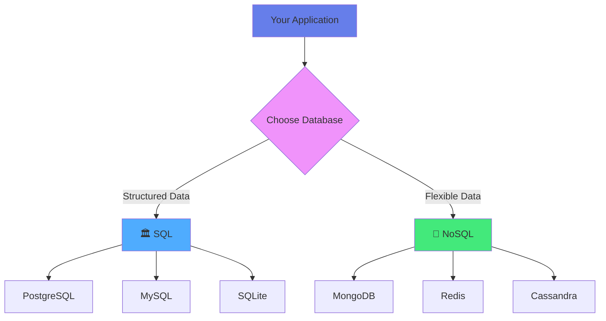
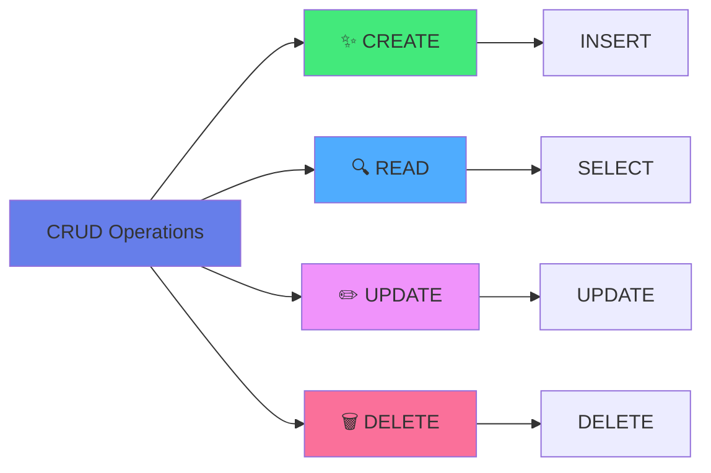
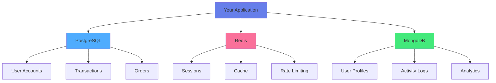

<div align="center">

# 💾 Chapter 07 · Data Management


### *SQL · NoSQL · CRUD Operations*


</div>

---

> [!NOTE]
> *"Data is the new oil. But unlike oil, data gets more valuable when you refine it properly."*

<div align="center">

[](./06-web-dev-basics.md)
[](./08-backend-dev.md)

</div>

<br>

## 🗄️ Why Data Management Matters

<div align="center">

Every application needs to:

</div>

<br>

<table>
<tr>
<td align="center" width="25%">

💾  
**Store**

Data persistently

</td>
<td align="center" width="25%">

🔍  
**Retrieve**

Data efficiently

</td>
<td align="center" width="25%">

✏️  
**Update**

Data accurately

</td>
<td align="center" width="25%">

🗑️  
**Delete**

Data safely

</td>
</tr>
</table>

<br>

### Without proper data management:

<br>

<table>
<tr>
<td width="50%" bgcolor="#ffebee" valign="top">

#### ❌ Problems You'll Face:

- App loses information on restart
- Performance degrades as data grows
- Users can't trust your system
- Scaling becomes impossible
- Data inconsistencies everywhere
- Security vulnerabilities

</td>
<td width="50%" bgcolor="#e8f5e9" valign="top">

#### ✅ With Good Data Management:

- Data persists reliably
- Fast queries at scale
- User trust and satisfaction
- Easy horizontal scaling
- Data integrity guaranteed
- Secure and compliant

</td>
</tr>
</table>

<br>

> [!IMPORTANT]
> **The database is often the bottleneck. Choose wisely.**

---

<br>

## 🎯 SQL vs NoSQL: The Great Divide

<br>

<div align="center">



</div>

<br>

<table>
<tr>
<td width="50%" align="center" bgcolor="#e3f2fd" valign="top">

### 🏛️ SQL (Relational)

**Structure:** Tables with fixed schema  
**Data Model:** Rows and columns  
**Scaling:** Vertical (bigger servers)  
**Best For:** Complex queries, transactions

**Examples:**
- PostgreSQL
- MySQL
- SQLite

**Use When:**
- Banking systems
- E-commerce
- ERP/CRM

</td>
<td width="50%" align="center" bgcolor="#f3e5f5" valign="top">

### 🌊 NoSQL (Non-Relational)

**Structure:** Flexible documents/collections  
**Data Model:** JSON-like documents  
**Scaling:** Horizontal (more servers)  
**Best For:** Fast reads/writes, flexible data

**Examples:**
- MongoDB
- Redis
- Cassandra

**Use When:**
- Social media
- Real-time apps
- IoT systems

</td>
</tr>
</table>

<br>

### 🧠 Mental Model

<br>

> [!TIP]
> **SQL:** 📊 Like an Excel spreadsheet with strict rules  
> **NoSQL:** 📦 Like a flexible filing cabinet

---

<br>

## 🏛️ Part 1 · SQL Databases

<div align="center">

### *Structured Query Language*

SQL databases organize data into **tables** with **relationships**.

</div>

---

<br>

### 📋 Basic Table Structure

<br>

```
Users Table:
┌────┬──────────┬─────────────────────┬─────┬────────────────────┐
│ id │   name   │        email        │ age │    created_at      │
├────┼──────────┼─────────────────────┼─────┼────────────────────┤
│ 1  │ Alice    │ alice@email.com     │ 28  │ 2026-01-11 10:30   │
│ 2  │ Bob      │ bob@email.com       │ 34  │ 2026-01-11 11:15   │
│ 3  │ Charlie  │ charlie@email.com   │ 22  │ 2026-01-11 12:00   │
└────┴──────────┴─────────────────────┴─────┴────────────────────┘
```

---

<br>

### 🔧 Creating Tables

<br>

<details>
<summary><b>📝 Table Creation with Constraints</b></summary>

<br>

```sql
CREATE TABLE users (
    id INTEGER PRIMARY KEY AUTOINCREMENT,
    name TEXT NOT NULL,
    email TEXT UNIQUE NOT NULL,
    age INTEGER CHECK (age >= 0 AND age <= 150),
    created_at TIMESTAMP DEFAULT CURRENT_TIMESTAMP,
    updated_at TIMESTAMP DEFAULT CURRENT_TIMESTAMP
);

-- Create an index for faster queries
CREATE INDEX idx_email ON users(email);
CREATE INDEX idx_age ON users(age);
```

</details>

---

<br>

### 📊 Common Data Types

<br>

<div align="center">

| Type | Description | Example | Use Case |
|:---:|:---|:---|:---|
| `INTEGER` | Whole numbers | 42, -10, 0 | IDs, counts, ages |
| `TEXT` | Strings | "Hello", "user@email.com" | Names, descriptions |
| `REAL` | Decimals | 3.14, 99.99 | Prices, percentages |
| `BOOLEAN` | True/False | TRUE, FALSE | Flags, status |
| `DATE/TIMESTAMP` | Date and time | 2026-01-11 | Created dates |
| `BLOB` | Binary data | Image, file | Media files |

</div>

---

<br>

### 🔗 Relationships Between Tables

<br>

<details>
<summary><b>🔄 One-to-Many Relationship Example</b></summary>

<br>

```sql
-- Users table
CREATE TABLE users (
    id INTEGER PRIMARY KEY,
    name TEXT NOT NULL,
    email TEXT UNIQUE NOT NULL
);

-- Posts table (related to users)
CREATE TABLE posts (
    id INTEGER PRIMARY KEY,
    user_id INTEGER NOT NULL,
    title TEXT NOT NULL,
    content TEXT,
    published_at TIMESTAMP DEFAULT CURRENT_TIMESTAMP,
    FOREIGN KEY (user_id) REFERENCES users(id) ON DELETE CASCADE
);

-- Comments table (related to posts)
CREATE TABLE comments (
    id INTEGER PRIMARY KEY,
    post_id INTEGER NOT NULL,
    user_id INTEGER NOT NULL,
    content TEXT NOT NULL,
    created_at TIMESTAMP DEFAULT CURRENT_TIMESTAMP,
    FOREIGN KEY (post_id) REFERENCES posts(id) ON DELETE CASCADE,
    FOREIGN KEY (user_id) REFERENCES users(id) ON DELETE CASCADE
);
```

</details>

---

<br>

### 🧠 Types of Relationships

<br>

<table>
<tr>
<td align="center" width="33%" bgcolor="#e3f2fd">

**One-to-Many**

👤 One user  
↓  
📝 Many posts

</td>
<td align="center" width="33%" bgcolor="#f3e5f5">

**Many-to-Many**

👥 Many students  
↔  
📚 Many courses

</td>
<td align="center" width="33%" bgcolor="#fff9c4">

**One-to-One**

👤 One user  
↓  
📋 One profile

</td>
</tr>
</table>

---

<br>

## 📝 Part 2 · CRUD Operations

<div align="center">

### *The Four Fundamental Actions*

**CRUD** = Create, Read, Update, Delete

</div>

<br>

<div align="center">



</div>

<br>

> [!NOTE]
> Every database interaction falls into one of these categories.

---

<br>

### ✨ CREATE (Insert Data)

<br>

<details>
<summary><b>📝 Single and Bulk Inserts</b></summary>

<br>

```sql
-- Insert a single user
INSERT INTO users (name, email, age)
VALUES ('Alice', 'alice@email.com', 28);

-- Insert multiple users at once
INSERT INTO users (name, email, age)
VALUES 
    ('Bob', 'bob@email.com', 34),
    ('Charlie', 'charlie@email.com', 22),
    ('Diana', 'diana@email.com', 30);

-- Insert with default values
INSERT INTO users (name, email)
VALUES ('Eve', 'eve@email.com');
-- age will be NULL, created_at will be CURRENT_TIMESTAMP

-- Get the ID of inserted record
INSERT INTO users (name, email, age)
VALUES ('Frank', 'frank@email.com', 45)
RETURNING id;
```

</details>

---

<br>

### 🔍 READ (Query Data)

<br>

<details>
<summary><b>📊 Basic SELECT Queries</b></summary>

<br>

```sql
-- Get all users
SELECT * FROM users;

-- Get specific columns
SELECT name, email FROM users;

-- Filter with WHERE
SELECT * FROM users WHERE age > 25;

-- Multiple conditions
SELECT * FROM users 
WHERE age > 20 AND age < 30;

-- Sort results
SELECT * FROM users ORDER BY age DESC;

-- Limit results
SELECT * FROM users LIMIT 10;

-- Pagination
SELECT * FROM users LIMIT 10 OFFSET 20;

-- Count records
SELECT COUNT(*) FROM users;
SELECT COUNT(*) FROM users WHERE age > 25;

-- Distinct values
SELECT DISTINCT age FROM users;
```

</details>

<details>
<summary><b>🔎 Advanced Queries</b></summary>

<br>

```sql
-- Pattern matching with LIKE
SELECT * FROM users WHERE name LIKE 'A%';    -- Starts with A
SELECT * FROM users WHERE email LIKE '%@gmail.com';  -- Ends with @gmail.com
SELECT * FROM users WHERE name LIKE '%ice%'; -- Contains "ice"

-- IN operator
SELECT * FROM users WHERE age IN (25, 30, 35);

-- BETWEEN
SELECT * FROM users WHERE age BETWEEN 20 AND 30;

-- NULL checks
SELECT * FROM users WHERE age IS NULL;
SELECT * FROM users WHERE age IS NOT NULL;

-- Aggregate functions
SELECT 
    MIN(age) as youngest,
    MAX(age) as oldest,
    AVG(age) as average_age,
    COUNT(*) as total_users
FROM users;

-- Group and aggregate
SELECT age, COUNT(*) as count
FROM users
GROUP BY age
ORDER BY count DESC;

-- HAVING (filter after GROUP BY)
SELECT age, COUNT(*) as count
FROM users
GROUP BY age
HAVING count > 1;
```

</details>

<details>
<summary><b>🔗 JOIN Operations</b></summary>

<br>

```sql
-- INNER JOIN (only matching records)
SELECT users.name, posts.title
FROM users
INNER JOIN posts ON users.id = posts.user_id;

-- LEFT JOIN (all users, even without posts)
SELECT users.name, posts.title
FROM users
LEFT JOIN posts ON users.id = posts.user_id;

-- Join multiple tables
SELECT 
    users.name,
    posts.title,
    comments.content
FROM users
INNER JOIN posts ON users.id = posts.user_id
INNER JOIN comments ON posts.id = comments.post_id;

-- Count posts per user
SELECT 
    users.name,
    COUNT(posts.id) as post_count
FROM users
LEFT JOIN posts ON users.id = posts.user_id
GROUP BY users.id, users.name
ORDER BY post_count DESC;
```

</details>

---

<br>

### ✏️ UPDATE (Modify Data)

<br>

<details>
<summary><b>🔧 Update Operations</b></summary>

<br>

```sql
-- Update a single record
UPDATE users
SET age = 29
WHERE id = 1;

-- Update multiple records
UPDATE users
SET age = age + 1
WHERE age < 30;

-- Update multiple columns
UPDATE users
SET 
    name = 'Alice Smith',
    email = 'alice.smith@email.com',
    updated_at = CURRENT_TIMESTAMP
WHERE id = 1;

-- Conditional update
UPDATE users
SET age = CASE
    WHEN age < 18 THEN 18
    WHEN age > 65 THEN 65
    ELSE age
END;

-- Update with subquery
UPDATE posts
SET user_id = (SELECT id FROM users WHERE name = 'Alice')
WHERE title = 'My First Post';
```

</details>

---

<br>

### 🗑️ DELETE (Remove Data)

<br>

<details>
<summary><b>⚠️ Delete Operations (Use with Caution!)</b></summary>

<br>

```sql
-- Delete specific record
DELETE FROM users WHERE id = 3;

-- Delete based on condition
DELETE FROM users WHERE age < 18;

-- Delete with subquery
DELETE FROM comments
WHERE post_id IN (
    SELECT id FROM posts WHERE user_id = 5
);

-- ⚠️ Delete all records (DANGEROUS!)
DELETE FROM users;

-- Better: Use soft deletes
ALTER TABLE users ADD COLUMN deleted_at TIMESTAMP;

UPDATE users 
SET deleted_at = CURRENT_TIMESTAMP 
WHERE id = 3;

-- Query only active users
SELECT * FROM users WHERE deleted_at IS NULL;
```

</details>

---

<br>

## 🌊 Part 3 · NoSQL Databases

<div align="center">

### *Flexibility Over Structure*

NoSQL databases use flexible, document-based storage.

</div>

---

<br>

### 📦 MongoDB Document Example

<br>

<details>
<summary><b>📄 JSON-like Document Structure</b></summary>

<br>

```javascript
{
  "_id": ObjectId("507f1f77bcf86cd799439011"),
  "name": "Alice",
  "email": "alice@email.com",
  "age": 28,
  "address": {
    "street": "123 Main St",
    "city": "New York",
    "zipCode": "10001",
    "country": "USA"
  },
  "hobbies": ["reading", "coding", "hiking"],
  "social": {
    "twitter": "@alice",
    "github": "alice-dev"
  },
  "settings": {
    "notifications": true,
    "theme": "dark"
  },
  "created_at": ISODate("2026-01-11T10:30:00Z"),
  "updated_at": ISODate("2026-01-11T10:30:00Z")
}
```

</details>

---

<br>

### ✨ CREATE (Insert Documents)

<br>

<details>
<summary><b>📝 Insert Operations in MongoDB</b></summary>

<br>

```javascript
// Insert one document
db.users.insertOne({
  name: "Alice",
  email: "alice@email.com",
  age: 28,
  hobbies: ["reading", "coding"]
});

// Insert multiple documents
db.users.insertMany([
  { 
    name: "Bob", 
    email: "bob@email.com", 
    age: 34,
    city: "San Francisco"
  },
  { 
    name: "Charlie", 
    email: "charlie@email.com", 
    age: 22,
    city: "Austin"
  }
]);

// Insert with custom _id
db.users.insertOne({
  _id: "custom-id-123",
  name: "Diana",
  email: "diana@email.com"
});
```

</details>

---

<br>

### 🔍 READ (Query Documents)

<br>

<details>
<summary><b>🔎 MongoDB Query Operations</b></summary>

<br>

```javascript
// Find all documents
db.users.find();

// Find with filter
db.users.find({ age: { $gt: 25 } });

// Find one document
db.users.findOne({ email: "alice@email.com" });

// Select specific fields (projection)
db.users.find({}, { name: 1, email: 1, _id: 0 });

// Multiple conditions
db.users.find({
  age: { $gte: 25, $lte: 35 },
  city: "New York"
});

// OR condition
db.users.find({
  $or: [
    { age: { $lt: 25 } },
    { age: { $gt: 60 } }
  ]
});

// Array contains
db.users.find({ hobbies: "coding" });

// Nested field query
db.users.find({ "address.city": "New York" });

// Sort and limit
db.users.find().sort({ age: -1 }).limit(10);

// Count documents
db.users.countDocuments({ age: { $gt: 25 } });

// Aggregation
db.users.aggregate([
  { $match: { age: { $gte: 25 } } },
  { $group: { 
      _id: "$city", 
      count: { $sum: 1 },
      avgAge: { $avg: "$age" }
    }
  },
  { $sort: { count: -1 } }
]);
```

</details>

---

<br>

### ✏️ UPDATE (Modify Documents)

<br>

<details>
<summary><b>🔧 MongoDB Update Operations</b></summary>

<br>

```javascript
// Update one document
db.users.updateOne(
  { email: "alice@email.com" },
  { $set: { age: 29 } }
);

// Update multiple documents
db.users.updateMany(
  { age: { $lt: 30 } },
  { $inc: { age: 1 } }
);

// Add to array
db.users.updateOne(
  { name: "Alice" },
  { $push: { hobbies: "swimming" } }
);

// Remove from array
db.users.updateOne(
  { name: "Alice" },
  { $pull: { hobbies: "reading" } }
);

// Add to set (no duplicates)
db.users.updateOne(
  { name: "Alice" },
  { $addToSet: { hobbies: "coding" } }
);

// Update nested field
db.users.updateOne(
  { name: "Alice" },
  { $set: { "address.city": "Boston" } }
);

// Replace entire document
db.users.replaceOne(
  { _id: ObjectId("507f1f77bcf86cd799439011") },
  {
    name: "Alice Smith",
    email: "alice.smith@email.com",
    age: 29
  }
);

// Upsert (insert if not exists)
db.users.updateOne(
  { email: "new@email.com" },
  { $set: { name: "New User", age: 25 } },
  { upsert: true }
);
```

</details>

---

<br>

### 🗑️ DELETE (Remove Documents)

<br>

<details>
<summary><b>⚠️ MongoDB Delete Operations</b></summary>

<br>

```javascript
// Delete one document
db.users.deleteOne({ 
  _id: ObjectId("507f1f77bcf86cd799439011") 
});

// Delete multiple documents
db.users.deleteMany({ age: { $lt: 18 } });

// Delete all documents in collection
db.users.deleteMany({});

// Drop entire collection
db.users.drop();
```

</details>

---

<br>

## 🎯 Part 4 · Choosing the Right Database

<br>

<table>
<tr>
<td width="50%" bgcolor="#e8f5e9" valign="top">

### ✅ Use SQL When You Need:

- **Complex relationships** between data
- **ACID transactions** (banking, e-commerce)
- **Structured, consistent** data
- **Complex queries** and joins
- **Mature ecosystem** and tools
- **Data integrity** guarantees

#### 📊 SQL Use Cases:

- E-commerce platforms
- Banking systems
- ERP/CRM systems
- Inventory management
- Accounting software
- Reservation systems

</td>
<td width="50%" bgcolor="#e3f2fd" valign="top">

### ✅ Use NoSQL When You Need:

- **Flexible schema** (evolving structure)
- **Horizontal scaling** (millions of users)
- **Fast read/write** performance
- **Hierarchical/nested** data
- **Real-time** applications
- **Rapid development** cycles

#### 🌊 NoSQL Use Cases:

- Social media feeds
- Real-time analytics
- Content management
- IoT applications
- Gaming leaderboards
- Session storage

</td>
</tr>
</table>

---

<br>

### 🧠 Pro Tip: You Can Use Both!

<br>

<div align="center">



</div>

<br>

> [!TIP]
> Modern applications often use:
> - **SQL** for critical transactional data
> - **NoSQL** for caching, sessions, logs
> - **Combination** for optimal performance

---

<br>

## 🛡️ Part 5 · Best Practices

<br>

### 🔒 Security

<br>

<table>
<tr>
<td width="50%" bgcolor="#ffebee" valign="top">

#### ❌ SQL Injection (DANGEROUS!)

```sql
-- NEVER do this
query = "SELECT * FROM users 
         WHERE name = '" + userInput + "'"

-- Attacker inputs: ' OR '1'='1
-- Results in: SELECT * FROM users 
--             WHERE name = '' OR '1'='1'
-- Returns ALL users!
```

</td>
<td width="50%" bgcolor="#e8f5e9" valign="top">

#### ✅ Use Parameterized Queries

```sql
-- Safe approach
query = "SELECT * FROM users 
         WHERE name = ?"
execute(query, [userInput])

-- Or prepared statements
stmt = prepare("SELECT * FROM users 
                WHERE name = ?")
stmt.execute([userInput])
```

</td>
</tr>
</table>

---

<br>

### ⚡ Performance Optimization

<br>

<details>
<summary><b>📈 Indexing for Speed</b></summary>

<br>

```sql
-- Create indexes for frequently queried columns
CREATE INDEX idx_email ON users(email);
CREATE INDEX idx_age ON users(age);
CREATE INDEX idx_created_at ON users(created_at);

-- Composite index
CREATE INDEX idx_user_post ON posts(user_id, created_at);

-- Unique index
CREATE UNIQUE INDEX idx_unique_email ON users(email);

-- Analyze query performance
EXPLAIN QUERY PLAN
SELECT * FROM users WHERE email = 'alice@email.com';

-- Check index usage
EXPLAIN ANALYZE
SELECT * FROM users 
WHERE age > 25 
ORDER BY created_at DESC;
```

</details>

<details>
<summary><b>🚀 Query Optimization Tips</b></summary>

<br>

```sql
-- ❌ Avoid SELECT *
SELECT * FROM users;  -- Fetches all columns

-- ✅ Select only needed columns
SELECT id, name, email FROM users;

-- ❌ Avoid functions in WHERE
SELECT * FROM users WHERE UPPER(name) = 'ALICE';

-- ✅ Use proper indexing
SELECT * FROM users WHERE name = 'Alice';

-- Use LIMIT for large datasets
SELECT * FROM users LIMIT 100;

-- Use EXISTS instead of IN for large subqueries
SELECT * FROM users u
WHERE EXISTS (
    SELECT 1 FROM posts p WHERE p.user_id = u.id
);
```

</details>

---

<br>

### 📋 Data Integrity

<br>

<details>
<summary><b>🛡️ Constraints and Validation</b></summary>

<br>

```sql
-- Use constraints
CREATE TABLE users (
    id INTEGER PRIMARY KEY,
    email TEXT UNIQUE NOT NULL,
    age INTEGER CHECK (age >= 0 AND age <= 150),
    status TEXT CHECK (status IN ('active', 'inactive', 'banned')),
    created_at TIMESTAMP NOT NULL DEFAULT CURRENT_TIMESTAMP
);

-- Foreign key constraints
CREATE TABLE posts (
    id INTEGER PRIMARY KEY,
    user_id INTEGER NOT NULL,
    title TEXT NOT NULL,
    FOREIGN KEY (user_id) REFERENCES users(id) 
        ON DELETE CASCADE 
        ON UPDATE CASCADE
);
```

</details>

<details>
<summary><b>🔄 Transactions (ACID)</b></summary>

<br>

```sql
-- Use transactions for multiple operations
BEGIN TRANSACTION;

-- Transfer money between accounts
UPDATE accounts 
SET balance = balance - 100 
WHERE id = 1;

UPDATE accounts 
SET balance = balance + 100 
WHERE id = 2;

-- If everything succeeds
COMMIT;

-- If something fails
-- ROLLBACK;
```

</details>

---

<br>

### 🗄️ Backup and Recovery

<br>

<details>
<summary><b>💾 Database Backup Strategies</b></summary>

<br>

```bash
# PostgreSQL backup
pg_dump -U username database_name > backup.sql

# MySQL backup
mysqldump -u root -p database_name > backup.sql

# MongoDB backup
mongodump --db database_name --out /backup/

# SQLite backup
sqlite3 database.db ".backup backup.db"

# Restore PostgreSQL
psql -U username database_name < backup.sql

# Restore MySQL
mysql -u root -p database_name < backup.sql

# Restore MongoDB
mongorestore /backup/

# Automated backup script (cron)
0 2 * * * /usr/bin/pg_dump mydb > /backups/db_$(date +\%Y\%m\%d).sql
```

</details>

---

<br>

## 📚 Common SQL Patterns

<br>

### Pagination

<br>

<details>
<summary><b>📄 Implementing Pagination</b></summary>

<br>

```sql
-- Page 1 (10 results per page)
SELECT * FROM users 
LIMIT 10 OFFSET 0;

-- Page 2
SELECT * FROM users 
LIMIT 10 OFFSET 10;

-- Page 3
SELECT * FROM users 
LIMIT 10 OFFSET 20;

-- Generic formula
-- OFFSET = (page - 1) * page_size
SELECT * FROM users 
LIMIT :page_size 
OFFSET :page_size * (:page - 1);
```

</details>

---

<br>

### Finding Duplicates

<br>

<details>
<summary><b>🔍 Detect Duplicate Records</b></summary>

<br>

```sql
-- Find duplicate emails
SELECT email, COUNT(*)
FROM users
GROUP BY email
HAVING COUNT(*) > 1;

-- Get all duplicate records
SELECT *
FROM users
WHERE email IN (
    SELECT email
    FROM users
    GROUP BY email
    HAVING COUNT(*) > 1
);

-- Delete duplicates (keep first)
DELETE FROM users
WHERE id NOT IN (
    SELECT MIN(id)
    FROM users
    GROUP BY email
);
```

</details>

---

<br>

### Upsert (Insert or Update)

<br>

<details>
<summary><b>🔄 Insert or Update Pattern</b></summary>

<br>

```sql
-- SQLite
INSERT OR REPLACE INTO users (id, name, email)
VALUES (1, 'Alice', 'alice@email.com');

-- PostgreSQL
INSERT INTO users (id, name, email)
VALUES (1, 'Alice', 'alice@email.com')
ON CONFLICT (id) DO UPDATE SET
  name = EXCLUDED.name,
  email = EXCLUDED.email,
  updated_at = CURRENT_TIMESTAMP;

-- MySQL
INSERT INTO users (id, name, email)
VALUES (1, 'Alice', 'alice@email.com')
ON DUPLICATE KEY UPDATE
  name = VALUES(name),
  email = VALUES(email);
```

</details>

---

<br>

## 🤖 AI Tip · Database Mastery

<br>

### ✅ Smart Prompts:

<table>
<tr>
<td width="50%">

```
💡 "Explain INNER JOIN vs LEFT JOIN with examples"
```
```
💡 "Write a SQL query to find duplicate emails"
```
```
💡 "Design database schema for a blog platform"
```

</td>
<td width="50%">

```
💡 "Optimize this slow MongoDB query"
```
```
💡 "Best way to store hierarchical data in SQL"
```
```
💡 "Convert this SQL query to MongoDB"
```

</td>
</tr>
</table>

<br>

### 🎯 AI Can Help With:

| Area | Application |
|:---|:---|
| ✅ Query optimization | Performance tuning |
| ✅ Schema design | Database architecture |
| ✅ Complex joins | Understanding relationships |
| ✅ SQL ↔ NoSQL | Converting between paradigms |
| ✅ Debugging | Error analysis |
| ✅ Migrations | Data transformation |

---

<br>

## 🎯 Mission · Day 07

<div align="center">

### 💾 Master data management

</div>

<br>

### Core Tasks:

- [ ] 📊 **Create a SQL table** — At least 3 columns with constraints
- [ ] ✨ **Insert 5 records** — Use both single and bulk inserts
- [ ] 🔍 **Write SELECT query** — With WHERE clause
- [ ] ✏️ **Update records** — Based on condition
- [ ] 🗑️ **Delete safely** — Using WHERE clause
- [ ] 🔗 **Create relationships** — Two tables with foreign key

<br>

<details>
<summary><b>⭐ Bonus Challenges</b></summary>

<br>

- [ ] 📐 Design complete database schema for todo app (users, tasks, categories)
- [ ] 🔗 Write a query that joins 3 tables
- [ ] 📊 Compare SQL vs NoSQL for a specific use case
- [ ] 🌊 Set up local MongoDB and perform CRUD operations
- [ ] 📄 Implement pagination (LIMIT and OFFSET)
- [ ] 🔍 Create indexes and measure query performance
- [ ] 🔄 Write a transaction with COMMIT/ROLLBACK
- [ ] 💾 Create a backup script for your database

</details>

---

<br>

<div align="center">

## 🏆 Achievement Unlocked

### **The Data Architect**

<br>

**You now understand:**
- SQL and relational databases
- NoSQL and document databases
- CRUD operations in both paradigms
- When to use each type
- Security and best practices

<br>

*You're no longer just storing data.*  
**You're designing information systems.**

<br>


</div>

---

<br>

<div align="center">

### 🎓 Pro Tip

> "Database design is permanent.  
> Spend time planning before coding.  
> A good schema today saves weeks of refactoring tomorrow."

</div>

---

<br>

<div align="center">

[](./08-backend-dev.md)

</div>

<br>
