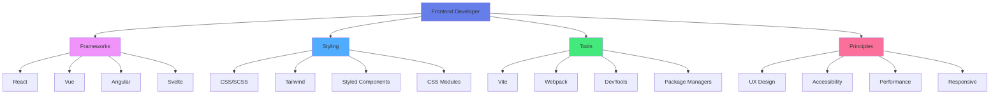

<div align="center">

# 🎨 Chapter 09 · Frontend Developer


### *React · Vue · UX Principles*


</div>

---

> [!NOTE]
> *"Design is not just what it looks like and feels like. Design is how it works."* — **Steve Jobs**

<div align="center">

[](./08-backend-dev.md)
[](./10-full-stack.md)

</div>

<br>

## 🚀 What Does a Frontend Developer Do?

<div align="center">

A **Frontend Developer** is responsible for building the **visual and interactive experience** of a web application.

</div>

<br>

<table>
<tr>
<td align="center" width="33%" bgcolor="#e3f2fd">

### 🧠 Application Logic

Component state  
User interactions  
Data flow

</td>
<td align="center" width="33%" bgcolor="#f3e5f5">

### 🎨 Visual Design

Layouts & styling  
Animations  
Responsive design

</td>
<td align="center" width="33%" bgcolor="#fff9c4">

### 👤 User Experience

Accessibility  
Performance  
Usability

</td>
</tr>
</table>

<br>

> [!IMPORTANT]
> Frontend developers translate ideas, designs, and business requirements into **usable, accessible, and attractive interfaces**.

---

<br>

## 🎯 Frontend Development Landscape

<br>

<div align="center">



</div>

---

<br>

## ⚛️ Part 1 · React

<div align="center">


</div>

<br>

**React** is a library developed by Meta (Facebook) for building user interfaces based on **reusable components**.

<br>

### 🔹 Key Features

<br>

<table>
<tr>
<td align="center" width="25%">

🧩  
**Component-based**

Reusable UI pieces

</td>
<td align="center" width="25%">

⚡  
**Virtual DOM**

High performance

</td>
<td align="center" width="25%">

➡️  
**Unidirectional**

Predictable data flow

</td>
<td align="center" width="25%">

🌟  
**Ecosystem**

Next.js, Redux, etc.

</td>
</tr>
</table>

---

<br>

### 🔹 When Should You Use React?

<br>

<table>
<tr>
<td width="50%" bgcolor="#e8f5e9" valign="top">

### ✅ Perfect For:

- Large and scalable applications
- Projects with high interactivity
- Teams that value flexibility
- SPAs (Single Page Applications)
- Complex state management needs
- Mobile apps (React Native)

</td>
<td width="50%" bgcolor="#fff3e0" valign="top">

### 🤔 Consider Alternatives When:

- Building simple static sites
- SEO is critical (use Next.js)
- Team prefers opinionated frameworks
- Learning curve is a concern
- Bundle size is critical

</td>
</tr>
</table>

---

<br>

### 📚 React Fundamentals

<br>

#### 1. Components

<br>

<details>
<summary><b>🧩 Functional Components</b></summary>

<br>

```javascript
// Simple component
function Welcome() {
  return <h1>Hello, World!</h1>;
}

// Component with props
function Greeting({ name, age }) {
  return (
    <div>
      <h1>Hello, {name}!</h1>
      <p>You are {age} years old.</p>
    </div>
  );
}

// Usage
<Greeting name="Alice" age={25} />
```

</details>

<details>
<summary><b>📦 Component Composition</b></summary>

<br>

```javascript
function Button({ children, onClick }) {
  return (
    <button onClick={onClick} className="btn">
      {children}
    </button>
  );
}

function Card({ title, content }) {
  return (
    <div className="card">
      <h2>{title}</h2>
      <p>{content}</p>
      <Button onClick={() => alert('Clicked!')}>
        Read More
      </Button>
    </div>
  );
}
```

</details>

---

<br>

#### 2. State Management

<br>

<details>
<summary><b>🎛️ useState Hook</b></summary>

<br>

```javascript
import { useState } from 'react';

function Counter() {
  const [count, setCount] = useState(0);

  return (
    <div>
      <p>Count: {count}</p>
      <button onClick={() => setCount(count + 1)}>
        Increment
      </button>
      <button onClick={() => setCount(count - 1)}>
        Decrement
      </button>
      <button onClick={() => setCount(0)}>
        Reset
      </button>
    </div>
  );
}
```

</details>

<details>
<summary><b>🔄 useEffect Hook</b></summary>

<br>

```javascript
import { useState, useEffect } from 'react';

function UserProfile({ userId }) {
  const [user, setUser] = useState(null);
  const [loading, setLoading] = useState(true);

  useEffect(() => {
    // Fetch user data when userId changes
    async function fetchUser() {
      setLoading(true);
      const response = await fetch(`/api/users/${userId}`);
      const data = await response.json();
      setUser(data);
      setLoading(false);
    }

    fetchUser();
  }, [userId]); // Dependency array

  if (loading) return <div>Loading...</div>;
  if (!user) return <div>User not found</div>;

  return (
    <div>
      <h1>{user.name}</h1>
      <p>{user.email}</p>
    </div>
  );
}
```

</details>

<details>
<summary><b>🎯 Custom Hooks</b></summary>

<br>

```javascript
// Custom hook for fetching data
function useFetch(url) {
  const [data, setData] = useState(null);
  const [loading, setLoading] = useState(true);
  const [error, setError] = useState(null);

  useEffect(() => {
    async function fetchData() {
      try {
        setLoading(true);
        const response = await fetch(url);
        const json = await response.json();
        setData(json);
      } catch (err) {
        setError(err.message);
      } finally {
        setLoading(false);
      }
    }

    fetchData();
  }, [url]);

  return { data, loading, error };
}

// Usage
function UserList() {
  const { data, loading, error } = useFetch('/api/users');

  if (loading) return <div>Loading...</div>;
  if (error) return <div>Error: {error}</div>;

  return (
    <ul>
      {data.map(user => (
        <li key={user.id}>{user.name}</li>
      ))}
    </ul>
  );
}
```

</details>

---

<br>

#### 3. React Router

<br>

<details>
<summary><b>🛣️ Client-Side Routing</b></summary>

<br>

```javascript
import { BrowserRouter, Routes, Route, Link } from 'react-router-dom';

function App() {
  return (
    <BrowserRouter>
      <nav>
        <Link to="/">Home</Link>
        <Link to="/about">About</Link>
        <Link to="/users">Users</Link>
      </nav>

      <Routes>
        <Route path="/" element={<Home />} />
        <Route path="/about" element={<About />} />
        <Route path="/users" element={<Users />} />
        <Route path="/users/:id" element={<UserDetail />} />
        <Route path="*" element={<NotFound />} />
      </Routes>
    </BrowserRouter>
  );
}
```

</details>

---

<br>

#### 4. Context API

<br>

<details>
<summary><b>🌐 Global State Without Props Drilling</b></summary>

<br>

```javascript
import { createContext, useContext, useState } from 'react';

// Create context
const ThemeContext = createContext();

// Provider component
function ThemeProvider({ children }) {
  const [theme, setTheme] = useState('light');

  const toggleTheme = () => {
    setTheme(theme === 'light' ? 'dark' : 'light');
  };

  return (
    <ThemeContext.Provider value={{ theme, toggleTheme }}>
      {children}
    </ThemeContext.Provider>
  );
}

// Custom hook to use theme
function useTheme() {
  return useContext(ThemeContext);
}

// Usage in components
function Button() {
  const { theme, toggleTheme } = useTheme();

  return (
    <button 
      className={theme}
      onClick={toggleTheme}
    >
      Toggle Theme
    </button>
  );
}

// App
function App() {
  return (
    <ThemeProvider>
      <Button />
    </ThemeProvider>
  );
}
```

</details>

---

<br>

### 🚀 React Ecosystem

<br>

<div align="center">

| Tool/Library | Purpose | Use Case |
|:---:|:---:|:---|
| **Next.js** | Framework | SSR, SSG, routing, API routes |
| **Redux** | State Management | Complex global state |
| **Zustand** | State Management | Simpler alternative to Redux |
| **React Query** | Data Fetching | Server state management |
| **Framer Motion** | Animation | Advanced animations |
| **Styled Components** | CSS-in-JS | Component styling |
| **React Hook Form** | Forms | Form validation & management |

</div>

---

<br>

## 🖼️ Part 2 · Vue.js

<div align="center">


</div>

<br>

**Vue** is a progressive framework that stands out for its **simplicity** and gentle learning curve.

<br>

### 🔹 Key Features

<br>

<table>
<tr>
<td align="center" width="25%">

📝  
**Clear Syntax**

Readable & expressive

</td>
<td align="center" width="25%">

🔄  
**Two-way Binding**

v-model simplicity

</td>
<td align="center" width="25%">

📚  
**Great Docs**

Best documentation

</td>
<td align="center" width="25%">

🎯  
**Progressive**

Scale as needed

</td>
</tr>
</table>

---

<br>

### 🔹 When Should You Use Vue?

<br>

<table>
<tr>
<td width="50%" bgcolor="#e8f5e9" valign="top">

### ✅ Perfect For:

- Projects needing quick setup
- Teams new to frameworks
- Gradual migration from jQuery
- Medium-sized applications
- Prototypes and MVPs
- When you want gentle learning curve

</td>
<td width="50%" bgcolor="#e3f2fd" valign="top">

### 🌟 Vue Advantages:

- Easier learning curve than React
- Less boilerplate code
- Built-in state management (Pinia)
- Official router included
- Excellent documentation
- Great CLI tools

</td>
</tr>
</table>

---

<br>

### 📚 Vue Fundamentals

<br>

#### 1. Vue Components

<br>

<details>
<summary><b>🎨 Single File Components (.vue)</b></summary>

<br>

```vue
<template>
  <div class="greeting">
    <h1>{{ message }}</h1>
    <button @click="updateMessage">Change Message</button>
  </div>
</template>

<script setup>
import { ref } from 'vue';

const message = ref('Hello, Vue!');

function updateMessage() {
  message.value = 'Message updated!';
}
</script>

<style scoped>
.greeting {
  padding: 20px;
  background: #42b983;
  color: white;
  border-radius: 8px;
}

button {
  margin-top: 10px;
  padding: 8px 16px;
  border: none;
  border-radius: 4px;
  cursor: pointer;
}
</style>
```

</details>

---

<br>

#### 2. Reactivity System

<br>

<details>
<summary><b>🔄 Reactive Data with Composition API</b></summary>

<br>

```vue
<script setup>
import { ref, reactive, computed } from 'vue';

// Reactive primitive
const count = ref(0);

// Reactive object
const user = reactive({
  name: 'Alice',
  age: 25,
  email: 'alice@example.com'
});

// Computed property
const isAdult = computed(() => user.age >= 18);

// Methods
function increment() {
  count.value++;
}

function updateUser() {
  user.age++;
}
</script>

<template>
  <div>
    <p>Count: {{ count }}</p>
    <button @click="increment">Increment</button>

    <h2>User: {{ user.name }}</h2>
    <p>Age: {{ user.age }}</p>
    <p>Status: {{ isAdult ? 'Adult' : 'Minor' }}</p>
    <button @click="updateUser">Age +1</button>
  </div>
</template>
```

</details>

---

<br>

#### 3. Vue Directives

<br>

<details>
<summary><b>🎯 Common Vue Directives</b></summary>

<br>

```vue
<template>
  <div>
    <!-- v-if: Conditional rendering -->
    <p v-if="isLoggedIn">Welcome back!</p>
    <p v-else>Please log in</p>

    <!-- v-for: List rendering -->
    <ul>
      <li v-for="user in users" :key="user.id">
        {{ user.name }}
      </li>
    </ul>

    <!-- v-model: Two-way binding -->
    <input v-model="searchQuery" placeholder="Search..." />

    <!-- v-show: Toggle visibility -->
    <div v-show="showDetails">
      Detailed information here
    </div>

    <!-- v-on (@): Event handling -->
    <button @click="handleClick">Click me</button>
    <input @input="handleInput" />

    <!-- v-bind (:): Attribute binding -->
    
    <div :class="{ active: isActive }"></div>
  </div>
</template>
```

</details>

---

<br>

#### 4. Vue Router

<br>

<details>
<summary><b>🛣️ Routing in Vue</b></summary>

<br>

```javascript
// router/index.js
import { createRouter, createWebHistory } from 'vue-router';
import Home from '../views/Home.vue';
import About from '../views/About.vue';

const routes = [
  {
    path: '/',
    name: 'Home',
    component: Home
  },
  {
    path: '/about',
    name: 'About',
    component: About
  },
  {
    path: '/users/:id',
    name: 'UserDetail',
    component: () => import('../views/UserDetail.vue')
  }
];

const router = createRouter({
  history: createWebHistory(),
  routes
});

export default router;
```

</details>

---

<br>

### 🚀 Vue Ecosystem

<br>

<div align="center">

| Tool/Library | Purpose | Use Case |
|:---:|:---:|:---|
| **Nuxt.js** | Framework | SSR, SSG, full-stack apps |
| **Pinia** | State Management | Modern Vuex alternative |
| **Vite** | Build Tool | Fast development server |
| **VueUse** | Utilities | Collection of composition utilities |
| **Vuetify** | UI Framework | Material Design components |
| **Element Plus** | UI Library | Enterprise components |
| **VueQuery** | Data Fetching | Server state management |

</div>

---

<br>

## 🎨 Part 3 · UX Principles for Developers

<br>

### 🌟 Core UX Principles

<br>

<table>
<tr>
<td width="50%" valign="top">

#### 1. **Usability**

- Clear navigation
- Intuitive interactions
- Consistent patterns
- Fast loading times
- Error prevention

</td>
<td width="50%" valign="top">

#### 2. **Accessibility**

- Keyboard navigation
- Screen reader support
- Color contrast
- ARIA labels
- Semantic HTML

</td>
</tr>
<tr>
<td width="50%" valign="top">

#### 3. **Visual Hierarchy**

- Size and scale
- Color and contrast
- Typography
- Whitespace
- Alignment

</td>
<td width="50%" valign="top">

#### 4. **Feedback**

- Loading states
- Success messages
- Error handling
- Progress indicators
- Hover effects

</td>
</tr>
</table>

---

<br>

### ♿ Accessibility (a11y)

<br>

<details>
<summary><b>✅ Accessibility Best Practices</b></summary>

<br>

```html
<!-- Semantic HTML -->
<nav>
  <ul>
    <li><a href="/">Home</a></li>
    <li><a href="/about">About</a></li>
  </ul>
</nav>

<!-- ARIA labels -->
<button aria-label="Close modal" @click="closeModal">
  <span aria-hidden="true">×</span>
</button>

<!-- Alt text for images -->


<!-- Form labels -->
<label for="email">Email:</label>
<input id="email" type="email" required />

<!-- Skip links -->
<a href="#main-content" class="skip-link">
  Skip to main content
</a>
```

</details>

<details>
<summary><b>⌨️ Keyboard Navigation</b></summary>

<br>

```javascript
// React example
function Modal({ isOpen, onClose }) {
  useEffect(() => {
    function handleEscape(e) {
      if (e.key === 'Escape') {
        onClose();
      }
    }

    if (isOpen) {
      document.addEventListener('keydown', handleEscape);
      return () => document.removeEventListener('keydown', handleEscape);
    }
  }, [isOpen, onClose]);

  if (!isOpen) return null;

  return (
    <div 
      role="dialog" 
      aria-modal="true"
      tabIndex="-1"
    >
      {/* Modal content */}
    </div>
  );
}
```

</details>

---

<br>

### 📱 Responsive Design

<br>

<details>
<summary><b>📐 Mobile-First Approach</b></summary>

<br>

```css
/* Mobile first (default) */
.container {
  padding: 10px;
  font-size: 14px;
}

/* Tablet */
@media (min-width: 768px) {
  .container {
    padding: 20px;
    font-size: 16px;
  }
}

/* Desktop */
@media (min-width: 1024px) {
  .container {
    padding: 30px;
    max-width: 1200px;
    margin: 0 auto;
  }
}
```

</details>

<details>
<summary><b>🎨 Responsive Grid</b></summary>

<br>

```css
.grid {
  display: grid;
  gap: 20px;
  
  /* Mobile: 1 column */
  grid-template-columns: 1fr;
}

/* Tablet: 2 columns */
@media (min-width: 768px) {
  .grid {
    grid-template-columns: repeat(2, 1fr);
  }
}

/* Desktop: 3 columns */
@media (min-width: 1024px) {
  .grid {
    grid-template-columns: repeat(3, 1fr);
  }
}
```

</details>

---

<br>

### ⚡ Performance Optimization

<br>

<details>
<summary><b>🚀 Code Splitting</b></summary>

<br>

```javascript
// React lazy loading
import { lazy, Suspense } from 'react';

const Dashboard = lazy(() => import('./Dashboard'));
const Profile = lazy(() => import('./Profile'));

function App() {
  return (
    <Suspense fallback={<div>Loading...</div>}>
      <Routes>
        <Route path="/dashboard" element={<Dashboard />} />
        <Route path="/profile" element={<Profile />} />
      </Routes>
    </Suspense>
  );
}
```

</details>

<details>
<summary><b>🖼️ Image Optimization</b></summary>

<br>

```html
<!-- Responsive images -->
<picture>
  <source 
    media="(min-width: 1024px)" 
    srcset="large.jpg"
  />
  <source 
    media="(min-width: 768px)" 
    srcset="medium.jpg"
  />
  
</picture>

<!-- Modern formats -->
<picture>
  <source type="image/webp" srcset="image.webp" />
  <source type="image/jpeg" srcset="image.jpg" />
  
</picture>
```

</details>

---

<br>

## 🎨 Part 4 · CSS & Styling Approaches

<br>

### 🔹 Modern CSS Techniques

<br>

<details>
<summary><b>🎯 CSS Grid Layout</b></summary>

<br>

```css
.dashboard {
  display: grid;
  grid-template-columns: 250px 1fr;
  grid-template-rows: auto 1fr auto;
  grid-template-areas:
    "sidebar header"
    "sidebar main"
    "sidebar footer";
  min-height: 100vh;
}

.sidebar { grid-area: sidebar; }
.header { grid-area: header; }
.main { grid-area: main; }
.footer { grid-area: footer; }
```

</details>

<details>
<summary><b>💪 Flexbox</b></summary>

<br>

```css
.navbar {
  display: flex;
  justify-content: space-between;
  align-items: center;
  padding: 1rem 2rem;
}

.card-list {
  display: flex;
  flex-wrap: wrap;
  gap: 20px;
}

.card {
  flex: 1 1 300px; /* grow, shrink, basis */
  min-width: 0; /* Prevent overflow */
}
```

</details>

<details>
<summary><b>🎨 CSS Variables</b></summary>

<br>

```css
:root {
  /* Colors */
  --primary: #3b82f6;
  --secondary: #8b5cf6;
  --success: #10b981;
  --danger: #ef4444;
  
  /* Spacing */
  --spacing-xs: 0.25rem;
  --spacing-sm: 0.5rem;
  --spacing-md: 1rem;
  --spacing-lg: 2rem;
  
  /* Typography */
  --font-sans: system-ui, sans-serif;
  --font-size-base: 16px;
}

.button {
  background: var(--primary);
  padding: var(--spacing-md);
  font-family: var(--font-sans);
}
```

</details>

---

<br>

### 🎨 CSS Frameworks & Libraries

<br>

<div align="center">

| Framework | Philosophy | Best For |
|:---:|:---|:---|
| **Tailwind CSS** | Utility-first | Rapid prototyping, custom designs |
| **Bootstrap** | Component-based | Quick projects, consistency |
| **Material-UI** | Material Design | Enterprise apps, React |
| **Chakra UI** | Accessible components | React apps, a11y focus |
| **Ant Design** | Enterprise design | Admin panels, dashboards |
| **Bulma** | Flexbox-based | Simple, modern layouts |

</div>

---

<br>

## 🤖 AI Tip · Frontend Development

<br>

### ✅ Smart Prompts:

<table>
<tr>
<td width="50%">

```
💡 "Convert this design to React components"
```
```
💡 "Optimize this component for performance"
```
```
💡 "Make this form accessible"
```

</td>
<td width="50%">

```
💡 "Create responsive grid with Tailwind"
```
```
💡 "Debug this React rendering issue"
```
```
💡 "Improve UX of this user flow"
```

</td>
</tr>
</table>

<br>

### 🎯 AI Can Help With:

| Area | Application |
|:---|:---|
| ✅ Component generation | Boilerplate code |
| ✅ CSS styling | Layout solutions |
| ✅ Accessibility | ARIA labels, a11y fixes |
| ✅ Performance | Optimization suggestions |
| ✅ Debugging | Error analysis |
| ✅ Responsive design | Media query generation |

---

<br>

## 🎯 Mission · Day 09

<div align="center">

### 🎨 Build beautiful, accessible interfaces

</div>

<br>

### Core Tasks:

- [ ] ⚛️ **Build a React app** — With hooks and components
- [ ] 🖼️ **Or build a Vue app** — Using Composition API
- [ ] 🎨 **Style with modern CSS** — Grid, Flexbox, or Tailwind
- [ ] ♿ **Make it accessible** — Keyboard nav, ARIA labels
- [ ] 📱 **Make it responsive** — Mobile-first design
- [ ] ⚡ **Optimize performance** — Lazy loading, code splitting

<br>

<details>
<summary><b>⭐ Bonus Challenges</b></summary>

<br>

- [ ] 🎭 Add smooth animations (Framer Motion or Vue transitions)
- [ ] 🌙 Implement dark mode toggle
- [ ] 🔍 Add search functionality with debouncing
- [ ] 📊 Create a data visualization dashboard
- [ ] 🎯 Implement advanced routing with protected routes
- [ ] 🧪 Write component tests (Jest, Vitest)
- [ ] 🚀 Deploy to Vercel or Netlify
- [ ] ♻️ Implement state management (Redux, Zustand, or Pinia)

</details>

---

<br>

## 📚 Frontend Checklist

<div align="center">

### Before Shipping:

</div>

<br>

<table>
<tr>
<td width="50%" valign="top">

#### ✅ Functionality:

- [ ] All features working
- [ ] Forms validated
- [ ] Error handling
- [ ] Loading states
- [ ] Navigation works
- [ ] Data persists correctly

</td>
<td width="50%" valign="top">

#### ✅ Quality:

- [ ] Mobile responsive
- [ ] Accessible (WCAG AA)
- [ ] Fast loading (<3s)
- [ ] Cross-browser tested
- [ ] SEO optimized
- [ ] No console errors

</td>
</tr>
</table>

---

<br>

<div align="center">

## 🏆 Achievement Unlocked

### **The UI Master**

<br>

**You now understand:**
- React & Vue fundamentals
- Component architecture
- UX principles
- Accessibility
- Responsive design
- Performance optimization

<br>

*You're no longer just coding interfaces.*  
**You're crafting user experiences.**

<br>


</div>

---

<br>

<div align="center">

### 🎓 Pro Tip

> "Good design is invisible.  
> Great UX is when users don't even think about the interface—  
> they just accomplish their goals effortlessly."

</div>

---

<br>

<div align="center">

### 🌟 Remember

**Code is temporary. User experience is forever.**  
Build interfaces that people love to use.

<br>

[](./10-full-stack.md)

</div>

<br>
