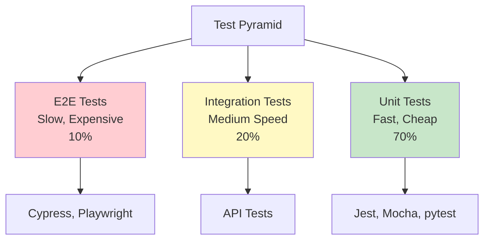
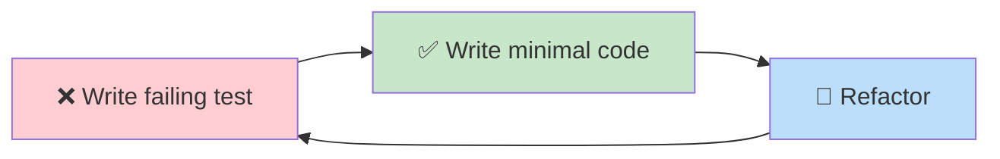

<div align="center">

# ✨ Chapter 12 · Code Quality


### *Clean Code · Testing · Refactoring*


</div>

---

> [!NOTE]
> *"Any fool can write code that a computer can understand. Good programmers write code that humans can understand."* — **Martin Fowler**

<div align="center">

[](./11-AI-integration.md)
[](./13-habits-&-growth.md)

</div>

<br>

## 🎯 Why Code Quality Matters

<div align="center">

**Bad code works... until it doesn't.**

</div>

<br>

<table>
<tr>
<td width="50%" bgcolor="#ffebee" valign="top">

### ❌ Junior Developer:

*"It works, ship it!"*

</td>
<td width="50%" bgcolor="#e8f5e9" valign="top">

### ✅ Senior Developer:

*"It works, but can others understand it? Can I maintain it?"*

</td>
</tr>
</table>

<br>

### 💰 The Cost of Bad Code

<table>
<tr>
<td align="center" width="20%">

🐛  
**More bugs**

Production issues

</td>
<td align="center" width="20%">

⏱️  
**Slower dev**

Time compounds

</td>
<td align="center" width="20%">

😤  
**Frustration**

Team morale drops

</td>
<td align="center" width="20%">

💸  
**Higher costs**

Maintenance nightmare

</td>
<td align="center" width="20%">

🔥  
**Tech debt**

Interest compounds

</td>
</tr>
</table>

<br>

> [!IMPORTANT]
> **Writing clean code takes the same time as writing messy code. But reading clean code saves hours.**

---

<br>

## 📖 Part 1 · Clean Code Principles

<div align="center">

### *Code That Speaks for Itself*

</div>

<br>

<details>
<summary><b>✅ What is Clean Code?</b></summary>

<br>

Clean code is code that:
- ✅ Is easy to read
- ✅ Is easy to understand
- ✅ Is easy to modify
- ✅ Does one thing well

</details>

<br>

### 🏷️ Meaningful Names

<table>
<tr>
<td width="50%" valign="top">

#### ❌ Bad: Cryptic names

```javascript
function calc(a, b) {
  const x = a * b;
  const y = x * 0.2;
  return x - y;
}
```

</td>
<td width="50%" valign="top">

#### ✅ Good: Self-documenting

```javascript
function calculateTotalWithDiscount(price, quantity) {
  const subtotal = price * quantity;
  const discount = subtotal * 0.2;
  return subtotal - discount;
}
```

</td>
</tr>
</table>

<br>

<details>
<summary><b>🐍 Python Example</b></summary>

<br>

<table>
<tr>
<td width="50%" valign="top">

#### ❌ Bad: Ambiguous names

```python
def process(d):
    result = []
    for i in d:
        if i[0] > 18:
            result.append(i)
    return result
```

</td>
<td width="50%" valign="top">

#### ✅ Good: Clear and descriptive

```python
def get_adult_users(users):
    adult_users = []
    for user in users:
        if user['age'] > 18:
            adult_users.append(user)
    return adult_users
```

#### ✅ Even better: Pythonic

```python
def get_adult_users(users):
    return [user for user in users 
            if user['age'] > 18]
```

</td>
</tr>
</table>

</details>

---

<br>

### 📏 Functions Should Do One Thing

<br>

<details>
<summary><b>❌ Bad Example: Function does too much</b></summary>

<br>

```javascript
function processUserAndSendEmail(userData) {
  // Validate data
  if (!userData.email || !userData.name) {
    throw new Error('Invalid data');
  }
  
  // Save to database
  const user = db.users.create(userData);
  
  // Send email
  emailService.send({
    to: user.email,
    subject: 'Welcome!',
    body: `Hello ${user.name}`
  });
  
  // Log analytics
  analytics.track('user_created', { userId: user.id });
  
  return user;
}
```

> ⚠️ **Problems:**
> - Violates Single Responsibility Principle
> - Hard to test
> - Hard to reuse
> - Difficult to modify

</details>

<details>
<summary><b>✅ Good Example: Separate concerns</b></summary>

<br>

```javascript
function validateUserData(userData) {
  if (!userData.email || !userData.name) {
    throw new Error('Invalid data');
  }
}

function createUser(userData) {
  validateUserData(userData);
  return db.users.create(userData);
}

function sendWelcomeEmail(user) {
  emailService.send({
    to: user.email,
    subject: 'Welcome!',
    body: `Hello ${user.name}`
  });
}

function trackUserCreation(user) {
  analytics.track('user_created', { userId: user.id });
}

// Orchestrate
function registerUser(userData) {
  const user = createUser(userData);
  sendWelcomeEmail(user);
  trackUserCreation(user);
  return user;
}
```

> ✅ **Benefits:**
> - Each function has one job
> - Easy to test individually
> - Reusable components
> - Clear responsibilities

</details>

---

<br>

### 💬 Comments vs Self-Documenting Code

<br>

<table>
<tr>
<td width="50%" valign="top">

#### ❌ Bad: Comments explain WHAT

```javascript
// Loop through users array
for (let i = 0; i < users.length; i++) {
  // Check if user age is greater than 18
  if (users[i].age > 18) {
    // Add to adults array
    adults.push(users[i]);
  }
}
```

</td>
<td width="50%" valign="top">

#### ✅ Good: Code explains itself

```javascript
const adults = users.filter(
  user => user.age > 18
);
```

#### ✅ Good: Comments explain WHY

```javascript
// We filter at 18 because that's 
// the legal age in most jurisdictions
// TODO: Make this configurable per region
const LEGAL_AGE = 18;
const adults = users.filter(
  user => user.age >= LEGAL_AGE
);
```

</td>
</tr>
</table>

---

<br>

### 🔢 Magic Numbers

<br>

<details>
<summary><b>❌ Bad Example: Magic numbers everywhere</b></summary>

<br>

```javascript
if (user.role === 3) {
  grantAccess();
}

setTimeout(() => checkStatus(), 5000);
```

> ⚠️ What does 3 mean? What's 5000?

</details>

<details>
<summary><b>✅ Good Example: Named constants</b></summary>

<br>

```javascript
const ROLE_ADMIN = 3;
const STATUS_CHECK_INTERVAL_MS = 5000;

if (user.role === ROLE_ADMIN) {
  grantAccess();
}

setTimeout(() => checkStatus(), STATUS_CHECK_INTERVAL_MS);
```

</details>

<details>
<summary><b>✅ Even Better: Enums</b></summary>

<br>

```javascript
const UserRole = {
  GUEST: 1,
  USER: 2,
  ADMIN: 3,
  SUPERADMIN: 4
};

if (user.role === UserRole.ADMIN) {
  grantAccess();
}
```

</details>

---

<br>

### 📦 Keep It Simple (KISS)

<br>

| ❌ Bad: Overly complex | ✅ Good: Simple and clear |
|:---|:---|
| `function isDivisibleByThreeAndFive(number) {`<br>`  return (`<br>`    (number % 3 === 0 && number % 5 === 0) \|\|`<br>`    (number % 3 === 0 && number % 5 !== 0 && number % 5 === 0) \|\|`<br>`    (number % 3 !== 0 && number % 3 === 0 && number % 5 === 0)`<br>`  ) ? true : false;`<br>`}` | `function isDivisibleByThreeAndFive(number) {`<br>`  return number % 3 === 0 && number % 5 === 0;`<br>`}` |

---

<br>

### 🔁 DRY (Don't Repeat Yourself)

<br>

<details>
<summary><b>❌ Bad Example: Repetition</b></summary>

<br>

```javascript
function getUserEmail(userId) {
  const response = await fetch(`/api/users/${userId}`);
  const user = await response.json();
  return user.email;
}

function getUserName(userId) {
  const response = await fetch(`/api/users/${userId}`);
  const user = await response.json();
  return user.name;
}

function getUserAge(userId) {
  const response = await fetch(`/api/users/${userId}`);
  const user = await response.json();
  return user.age;
}
```

</details>

<details>
<summary><b>✅ Good Example: Reusable function</b></summary>

<br>

```javascript
async function getUser(userId) {
  const response = await fetch(`/api/users/${userId}`);
  return await response.json();
}

async function getUserEmail(userId) {
  const user = await getUser(userId);
  return user.email;
}

// Even better: Just use directly
const user = await getUser(userId);
console.log(user.email);
```

</details>

---

<br>

## 🧪 Part 2 · Testing

<div align="center">

### *Confidence in Your Code*

**Tests are not optional. They are insurance.**

</div>

<br>

<table>
<tr>
<td width="50%" bgcolor="#ffebee" valign="top">

### ❌ Without Tests

- Fear of changing code
- Manual testing after every change
- Bugs in production
- "It works on my machine"

</td>
<td width="50%" bgcolor="#e8f5e9" valign="top">

### ✅ With Tests

- Refactor with confidence
- Automated verification
- Catch bugs before deployment
- Consistent behavior

</td>
</tr>
</table>

---

<br>

### 🎯 Types of Tests

<br>

<div align="center">



</div>

<br>

```
┌─────────────────────────────────────┐
│       E2E Tests (Slow, Expensive)   │
│  Test entire user workflows         │
│  Example: Cypress, Playwright       │
├─────────────────────────────────────┤
│    Integration Tests (Medium)       │
│  Test multiple components together  │
│  Example: API tests                 │
├─────────────────────────────────────┤
│     Unit Tests (Fast, Cheap)        │
│  Test individual functions          │
│  Example: Jest, Mocha               │
└─────────────────────────────────────┘

Test Pyramid: 70% Unit, 20% Integration, 10% E2E
```

---

<br>

### 🧪 Unit Testing with Jest

<br>

<details>
<summary><b>📝 Code to Test</b></summary>

<br>

```javascript
// math.js
export function add(a, b) {
  return a + b;
}

export function multiply(a, b) {
  return a * b;
}

export function divide(a, b) {
  if (b === 0) {
    throw new Error('Cannot divide by zero');
  }
  return a / b;
}
```

</details>

<details>
<summary><b>✅ Test Suite</b></summary>

<br>

```javascript
// math.test.js
import { add, multiply, divide } from './math';

describe('Math functions', () => {
  
  describe('add', () => {
    test('should add two positive numbers', () => {
      expect(add(2, 3)).toBe(5);
    });
    
    test('should handle negative numbers', () => {
      expect(add(-2, 3)).toBe(1);
    });
    
    test('should handle zero', () => {
      expect(add(0, 5)).toBe(5);
    });
  });
  
  describe('multiply', () => {
    test('should multiply two numbers', () => {
      expect(multiply(3, 4)).toBe(12);
    });
    
    test('should return zero when multiplying by zero', () => {
      expect(multiply(5, 0)).toBe(0);
    });
  });
  
  describe('divide', () => {
    test('should divide two numbers', () => {
      expect(divide(10, 2)).toBe(5);
    });
    
    test('should throw error when dividing by zero', () => {
      expect(() => divide(10, 0)).toThrow('Cannot divide by zero');
    });
  });
  
});
```

</details>

---

<br>

### 🐍 Unit Testing with pytest

<br>

<details>
<summary><b>📝 Code to Test</b></summary>

<br>

```python
# calculator.py
def add(a, b):
    return a + b

def subtract(a, b):
    return a - b

def divide(a, b):
    if b == 0:
        raise ValueError("Cannot divide by zero")
    return a / b
```

</details>

<details>
<summary><b>✅ Test Suite</b></summary>

<br>

```python
# test_calculator.py
import pytest
from calculator import add, subtract, divide

class TestCalculator:
    
    def test_add_positive_numbers(self):
        assert add(2, 3) == 5
    
    def test_add_negative_numbers(self):
        assert add(-2, 3) == 1
    
    def test_subtract(self):
        assert subtract(10, 3) == 7
    
    def test_divide(self):
        assert divide(10, 2) == 5
    
    def test_divide_by_zero_raises_error(self):
        with pytest.raises(ValueError, match="Cannot divide by zero"):
            divide(10, 0)
```

</details>

---

<br>

### 🎯 Testing Best Practices

<br>

<table>
<tr>
<td width="50%" valign="top">

#### ✅ Good: Test behavior

```javascript
test('should filter adult users', () => {
  const users = [
    { name: 'Alice', age: 25 },
    { name: 'Bob', age: 17 }
  ];
  
  const adults = getAdultUsers(users);
  
  expect(adults).toHaveLength(1);
  expect(adults[0].name).toBe('Alice');
});
```

</td>
<td width="50%" valign="top">

#### ❌ Bad: Test implementation

```javascript
test('should loop through users array', () => {
  // Don't test HOW it works,
  // test WHAT it does
});
```

</td>
</tr>
</table>

<br>

<details>
<summary><b>✅ Test Edge Cases Example</b></summary>

<br>

```javascript
describe('getUserById', () => {
  test('should return user when found', () => {
    const user = getUserById(1);
    expect(user).toBeDefined();
  });
  
  test('should return null when user not found', () => {
    const user = getUserById(999);
    expect(user).toBeNull();
  });
  
  test('should handle invalid ID types', () => {
    expect(() => getUserById('invalid')).toThrow();
  });
});
```

</details>

---

<br>

### 🔄 Test-Driven Development (TDD)

<br>

<div align="center">



</div>

<br>

<details>
<summary><b>📚 TDD Example</b></summary>

<br>

**Step 1: Write test first (it will fail)**
```javascript
test('should calculate discount price', () => {
  expect(calculateDiscount(100, 0.2)).toBe(80);
});
```

**Step 2: Write minimal code to pass**
```javascript
function calculateDiscount(price, discountRate) {
  return price - (price * discountRate);
}
```

**Step 3: Refactor if needed**
```javascript
function calculateDiscount(price, discountRate) {
  if (price < 0 || discountRate < 0 || discountRate > 1) {
    throw new Error('Invalid input');
  }
  return price * (1 - discountRate);
}
```

</details>

---

<br>

### 🎭 Mocking & Stubbing

<br>

<details>
<summary><b>🔧 Service Code</b></summary>

<br>

```javascript
// user.service.js
export async function getUserData(userId) {
  const response = await fetch(`/api/users/${userId}`);
  return await response.json();
}
```

</details>

<details>
<summary><b>✅ Test with Mocks</b></summary>

<br>

```javascript
// user.service.test.js
import { getUserData } from './user.service';

// Mock fetch
global.fetch = jest.fn();

describe('getUserData', () => {
  
  beforeEach(() => {
    fetch.mockClear();
  });
  
  test('should fetch user data', async () => {
    const mockUser = { id: 1, name: 'Alice' };
    
    fetch.mockResolvedValueOnce({
      json: async () => mockUser
    });
    
    const user = await getUserData(1);
    
    expect(fetch).toHaveBeenCalledWith('/api/users/1');
    expect(user).toEqual(mockUser);
  });
  
  test('should handle fetch errors', async () => {
    fetch.mockRejectedValueOnce(new Error('Network error'));
    
    await expect(getUserData(1)).rejects.toThrow('Network error');
  });
  
});
```

</details>

---

<br>

## 🔧 Part 3 · Refactoring

<div align="center">

### *Improving Code Without Changing Behavior*

**Refactoring** = Restructuring code to make it better without changing what it does.

</div>

<br>

### 🎯 When to Refactor

<table>
<tr>
<td align="center" width="33%">

🔴  
**Hard to understand**

Code is cryptic

</td>
<td align="center" width="33%">

🔴  
**Too long**

Functions >20 lines

</td>
<td align="center" width="33%">

🔴  
**Duplicated**

Copy-paste code

</td>
</tr>
<tr>
<td align="center" width="33%">

🔴  
**Many parameters**

More than 3

</td>
<td align="center" width="33%">

🔴  
**Deep nesting**

More than 3 levels

</td>
<td align="center" width="33%">

🔴  
**Before features**

Clean before adding

</td>
</tr>
</table>

---

<br>

### 🏗️ Extract Function

<br>

<details>
<summary><b>❌ Before: Long function</b></summary>

<br>

```javascript
function generateReport(users) {
  let report = '';
  
  // Calculate totals
  let totalAge = 0;
  let count = 0;
  for (const user of users) {
    totalAge += user.age;
    count++;
  }
  const avgAge = totalAge / count;
  
  // Format report
  report += '=== User Report ===\n';
  report += `Total Users: ${count}\n`;
  report += `Average Age: ${avgAge.toFixed(2)}\n`;
  report += '\nUsers:\n';
  
  for (const user of users) {
    report += `- ${user.name} (${user.age})\n`;
  }
  
  return report;
}
```

</details>

<details>
<summary><b>✅ After: Extracted functions</b></summary>

<br>

```javascript
function calculateAverageAge(users) {
  const totalAge = users.reduce((sum, user) => sum + user.age, 0);
  return totalAge / users.length;
}

function formatUserList(users) {
  return users.map(user => `- ${user.name} (${user.age})`).join('\n');
}

function generateReport(users) {
  const avgAge = calculateAverageAge(users);
  
  return `
=== User Report ===
Total Users: ${users.length}
Average Age: ${avgAge.toFixed(2)}

Users:
${formatUserList(users)}
  `.trim();
}
```

</details>

---

<br>

### 📦 Extract Variable

<br>

<table>
<tr>
<td width="50%" valign="top">

#### ❌ Before: Complex expression

```javascript
if (order.total > 100 && 
    order.items.length > 5 && 
    order.user.isPremium) {
  applyDiscount();
}
```

</td>
<td width="50%" valign="top">

#### ✅ After: Meaningful variables

```javascript
const isLargeOrder = order.total > 100;
const hasMultipleItems = order.items.length > 5;
const isPremiumCustomer = order.user.isPremium;

if (isLargeOrder && 
    hasMultipleItems && 
    isPremiumCustomer) {
  applyDiscount();
}
```

</td>
</tr>
</table>

---

<br>

### 🎨 Replace Conditional with Polymorphism

<br>

<details>
<summary><b>❌ Before: Switch statement</b></summary>

<br>

```javascript
function getSpeed(vehicle) {
  switch(vehicle.type) {
    case 'car':
      return vehicle.speed;
    case 'bike':
      return vehicle.speed * 0.5;
    case 'plane':
      return vehicle.speed * 10;
    default:
      return 0;
  }
}
```

</details>

<details>
<summary><b>✅ After: Polymorphism</b></summary>

<br>

```javascript
class Vehicle {
  getSpeed() {
    return this.speed;
  }
}

class Car extends Vehicle {
  getSpeed() {
    return this.speed;
  }
}

class Bike extends Vehicle {
  getSpeed() {
    return this.speed * 0.5;
  }
}

class Plane extends Vehicle {
  getSpeed() {
    return this.speed * 10;
  }
}
```

</details>

---

<br>

### 🔄 Replace Loop with Pipeline

<br>

<table>
<tr>
<td width="50%" valign="top">

#### ❌ Before: Imperative loop

```javascript
function getActiveAdultUsernames(users) {
  const result = [];
  
  for (let i = 0; i < users.length; i++) {
    if (users[i].age >= 18 && 
        users[i].active) {
      result.push(users[i].username);
    }
  }
  
  return result;
}
```

</td>
<td width="50%" valign="top">

#### ✅ After: Functional pipeline

```javascript
function getActiveAdultUsernames(users) {
  return users
    .filter(user => user.age >= 18)
    .filter(user => user.active)
    .map(user => user.username);
}
```

</td>
</tr>
</table>

---

<br>

### 🧹 Remove Dead Code

<br>

<table>
<tr>
<td width="50%" valign="top">

#### ❌ Before: Commented code

```javascript
function processOrder(order) {
  // const oldMethod = calculateOldPrice(order);
  // console.log('Debug:', oldMethod);
  
  return calculateNewPrice(order);
}

function calculateOldPrice(order) {
  // This is no longer used
  return order.total * 0.9;
}
```

</td>
<td width="50%" valign="top">

#### ✅ After: Clean and minimal

```javascript
function processOrder(order) {
  return calculateNewPrice(order);
}

// If you need old code, Git has it!
```

</td>
</tr>
</table>

---

<br>

## 🎯 Part 4 · Code Review Best Practices

<br>

### 👥 For Reviewers

<br>

<table>
<tr>
<td width="50%" bgcolor="#e8f5e9" valign="top">

### ✅ Do:

- 🎯 Focus on logic and maintainability
- ❓ Ask questions, don't demand
- 👏 Praise good code
- 💡 Suggest alternatives
- ✅ Check for tests

</td>
<td width="50%" bgcolor="#ffebee" valign="top">

### ❌ Don't:

- 🎨 Nitpick style (use linters instead)
- 😤 Be condescending
- 📚 Review 1000+ lines at once
- 🚫 Block on personal preferences

</td>
</tr>
</table>

---

<br>

### 📝 Good Code Review Comments

<br>

<details>
<summary><b>✅ Good Examples</b></summary>

<br>

**Constructive:**
```
"This works, but could be more efficient. Have you considered 
using a Map here instead of an array? It would give us O(1) 
lookup instead of O(n)."
```

**Question-based:**
```
"What happens if userId is undefined here? Should we add 
validation?"
```

**Specific:**
```
"Line 42: This could throw an error if the array is empty. 
Consider adding a length check."
```

</details>

<details>
<summary><b>❌ Bad Examples</b></summary>

<br>

**Vague:**
```
"This is wrong."
```

**Condescending:**
```
"Obviously you should use a Map here. Everyone knows that."
```

</details>

---

<br>

## 🛠️ Part 5 · Tools for Code Quality

<br>

### 📏 Linters

<br>

<details>
<summary><b>ESLint (JavaScript)</b></summary>

<br>

```json
// .eslintrc.json
{
  "extends": ["eslint:recommended"],
  "rules": {
    "no-unused-vars": "error",
    "no-console": "warn",
    "prefer-const": "error",
    "max-len": ["error", { "code": 80 }]
  }
}
```

</details>

<details>
<summary><b>Pylint (Python)</b></summary>

<br>

```bash
# Install
pip install pylint

# Run
pylint myfile.py
```

</details>

---

<br>

### 🎨 Formatters

<br>

<details>
<summary><b>Prettier (JavaScript)</b></summary>

<br>

```json
// .prettierrc
{
  "semi": true,
  "singleQuote": true,
  "tabWidth": 2,
  "printWidth": 80
}
```

</details>

<details>
<summary><b>Black (Python)</b></summary>

<br>

```bash
# Install
pip install black

# Format
black myfile.py
```

</details>

---

<br>

### 🔍 Static Analysis

<br>

<details>
<summary><b>TypeScript Example</b></summary>

<br>

```typescript
// Catch errors before runtime
function greet(name: string): string {
  return `Hello, ${name}`;
}

greet(42); // ❌ Error: Argument of type 'number' 
           //    is not assignable
```

</details>

---

<br>

## 🤖 AI Tip · Code Quality

<br>

### ✅ Smart Prompts:

<table>
<tr>
<td width="50%">

```
💡 "Review this code and suggest improvements"
```
```
💡 "Refactor this function to be more readable"
```
```
💡 "Write unit tests for this function"
```

</td>
<td width="50%">

```
💡 "Explain why this code violates SOLID principles"
```
```
💡 "Convert this imperative code to functional style"
```
```
💡 "Find edge cases I might have missed"
```

</td>
</tr>
</table>

<br>

### 🎯 AI Can Help With:

| Area | Application |
|:---|:---|
| ✅ Generating test cases | Comprehensive coverage |
| ✅ Suggesting refactoring patterns | Design improvements |
| ✅ Explaining code smells | Learning opportunities |
| ✅ Creating documentation | Clear explanations |
| ✅ Finding edge cases | Better testing |

---

<br>

## 🎯 Mission · Day 12

<div align="center">

### ✨ Level up your code quality

</div>

<br>

### Core Tasks:

- [ ] 📖 **Refactor an old project** — Apply clean code principles
- [ ] 🧪 **Write unit tests** — At least 3 functions
- [ ] 🔧 **Set up linting** — ESLint/Pylint in a project
- [ ] 🎨 **Configure formatting** — Prettier/Black for auto-format
- [ ] 👥 **Code review** — Review a colleague's PR
- [ ] 📊 **Test coverage** — Achieve 80%+ on a module

<br>

<details>
<summary><b>⭐ Bonus Challenges</b></summary>

<br>

- [ ] 🔴 Practice TDD: Write tests before code
- [ ] 🪝 Set up pre-commit hooks for linting
- [ ] 🚀 Implement CI tests in GitHub Actions
- [ ] 🏗️ Refactor a complex function using extract method
- [ ] 🔌 Write integration tests for an API
- [ ] 📚 Document your code with JSDoc/docstrings
- [ ] 📈 Measure and improve code complexity metrics

</details>

---

<br>

## 📚 Code Quality Checklist

<div align="center">

### Before Committing:

</div>

<br>

| ✅ | Checklist Item |
|:---:|:---|
| ☑️ | Code follows naming conventions |
| ☑️ | Functions are small and focused |
| ☑️ | No magic numbers or hardcoded values |
| ☑️ | DRY principle applied |
| ☑️ | Tests written and passing |
| ☑️ | Code formatted (Prettier/Black) |
| ☑️ | Linter passes with no errors |
| ☑️ | No commented-out code |
| ☑️ | Complex logic has comments explaining WHY |
| ☑️ | Error handling implemented |

---

<br>

<div align="center">

## 🏆 Achievement Unlocked

### **The Craftsperson**

<br>

**You now understand:**
- Clean code principles
- Test-driven development
- Refactoring techniques
- Code review best practices
- Quality tooling

<br>

*You're no longer just writing code.*  
**You're crafting maintainable software.**

<br>


</div>

---

<br>

<div align="center">

### 🎓 Pro Tip

> "Leave the code better than you found it.  
> The Boy Scout Rule applies to programming too."

</div>

---

<br>

<div align="center">

### ✨ Remember

**Code is read 10× more than it's written.**  
**Write for the humans who will maintain it,**  
**not for the computer that will execute it.**

<br>

[](./13-habits-&-growth.md)

</div>

<br>
