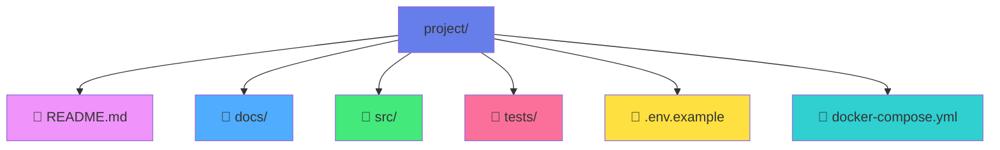

<div align="center">

# ✨ Chapter 14 · Projects


### *Real‑World Portfolio Building*

</div>

---

> [!NOTE]
> *"Talk is cheap. Show me the code."* — **Linus Torvalds**

<div align="center">

[](./13-habits-&-growth.md)
[](./15-career-launch.md)

</div>

<br>

## 🎯 Why Projects Matter More Than Certificates

<table>
<tr>
<td width="50%">

**Courses** teach you *how*.

</td>
<td width="50%">

**Projects** prove you *can*.

</td>
</tr>
</table>

<br>

<table>
<tr>
<td width="50%" bgcolor="#ffebee" valign="top">

### ❌ Weak portfolio:

- 📚 Only tutorials
- 🎓 Only certificates
- 📋 Only cloned examples

</td>
<td width="50%" bgcolor="#e8f5e9" valign="top">

### ✅ Strong portfolio:

- 🎯 Real problems
- 🧠 Real decisions
- ⚖️ Real trade‑offs

</td>
</tr>
</table>

<br>

> [!IMPORTANT]
> Recruiters don't hire potential. They hire **evidence**.

<br>

<div align="center">


</div>

---

<br>

## 🧠 Part 1 · Thinking in Projects

<br>

### 🧩 Tutorial vs Project

<table>
<tr>
<td width="50%" valign="top">

#### ❌ Tutorial:

- 📖 Follow steps
- 🚫 No decisions
- 🔄 Same result as everyone

</td>
<td width="50%" valign="top">

#### ✅ Project:

- 📐 Define scope
- ⚖️ Make trade‑offs
- 🔧 Solve problems
- 💪 Own the result

</td>
</tr>
</table>

<br>

> [!TIP]
> **🎯 Rule:** If someone else can predict your solution, it's not a real project.

---

<br>

### 🏗️ Project Mindset

<br>

<table>
<tr>
<td width="50%" bgcolor="#e8f5e9" valign="top">

### ✅ Good projects answer:

- 👥 **Who is this for?**
- 🎯 **What problem does it solve?**
- 💡 **Why does it exist?**
- ⚙️ **What constraints apply?**

</td>
<td width="50%" bgcolor="#ffebee" valign="top">

### ❌ Bad projects answer:

- 🤷 *"I just wanted to practice."*

</td>
</tr>
</table>

<br>

<div align="center">


</div>

---

<br>

## 🛠️ Part 2 · What Makes a Great Portfolio Project

<br>

### ✅ Core Ingredients

<div align="center">

A strong project has:

</div>

<table>
<tr>
<td align="center" width="33%">

🧠  
**Clear problem statement**

Define what you're solving

</td>
<td align="center" width="33%">

🎯  
**Defined scope**

Not too big, not too small

</td>
<td align="center" width="33%">

🏗️  
**Solid architecture**

Thoughtful design decisions

</td>
</tr>
<tr>
<td align="center" width="33%">

🧪  
**Tests**

At least the basics

</td>
<td align="center" width="33%">

📝  
**Documentation**

Explain your thinking

</td>
<td align="center" width="33%">

🔄  
**Iterations & refactors**

Show improvement

</td>
</tr>
</table>

<br>

> [!IMPORTANT]
> One polished project beats five unfinished ones.

---

<br>

### 📦 Examples of Strong Projects

<br>

<details>
<summary><b>💼 Professional Projects</b></summary>

<br>

- ✅ **Task manager with auth** — User management, sessions, security
- 💰 **Expense tracker** — CRUD operations, data visualization
- 🔌 **REST API with tests** — Clean architecture, TDD approach
- 📱 **Mobile app with offline support** — State management, sync logic

</details>

<details>
<summary><b>🧠 Advanced Projects</b></summary>

<br>

- 🎯 **Recommendation engine** — Algorithms, data processing
- 💬 **Chat system** — WebSockets, real-time communication
- 🎮 **Game with state management** — Complex logic, performance
- 📊 **Data visualization dashboard** — D3.js, interactive charts

</details>

<details>
<summary><b>❌ Weak Examples (Unless You Add Depth)</b></summary>

<br>

- 📝 Todo app clone
- ☁️ Weather app copy
- 🔢 Calculator

**Note:** These can become strong if you add unique features, architecture, or constraints!

</details>

---

<br>

## 🧱 Part 3 · Building Projects Like a Pro

<br>

### 🔨 Project Structure

<div align="center">



</div>

<br>

```text
project/
 ├─ README.md           ← Your project's front page
 ├─ docs/               ← Architecture & decisions
 ├─ src/                ← Source code
 ├─ tests/              ← Test suite
 ├─ .env.example        ← Configuration template
 └─ docker-compose.yml  ← Easy setup
```

<br>

> [!TIP]
> ✅ This structure signals maturity

---

<br>

### 📝 README That Recruiters Love

<br>

<div align="center">

Your README must answer:

</div>

<table>
<tr>
<td align="center" width="33%">

❓  
**What does this do?**

Clear description

</td>
<td align="center" width="33%">

💡  
**Why did you build it?**

Your motivation

</td>
<td align="center" width="33%">

🛠️  
**Tech stack**

Technologies used

</td>
</tr>
<tr>
<td align="center" width="33%">

🏗️  
**Architecture decisions**

Design choices

</td>
<td align="center" width="33%">

⚖️  
**Trade‑offs**

What you considered

</td>
<td align="center" width="33%">

▶️  
**How to run it**

Setup instructions

</td>
</tr>
</table>

<br>

| ❌ Bad README | ✅ Good README |
|:---|:---|
| *"My project for learning."* | *"A task management API designed to explore clean architecture and testability."* |

<br>

<div align="center">


</div>

---

<br>

## 🧪 Part 4 · Projects That Show Seniority

<br>

### 🧠 Show Your Thinking

<div align="center">

Recruiters care about:

</div>

<table>
<tr>
<td width="50%" valign="top">

### Decision Making

- 🤔 **Why you chose X over Y**
- 🎯 **How you handled edge cases**

</td>
<td width="50%" valign="top">

### Evolution

- 🔄 **How you refactored**
- ✅ **How you tested**

</td>
</tr>
</table>

<br>

> [!NOTE]
> Code tells *what*. Documentation tells *why*.

---

<br>

### 🔄 Iteration > Perfection

<br>

<div align="center">

| ❌ Approach | ✅ Better Approach |
|:---:|:---:|
| Never shipped | Shipped, then improved |

</div>

<br>

<details>
<summary><b>📈 Show your evolution</b></summary>

<br>

### Version History:

- **v1** — Naive solution (it works!)
- **v2** — Refactor (better structure)
- **v3** — Optimization (faster, cleaner)

This shows growth and learning!

</details>

<br>

<div align="center">


</div>

---

<br>

## 🌍 Part 5 · Real‑World Simulation

<br>

### 🧑‍💼 Act Like It's a Real Job

<table>
<tr>
<td width="50%" valign="top">

#### Professional Practices:

- 📋 **Write issues**
- 💬 **Use commits with meaning**

</td>
<td width="50%" valign="top">

#### Code Review:

- 🔀 **Create pull requests**
- 👁️ **Review your own code**

</td>
</tr>
</table>

<br>

<div align="center">

Even if you work alone.

</div>

<br>

> [!WARNING]
> **Fake experience** is visible.  
> **Simulated real experience** is valuable.

---

<br>

### 🧩 Constraints Make Projects Better

<br>

<div align="center">

Add constraints:

</div>

<table>
<tr>
<td align="center" width="25%">

⚡  
**Performance limits**

Max response time

</td>
<td align="center" width="25%">

🔌  
**API rate limits**

Handle throttling

</td>
<td align="center" width="25%">

📵  
**Offline mode**

Work without network

</td>
<td align="center" width="25%">

🏚️  
**Legacy code**

Refactor challenges

</td>
</tr>
</table>

<br>

> [!TIP]
> Constraints force design decisions.

<br>

<div align="center">


</div>

---

<br>

## 🤖 AI Tip · Projects

<br>

### Smart prompts:

<table>
<tr>
<td width="50%">

```
💡 "Suggest a portfolio project for my level"
```
```
💡 "Review this README as a recruiter"
```

</td>
<td width="50%">

```
💡 "What trade‑offs exist in this architecture?"
```
```
💡 "How would a senior refactor this?"
```

</td>
</tr>
</table>

<br>

### 🎯 AI helps with:

| Area | Application |
|:---|:---|
| ✅ Project ideas | Tailored to your skill level |
| ✅ Code reviews | Spot improvements |
| ✅ Architecture feedback | Design patterns |
| ✅ Edge cases | What you might miss |

---

<br>

## 🎯 Mission · Day 14

<div align="center">

### 🧱✨ Build something real

</div>

<br>

### Core Tasks:

- [ ] 🧠 **Define a problem** — What are you solving?
- [ ] 📐 **Define scope** — Keep it manageable
- [ ] 🛠️ **Choose stack** — Pick your technologies
- [ ] 🧪 **Write at least one test** — Start with testing
- [ ] 📝 **Write README** — Document your decisions

<br>

<details>
<summary><b>⭐ Bonus Challenges</b></summary>

<br>

- [ ] 🔄 Add a second version
- [ ] 📄 Write architectural notes
- [ ] 🚀 Add CI pipeline
- [ ] 🎬 Record a demo GIF
- [ ] 🌐 Deploy it

</details>

---

<br>

## 📚 Projects Checklist

<div align="center">

### Before Publishing:

</div>

<br>

| ✅ | Checklist Item |
|:---:|:---|
| ☑️ | Problem clearly stated |
| ☑️ | Code is readable |
| ☑️ | Tests exist |
| ☑️ | README explains decisions |
| ☑️ | Commits are meaningful |
| ☑️ | No dead code |

---

<br>

<div align="center">

## 🏆 Achievement Unlocked

### **The Builder**

<br>

*You don't just learn.*  
*You **create**.*

<br>

**Projects turn knowledge into proof.**

<br>


</div>

---

<br>

<div align="center">

### ✨ Remember

**Your portfolio is your story.**  
**Make it worth reading.**

<br>

[](./15-career-launch.md)

</div>

<br>
