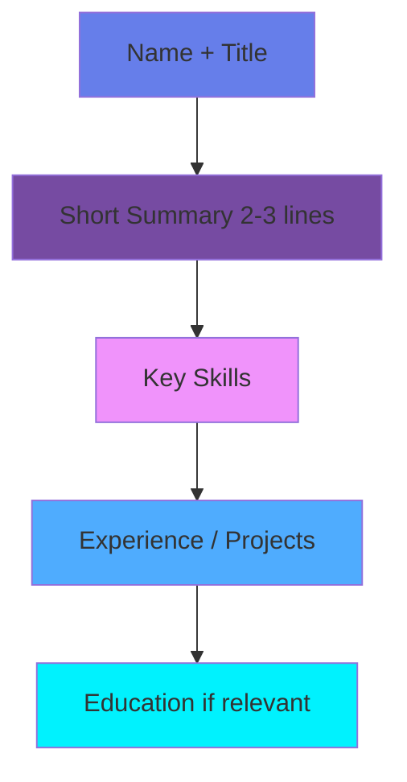

<div align="center">

# ✨ Chapter 15 · Career Launch


### *Resumes · Networking · Freelancing*

</div>

---

> [!NOTE]
> *"Opportunities don't happen. You create them."* — **Chris Grosser**

<div align="center">

[](./14-projects.md)
[](./README.md)

</div>

<br>

## 🎯 Why Career Launch Is a Skill

<table>
<tr>
<td width="50%">

**Technical skills** get you *ready*.

</td>
<td width="50%">

**Career skills** get you *hired*.

</td>
</tr>
</table>

<br>

> [!WARNING]
> **❌ Common mistake:** *"I'll focus on my career after I'm ready."*

> [!TIP]
> **✅ Reality:** Your career starts **now**, not later.

<br>

<div align="center">

💡 **Key Insight**

Great developers who don't know how to present themselves often stay invisible.


</div>

---

<br>

## 🧠 Part 1 · Resumes That Get Interviews

<br>

### 📄 The Purpose of a Resume

<div align="center">

A resume is **not** your life story.  
It's a marketing document with **one goal**:

### 🎯 GET THE INTERVIEW

</div>

<br>

<details>
<summary><b>❌ What makes a BAD resume?</b></summary>

<br>

- 📝 Long paragraphs that nobody reads
- 🔄 Generic responsibilities without impact
- 🗣️ Buzzwords only (no substance)
- 📊 No measurable results
- 🎨 Poor formatting and structure

</details>

<details>
<summary><b>✅ What makes a GOOD resume?</b></summary>

<br>

- 💥 Clear impact statements
- 📈 Measurable results with numbers
- 🚀 Relevant projects highlighted
- 🎯 Tailored to the position
- ✨ Clean, professional design

</details>

<br>

---

### 🧱 Resume Structure

<div align="center">



</div>

<br>

> [!IMPORTANT]
> If you don't have experience yet, **projects ARE experience**.

---

<br>

### ✍️ Write Impact, Not Tasks

<br>

| ❌ Bad Example | ✅ Good Example |
|:---|:---|
| *"Worked on backend services."* | *"Designed and implemented REST APIs used by **10k+ users**, reducing response time by **30%**."* |
| *"Helped with the mobile app."* | *"Built 5 core features for iOS app that increased user retention by **25%**."* |
| *"Did some testing."* | *"Created automated test suite covering **80%** of codebase, reducing bugs by **40%**."* |

<br>

<div align="center">

### 📊 Numbers tell stories


</div>

---

<br>

## 🤝 Part 2 · Networking Without Being Fake

<br>

### 🧠 What Networking Really Is

<table>
<tr>
<td width="50%" valign="top">

#### Networking is NOT:

- ❌ Asking for favors
- ❌ Spamming LinkedIn
- ❌ Forced small talk
- ❌ Collecting business cards
- ❌ Transactional relationships

</td>
<td width="50%" valign="top">

#### Networking IS:

- ✅ Building genuine relationships
- ✅ Sharing interests
- ✅ Being useful
- ✅ Long-term connections
- ✅ Mutual support

</td>
</tr>
</table>

<br>

> [!TIP]
> **🎯 Golden Rule:** People help people they know and trust.

---

<br>

### 🌍 Where Networking Happens

<div align="center">

| Platform | Type | Best For |
|:---:|:---:|:---|
| 🎤 | **Meetups & Conferences** | Face-to-face connections |
| 🌟 | **Open Source Communities** | Collaborative projects |
| 💼 | **Twitter / LinkedIn** | Thought leadership |
| 💬 | **Discord / Slack** | Daily interactions |
| 🤝 | **Former Colleagues** | Warm introductions |

</div>

<br>

> [!NOTE]
> Opportunities often come from **weak ties**, not close friends.

<br>

<div align="center">


</div>

---

<br>

### 💬 Simple Networking Message

<details>
<summary><b>📧 Click to see example message</b></summary>

<br>

```text
Subject: Loved your talk on mobile architecture

Hi Ana,

I saw your talk about mobile architecture at DevConf and really 
liked how you explained trade-offs in real projects.

I'm currently working on similar problems and would love to 
stay in touch.

Best,
[Your Name]
```

</details>

<br>

<div align="center">

| ❌ Don't | ✅ Do |
|:---:|:---:|
| Ask for a job | Start a conversation |
| Make it about you | Show genuine interest |
| Send generic messages | Personalize each message |

</div>

---

<br>

## 💼 Part 3 · Freelancing as a Career Accelerator

<br>

<div align="center">

### Freelancing is not just about money

</div>

<table>
<tr>
<td align="center" width="25%">

🎯  
**Real Clients**

</td>
<td align="center" width="25%">

⏰  
**Real Deadlines**

</td>
<td align="center" width="25%">

🔧  
**Real Constraints**

</td>
<td align="center" width="25%">

💪  
**Real Confidence**

</td>
</tr>
</table>

---

<br>

### ⚖️ Freelancing: Pros & Cons

<table>
<tr>
<td width="50%" bgcolor="#e8f5e9" valign="top">

### ✅ Pros

- 🚀 **Fast learning** — Every project is different
- 📁 **Portfolio growth** — Real work for real clients
- 🕐 **Flexibility** — Work when and where you want
- 💰 **Income potential** — Unlimited earning ceiling
- 🎓 **Skill diversity** — Jack of all trades

</td>
<td width="50%" bgcolor="#ffebee" valign="top">

### ❌ Cons

- 📊 **Income variability** — Feast or famine cycles
- 🤝 **Client management** — Dealing with difficult people
- ⚖️ **Responsibility** — You are the business
- 🔍 **Finding clients** — Constant hustle
- 📋 **Admin work** — Invoices, contracts, taxes

</td>
</tr>
</table>

<br>

> [!IMPORTANT]
> Freelancing teaches skills jobs don't.

<br>

<div align="center">


</div>

---

<br>

### 🧾 First Freelance Projects

<br>

<table>
<tr>
<td width="50%" valign="top">

#### ✅ Good first gigs:

- 🐛 **Fixing bugs** — Low risk, high learning
- ⚙️ **Small features** — Defined scope
- 🚀 **MVPs** — Build from scratch
- 🤖 **Automation scripts** — Quick wins
- 🎨 **UI improvements** — Visual impact

</td>
<td width="50%" valign="top">

#### ❌ Avoid at first:

- 🌊 **Huge undefined projects** — Scope creep nightmare
- 💸 **"Equity only" offers** — Pay your bills first
- 🔮 **Vague requirements** — Recipe for disaster
- ⏰ **Unrealistic deadlines** — Stress overload
- 🔧 **Unknown tech stacks** — Too much at once

</td>
</tr>
</table>

<br>

<div align="center">

### 🎯 Start small. Deliver well.

</div>

---

<br>

## 🧠 Part 4 · Personal Brand (Without Cringe)

<br>

### 🪞 You Already Have a Brand

<div align="center">

The question is:

> *Are you shaping it, or letting it happen?*

</div>

<br>

<table>
<tr>
<td align="center" width="33%">

### 🔨
**What you BUILD**

Your projects speak  
louder than words

</td>
<td align="center" width="33%">

### 📢
**What you SHARE**

Your insights help  
others grow

</td>
<td align="center" width="33%">

### 💬
**How you COMMUNICATE**

Your tone defines  
your reputation

</td>
</tr>
</table>

---

<br>

### ✨ Simple Ways to Build Visibility

<details>
<summary><b>📦 Share a project on GitHub</b></summary>

<br>

- Write clear README files
- Document your code
- Add helpful comments
- Include screenshots/demos
- Maintain consistently

</details>

<details>
<summary><b>✍️ Write short technical posts</b></summary>

<br>

- Share what you learned
- Explain complex topics simply
- Use code examples
- Be authentic
- Publish regularly

</details>

<details>
<summary><b>💭 Comment thoughtfully</b></summary>

<br>

- Add value to discussions
- Be respectful and kind
- Share your experience
- Ask good questions
- Help others

</details>

<details>
<summary><b>🤝 Help others publicly</b></summary>

<br>

- Answer questions on forums
- Review pull requests
- Mentor beginners
- Share resources
- Celebrate others' wins

</details>

<br>

<div align="center">

### Consistency > Virality


</div>

---

<br>

## 🤖 AI Tip · Career Launch

<br>

### Smart prompts:

<table>
<tr>
<td width="50%">

```
💡 "Review my resume as a recruiter"
```
```
💡 "Rewrite this bullet point with impact"
```
```
💡 "Simulate a technical interview"
```

</td>
<td width="50%">

```
💡 "Help me price a freelance project"
```
```
💡 "Draft a networking message"
```
```
💡 "Create a portfolio structure"
```

</td>
</tr>
</table>

<br>

### 🎯 AI helps with:

| Area | Application |
|:---|:---|
| ✅ Resume optimization | Improve impact statements |
| ✅ Interview prep | Practice common questions |
| ✅ Client communication | Professional emails |
| ✅ Career planning | Identify growth paths |

---

<br>

## 🎯 Mission · Day 15

<div align="center">

### 🚀 Launch your career

</div>

<br>

### Core Tasks:

- [ ] 📄 **Improve your resume** — Apply impact formula
- [ ] 🧠 **List 3 strong projects** — Document properly
- [ ] 🤝 **Reach out to 1 person** — Start networking
- [ ] 📝 **Update LinkedIn/GitHub** — Polish your presence
- [ ] 💬 **Practice explaining your work** — Elevator pitch

<br>

<details>
<summary><b>⭐ Bonus Challenges</b></summary>

<br>

- [ ] 🌐 Create a portfolio page
- [ ] 📊 Write a short case study
- [ ] 🎤 Do a mock interview
- [ ] ✉️ Send a follow-up message
- [ ] 🎯 Define your ideal role

</details>

---

<br>

## 📚 Career Launch Checklist

<div align="center">

### Before Applying:

</div>

<br>

| ✅ | Checklist Item |
|:---:|:---|
| ☑️ | Resume is clear and concise |
| ☑️ | Projects are documented |
| ☑️ | GitHub is clean |
| ☑️ | Online presence is professional |
| ☑️ | You can explain your work confidently |

---

<br>

<div align="center">

## 🏆 Achievement Unlocked

### **The Professional**

<br>

*You're no longer preparing.*  
*You're participating.*

<br>

**Your career has officially launched.**

<br>


</div>

---

<br>

<div align="center">

### ✨ Remember

**Skills open doors.**  
**People open opportunities.**

<br>

[](https://github.com)
[](https://twitter.com)

</div>

<br>
